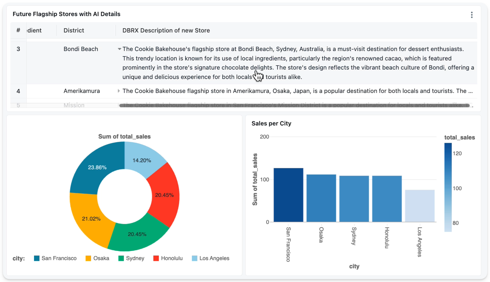

# The Cookies Dataset and Data Engineering App


This project demonstrates advanced Databricks features using the bakehouse dataset from Data+AI Summit 2024. It assumes familiarity with Databricks, its tooling, and core concepts. The dataset is freely available in the [Databricks Marketplace](https://marketplace.databricks.com/details/f8498740-31ea-49f8-9206-1bbf533f3993/Databricks_Cookies-Dataset-DAIS-2024-).

For those interested in the underlying technologies, there's an excellent [introduction to Databricks Workflows and Delta Live Tables](https://www.youtube.com/watch?v=KVCc1Dkz7tM). This video also provides an overview of the bakehouse application, which analyzes streaming data to identify optimal locations for new flagship stores. This repository implements the same application as a Databricks Asset Bundle.




## Getting started

1. Preparations 

* Install the Databricks CLI from https://docs.databricks.com/dev-tools/cli/databricks-cli.html
* Get the Cookies dataset from [Databricks Marketplace](https://marketplace.databricks.com/details/). Make sure to save it with the catalog name ``bakehouse`` (otherwise you have to adjust the code in the DAB accordingly).
* Since the the Cookie dataset in ``bakehouse`` is a read-only share, create another catalog with the name ``bakehouse-active`` for pipeline and result tables using either the workspace UI or SQL. 
* Install developer tools such as the Databricks extension for Visual Studio Code from [here](https://docs.databricks.com/dev-tools/vscode-ext.html). 


2. Authenticate to your Databricks workspace, if you have not done so already:
   
   ```
    databricks auth login --host <workspace-url>
   ```

3. Make sure the CLI is configured and the bundle is valid, run the following command from the current folder:       

```
   databricks bundle validate [-p profileName]
```

Depending on the default profile of your CLI setup you might have to add the correct auth profile with [-p profileName].To deploy this project, you need to reference an existing DWH. If you don't have one create it now using the Workspace UI and note its ID (here wwwww). 
   
   
Then deploy to your production environment (replace wwwww with your warehouse ID):
   ```
    databricks bundle deploy -t prod --var="prod_warehouse_id=wwwww" [-p profileName]
   ```

This deployment creates:

* A Databricks Workflow with DLT data ingestion and transformation
* A branch task
* A SQL task with ai_query() callout
* Two notebooks

Access these resources through your workspace's **Workflows** or **Delta Live Tables** section.


4. For reference, the bundle was created by importing existing resources. The following commands were used (do not run these as resources are already added): 
   ```
   databricks bundle generate pipeline --existing-pipeline-id pppp
   databricks bundle generate job --existing-job-id jjjj 
   databricks bundle validate 

5. To run a job or pipeline, you can use the "run" command:
   ```
   $ databricks bundle run
   ```

6. The AI/BI dashboard requires manual installation. [import it from here](https://github.com/databricks/tmm/blob/main/Cookies-DataEng-DAB/src/Bakehouse%20Flagship%20Stores%20bundle.lvdash.json) 

7. For detailed documentation on Databricks Asset Bundles and CI/CD, visit the official documentation
   https://docs.databricks.com/dev-tools/bundles/index.html.


