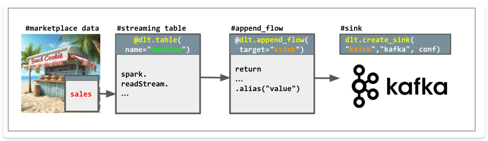

# DLT Kafka Sink Pipeline
A Delta Live Tables pipeline that reads cookie sales data and streams it to Confluent Kafka using DLT with Kafka sink capability.





## Overview
This pipeline demonstrates:
- Reading from a Delta table source 
- Processing and filtering records in Delta Live Tables
- Sinking transformed data to a Confluent Cloud Kafka topic
- Using Databricks secrets for secure credential management

## Prerequisites
- Databricks workspace
- Confluent Cloud account and credentials
- Databricks CLI installed to set up access for Confluent credentials as secrets in Databricks
- Get the dataset from [Databricks Marketplace](https://marketplace.databricks.com/details/f8498740-31ea-49f8-9206-1bbf533f3993/Databricks_Cookies-Dataset-DAIS-2024-) and confirm you can access the bakehouse.sales.transactions Delta table.


## Quick Start
1. Set Up Secrets
```
databricks secrets create-scope fm-kafka-sink
databricks secrets put-secret fm-kafka-sink confluentApiKey --string-value <your-api-key>
databricks secrets put-secret fm-kafka-sink confluentSecret --string-value <your-secret>
```

2. Configure Pipeline

Update these variables in the pipeline source file dlt_kafka_sink.py (or extract them into pipeline configuration values):
```
BOOTSTRAP = "your-bootstrap-server"  # From Confluent Cloud
TOPIC = "your-topic-name"            # Your target Kafka topic
```
3. Create Pipeline Settings

- Create and configure a new **serverless DLT pipeline** in your workspace under "Pipelines" using the SQL source file
- If you are running this while Kafka sinks are still in preview you also need to add the following parameter under Avanced / Configuration 

```
pipelines.externalSink.enabled true
```

## Security
- Uses SASL/SSL for Kafka authentication
- Credentials stored in Databricks secret scope


## Monitoring
Monitor pipeline health in:
- DLT pipeline UI
- Confluent Cloud dashboard
- Spark structured streaming UI

## Common Issues
1. Secret scope access
- Ensure proper permissions
- Verify secret scope name
   
2. Kafka connectivity
- Check bootstrap server
- Verify credentials
- Confirm topic exists

## Support
- Use Databricks community.databricks.com for technical questions
- Refer to Confluent documentation for Kafka issues