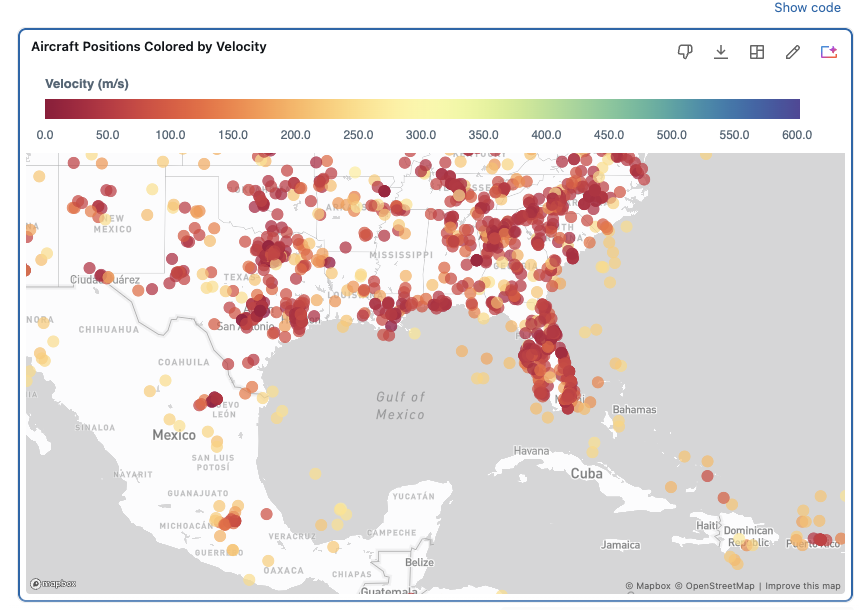

# 3. Explore and Visualize data with Genie Agents

Whether you are dealing with complex enterprise data spread across many different sources or huge volumes of scientific data, making sense of it is hard, and writing correct SQL statements is even harder.


## How can I gain insights without writing SQL?

With the data profiled in the [EDA step](20-genie-eda.md), you now use a **Genie Agent** to answer questions and **visualize** the results.
Genie Agents answer both business and technical questions. Each answer is worked out in an **agentic loop**: it pulls in context (your Unity Catalog tables and their governance, curated sample queries, business rules and metrics, and verified answers), then reasons over it to return a grounded result, not a guess.


Where [the EDA step](20-genie-eda.md) was focused on data quality and finding anomalies, this step is about *insight*: ask a question and Genie returns the SQL, the result table, and an appropriate **chart or map**. You never write a query or build a dashboard by hand.

## Step-by-step guide

1. **Open your Genie Agent.** Create a new Genie Agent on the table `marketplace.opensky.state_vectors`.

2. **Ask for a visualization.** Enter one of the prompts below in the chat box. Genie returns the generated SQL, the result set, and a chart or map. Then ask follow-ups to refine it: change the chart type, add a filter, or split by another column.

## Prompts to try

### Interactive prompts

Before charting anything, warm up with a few plain-text questions. Genie answers each with a single value or a small table:

- *"Which aircraft showed the fastest descent?"*
- *"What's the highest-flying aircraft?"*
- *"Which aircraft was the fastest?"*

### Data Visualization

**1. Where is every plane, and how fast is it going?**

Plot each aircraft's last known position on a map, colored by speed.

```text
For each aircraft take its most recent position and plot it on a map, coloring each point by velocity. Use a red color scale.
```



**2. Altitude vs. speed**

How is the speed of an aircraft correlated to altitude and the flight phase? Let's try the following prompt with Genie Agents:
```text
For each aircraft (icao24), pick one random row where baro_altitude and velocity are not null. 
Plot baro_altitude (y) vs velocity (x) as a scatter, colored by flight phase: 

"Ground" if on_ground, 
"Climb" if vertical_rate > 1.5, 
"Descent" if vertical_rate < -1.5, 
else "Cruise". 

Zoom in on the main cluster: 
only include baro_altitude between 0 and 13000 meters and velocity between 0 and 300 m/s.
```

 

The process is transparent and you can always check the underlying SQL code:
```SQL
WITH one_row_per_aircraft AS (
  SELECT
    `icao24`,
    `baro_altitude`,
    `velocity`,
    `on_ground`,
    `vertical_rate`,
    ROW_NUMBER() OVER (PARTITION BY `icao24` ORDER BY RAND()) AS rn
  FROM
    `marketplace`.`opensky`.`state_vectors`
  WHERE
    `baro_altitude` IS NOT NULL
    AND `velocity` IS NOT NULL
)
SELECT
  `icao24`,
  `baro_altitude`,
  `velocity`,
  CASE
    WHEN `on_ground` = true THEN 'Ground'
    WHEN `vertical_rate` > 1.5 THEN 'Climb'
    WHEN `vertical_rate` < -1.5 THEN 'Descent'
    ELSE 'Cruise'
  END AS flight_phase
FROM
  one_row_per_aircraft
WHERE
  rn = 1
  AND `baro_altitude` BETWEEN 0 AND 13000
  AND `velocity` BETWEEN 0 AND 300
Altitude vs Speed by Flight Phase (Main Cluster)

```

## Genie Agents — Beyond the Basics

A few things worth knowing once the basics work:

- **[Ask Genie to visualize](https://docs.databricks.com/aws/en/genie-agents/talk-to-genie)** — Genie auto-generates a chart for most answers and lets you switch to any of the ~20 [visualization types](https://docs.databricks.com/aws/en/dashboards/manage/visualizations/types) (point and choropleth maps, heatmaps, box and bubble charts, funnels, Sankey diagrams, and the usual bar/line/area/pie), then download it as PNG, export the data as CSV, or save it to a dashboard. Use it when you want to see a trend, distribution, or geography without writing plotting code.
- **Multi-turn exploration** — follow-ups keep context, so you refine a view across several questions in one session. Use it when narrowing from an overview down to a specific slice.
- **Suggested questions when stuck** — Genie offers alternative questions it can answer when yours won't run. Use it when you're exploring unfamiliar tables and aren't sure what's askable.

## Recap

You've explored the OpenSky data and produced visualizations with Genie Agents. No query writing, no dashboard setup. These views tell you what's worth operationalizing, which is exactly what the [pipeline](40-pipeline.md) and the [app](60-app.md) build on.

---

### Tutorial navigation

| ← Previous | Overview | Next → |
|:---|:---:|---:|
| [2. Genie Agents — EDA](20-genie-eda.md) | [Table of contents](index.md) | [4. Declarative Pipeline](40-pipeline.md) |

---

_Author: Frank Munz · Updated 2026-09-18_
