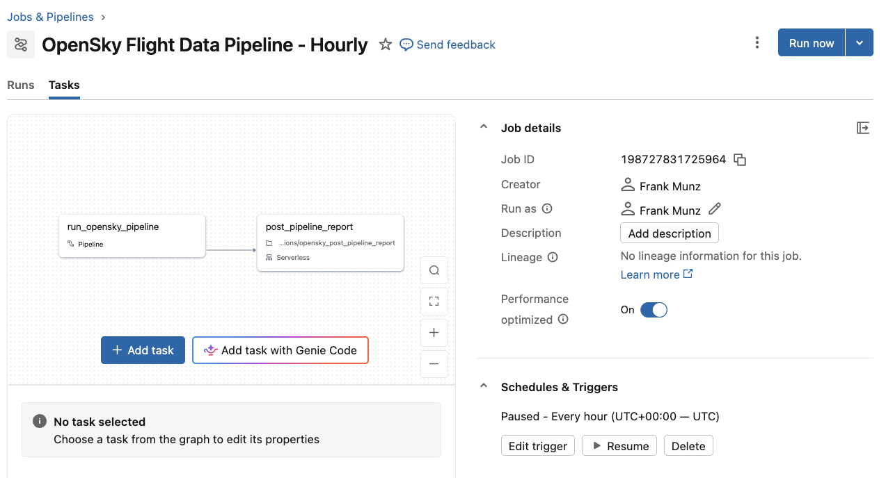

# 5. Build a Lakeflow Job with Genie Code

A pipeline that runs only when you click **Run** is not a data product. In production it runs inside a **job**: a Lakeflow workflow that orchestrates any number of tasks, such as notebooks, SQL queries, and other pipelines. You generate that job the same way you generated the [pipeline](40-pipeline.md) in the previous step, from a plain-English prompt to Genie Code.

Here you build a **multi-task job**: the pipeline runs first, then a notebook runs after it. The notebook is a placeholder for the downstream work you would add later, such as post-processing or a report.

## How to create a Lakeflow Job with Genie Code?

**[Lakeflow Jobs](https://docs.databricks.com/aws/en/jobs)** is the orchestration layer on Databricks: it schedules the pipeline, retries it on failure, and notifies you when a run breaks. Your SDP pipeline becomes one task in that workflow, and Genie Code assembles the whole job from a single prompt.

## Step-by-step guide: multi-task job with Genie Code

1. Use the **same Genie Code** panel you used to build the pipeline.

2. **Prompt Genie Code to create the job.** Name the pipeline you built in the [previous step](40-pipeline.md) so the job references it, then describe the schedule, retry, notification, and a second task: a notebook that runs after the pipeline.

   ```text
   Create a Lakeflow Job with the pipeline task that runs my OpenSky SDP
   pipeline on an hourly schedule. Retry once on failure and send an email
   notification when a run fails. Also add a notebook that is executed
   after the pipeline.
   ```

3. **Review the proposed job.** Genie Code returns a job with two tasks: a **pipeline task** pointing at your SDP pipeline (by name or pipeline ID), and a **notebook task** set to run after it. Confirm the task order, the **schedule** you asked for, and the **retry policy** with its **failure notification**.

4. The job then appears under **Jobs & Pipelines** in the workspace.

5. **Run it and verify.** Trigger **Run now**, then open the run to confirm the pipeline task runs first and the notebook task runs after it. Free Edition allows up to five concurrent job tasks.

## Results

Genie Code returns the two-task job below: the **pipeline task** runs first, then the **notebook task**, on the hourly schedule with the retry and failure notification you asked for.



What a job adds on top of the pipeline:

- **Schedule or trigger:** run on a cron schedule, or start the moment new data lands with a file-arrival trigger.
- **Multi-task orchestration:** chain the pipeline with downstream work, such as a notebook or a SQL refresh, in one dependency graph.
- **Retries and notifications:** retry transient failures automatically and alert the right people when a run fails.

## Lakeflow Jobs — Beyond the Basics

A few things worth knowing once the basics work:

- **[Serverless compute for jobs](https://docs.databricks.com/aws/en/jobs/run-serverless-jobs)** — run the job with no cluster to configure or size: Databricks provisions, autoscales, and tunes the compute for you, and any workspace user can run jobs without cluster-creation rights. Use it when you want the job to run on demand without owning infrastructure, the same serverless model this whole tutorial runs on.
- **[Conditional and data-driven orchestration](https://docs.databricks.com/aws/en/jobs/control-flow)** — go past "run every task in order": **If/else** condition tasks branch on an expression, **run-if** rules fire a task only when upstream tasks succeeded or failed, and a **SQL alert task** lets the job react to a data-quality or SLA condition instead of just the clock. Use it when downstream work should depend on the data, not only the schedule.
- **[Genie Code as a job task](https://docs.databricks.com/aws/en/jobs/tasks/genie-code)** (Beta) — run a plain-English Genie Code prompt as a task in the job: it reads your tables, calls tools, and hands its result to the next task. Use it when you want AI-assisted analysis, anomaly detection, or a generated report to run on the same schedule as the pipeline, the natural extension of the Genie work in this tutorial.

## Recap

You wrapped the Spark Declarative Pipeline in a **Lakeflow Job**: a scheduled, multi-task workflow that runs the pipeline, then a notebook, retries on failure, and emails you when a run breaks. The pipeline is now a data product that runs on its own, not only when you click **Run**.

---

### Tutorial navigation

| ← Previous | Overview | Next → |
|:---|:---:|---:|
| [4. Declarative Pipeline](40-pipeline.md) | [Table of contents](index.md) | [6. Databricks App](60-app.md) |

---

_Author: Frank Munz · Updated 2026-09-15_
