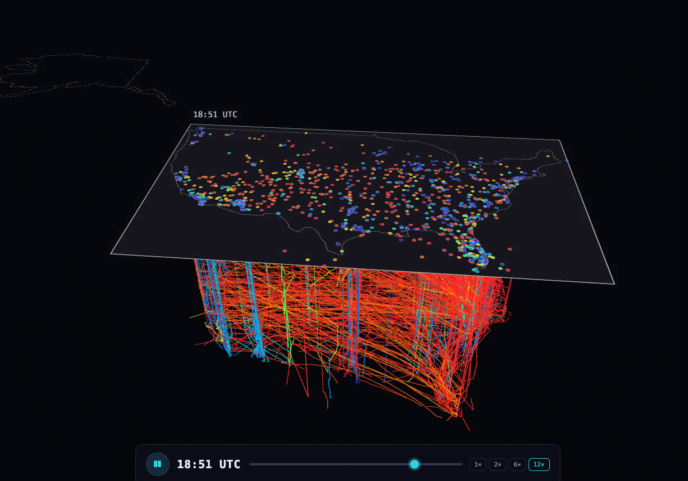

# AI-powered Analytics of 700 Million OpenSky Network Avionics Records 

## How to get started with Databricks Genie as a Data Scientist or Data Engineer on Databricks Free Edition


Welcome to this hands-on tutorial for data scientists and data engineers that runs start to finish on Databricks Free Edition, with real data from real planes instead of an AI generated toy dataset.

You begin with raw flight data from the **[OpenSky Network](https://opensky-network.org/)** on Databricks Marketplace: 696 million records — one full day of telemetry data in 2026, every aircraft that was in the air.

From there you track down the anomalies, explore it with natural language, build a Spark Declarative Pipeline to clean it, and finish with a live app. Genie handles the analysis and writes the SQL, pipeline and web app code as you go.

If you are interested in OSS and data sharing, you can read the same data straight from your own laptop with [open sharing](docs/06-opensharing.md) and take it from there.

<p align="center">
  
</p>

<p align="center"><em>The animation above is built from the Marketplace dataset: a space-time prism of flights over the US, followed by aircraft trajectories across Australia and holding patterns over Sydney Airport. It runs as a Databricks App</em></p>


## What you'll build

1. **[Databricks Marketplace](docs/01-marketplace.md)** — get the data as a read-only Unity Catalog table.
2. **[Genie Agents - EDA](docs/02-genie-eda.md)** — find data anomalies.
3. **[Genie Agents - explore & visualize](docs/03-genie-explore.md)** — explore and visualize the data.
4. **[Genie Code - Spark Declarative Pipeline](docs/04-pipeline.md)** — ingest and clean the data into per-region gold tables.
5. **[Genie Code - create a Databricks App](docs/05-app.md)** — visualize APAC flight routes on a zoomable map.
6. **[OpenSharing](docs/06-opensharing.md)** — receive the shared data locally with the open-source client and VSCode.
7. **[Wrap-up & next steps](docs/07-wrap-up.md)** — clean up and where to go from here.

```text
Marketplace → Genie Agents & Genie Code (EDA) → Genie Agents (explore & visualize) → Genie Code for Declarative Pipeline → Genie Code with Databricks App → OpenSharing with OSS only
```

## Before you begin

- A **Databricks account** — the free [Databricks Free Edition](https://login.databricks.com/signup?provider=DB_FREE_TIER&dbx_source=lf_fm1)
  is enough to follow along. 
- **Unity Catalog** enabled (default on Free Edition).
- **Serverless compute** available (default on Free Edition).
- The **`USE MARKETPLACE ASSETS`** privilege on the metastore (default unless your admin revoked it).

---

_Author: Frank Munz · Updated 2026-09-04_
