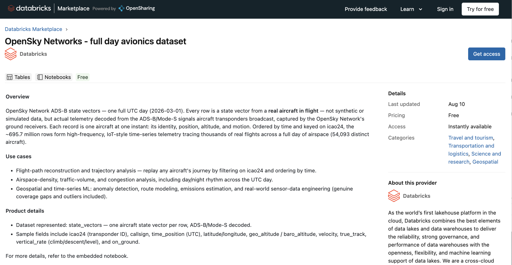

# 1. Databricks Marketplace — get the sample data

## What we do

We attach the **OpenSky Networks – full day avionics dataset** to our workspace from
**Databricks Marketplace** — an open exchange where you get datasets as a **read-only Unity
Catalog catalog**, with no copying and no ETL required.

The listing is
real ADS-B/Mode-S telemetry: one full UTC day (2026-03-01), about **695.7 million rows** tracing
**54,093 distinct aircraft** — one aircraft state vector per row in a table called
`state_vectors`.

> [!NOTE]
> **[OpenSharing](https://opensharing.io)** is an open specification hosted by the Linux
> Foundation that extends sharing beyond tables to AI assets, including **Genie Agent
> sharing**. Read the announcement:
> [*Introducing OpenSharing: the Next Evolution of Delta Sharing for the Agentic Era*](https://www.databricks.com/blog/introducing-opensharing-next-evolution-delta-sharing-agentic-era)
> (Databricks Blog, 16 Jun 2026).

## Databricks Marketplace



## Step-by-step guide

> **Step 1: Access Databricks Marketplace**
>
> - From the Databricks home page left-hand navigation menu, click **Marketplace**.
>
> **Step 2: Search for the OpenSky Dataset**
>
> - In the Marketplace search bar, type `opensky` and press **Enter**.
> - Select the product result titled **OpenSky Networks - full day avionics dataset**.
>
> **Step 3: Request Access to the Data**
>
> - On the dataset listing page, click the blue **Get instant access** button in the top right corner.
>
> **Step 4: Configure Catalog Name**
>
> - In the modal window, expand **More options**.
> - Under **Catalog name**, replace the default long string with  `marketplace`. Make sure to get the catalog name right. This will simplify data access throughout the tutorial. 
> - Click **Get instant access**.
>
> **Step 5: Navigate to Catalog Explorer**
>
> - Once installed, click **Catalog** from the left-hand main navigation sidebar.
>
> **Step 6: View the Table Data**
>
> - In the left-hand panel under **Shares received**, expand `marketplace` > `opensky` > **Tables**.
> - Select `state_vectors`.
> - Switch to the **Sample Data** tab in the main view to inspect rows containing UTC flight telemetry, call signs, and coordinates.

## Recap

You now have a read-only table at **`marketplace.opensky.state_vectors`**. You can confirm it
from a SQL editor:

```sql
SELECT * FROM marketplace.opensky.state_vectors LIMIT 10;
```

```sql
DESCRIBE marketplace.opensky.state_vectors;
```

You should see ADS-B state-vector columns such as `icao24`, `callsign`, `time_position`,
`latitude`, `longitude`, `baro_altitude`, `geo_altitude`, `velocity`, `true_track`,
`vertical_rate`, and `on_ground`. **Note the exact three-part name
`marketplace.opensky.state_vectors`** — every later step uses it.
