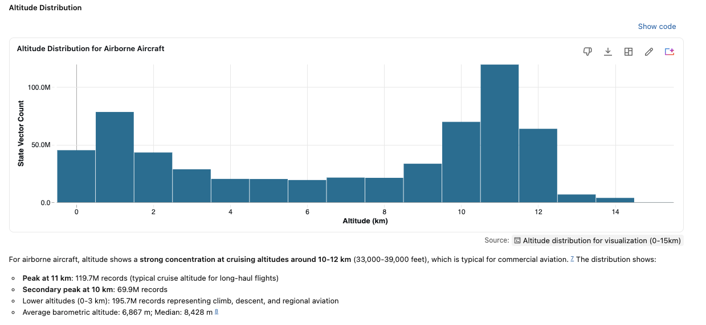
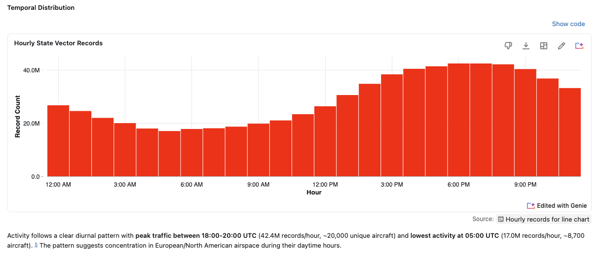

# 2. Find Data Insights and Anomalies with Databricks Genie

Before you transform, visualize, or even trust any dataset, you need to understand what the raw data
actually looks like. That process is called **[exploratory data analysis (EDA)](https://en.wikipedia.org/wiki/Exploratory_data_analysis)**: profiling each column, checking
value ranges and null rates, and spotting anomalies or impossible values that would otherwise
silently corrupt everything downstream. EDA is the necessary **first step**, because the issues you
find here become the cleanup rules for your pipeline ([Step 4](04-pipeline.md)) and the caveats for every later
analysis. Skip it and you build on data you don't understand.

## How to run EDA with Genie Agents or Genie Code?

**Genie Code and Genie Agents** run your EDA for you. Point either one at
`marketplace.opensky.state_vectors` and ask, in plain English, to profile the columns and flag
impossible values. The agent writes and runs the SQL, summarizes the results, and explains each
anomaly in avionics context. You profile a brand-new dataset in minutes, without writing a single
query.

## Step-by-step guide with Genie Code

1. **Open the Genie Code interface.** In your Databricks workspace, open Genie Code (for example, click the Genie lamp icon, top right).

2. **Enter the prompt.** In the prompt input box, name the target dataset and the analysis parameters. Prompt template shown in the recording:

   ```text
   Run a comprehensive EDA for @state_vectors; check the key columns for
   null values and any out-of-range or impossible values. Provide a list of
   issues with explanations in the OpenSky avionics context
   ```

3. **Execution and automated analysis.** Submit the prompt. The Genie Agent will automatically:

   - Examine the table schema (e.g., reading column definitions for icao24, time, lat, lon, baro_altitude, velocity, etc.).
   - Formulate analytical goals (evaluating key primary keys, geospatial limits, velocity bounds, and time boundaries).
   - Execute multi-step data quality checks across the dataset.

4. **Review EDA findings & reports.** Once processing is complete, scroll through the structured summary generated by Genie:

   - No Critical Issues Found: Quick status checks verifying baseline constraints (e.g., valid latitude/longitude ranges, non-null key identifiers).
   - Issues Requiring Context & Potential Quality Concerns: Categorized anomaly detection (e.g., unrealistic extreme velocities, extreme vertical rates, barometric vs. geo altitude discrepancies, negative altitude levels, or timestamp anomalies).
   - Recommendations: Actionable filters and queries generated by Genie to clean or handle anomalies during downstream analysis.

## Results


## Optional: EDA with Visualizations and Genie Agent

If you set up a **Genie Agent** on the dataset, you can ask
the same questions in plain English and get a **graphical report** back. Genie writes the SQL
*and* picks the right chart. Both visualizations below were generated automatically as part of EDA by a Genie Agent.

### Altitude for airborne aircraft 

Clusters at cruising altitudes of **10–12 km** (a clear peak at
11 km, ~119.7M records), with lower counts at 0–3 km for climb, descent, and regional traffic:



### Hourly Pattern

State-vector volume follows a clear **diurnal pattern**: it peaks at 18:00–20:00 UTC
(~42.4M records/hour) and bottoms out around 05:00 UTC (~17.0M records/hour), pointing to
European and North American daytime airspace:



## Recap

You now have a set of EDA findings: the **data-quality issues Genie flagged** and what they mean in avionics terms.
Keep these: the [Step 4](04-pipeline.md) pipeline prompt turns them into data-quality constraints.

You can also ask Genie for a written report, then save it and reuse it to build the SDP ETL pipeline in [Step 4](04-pipeline.md).

---

### Tutorial navigation

| ← Previous | Overview | Next → |
|:---|:---:|---:|
| [1. Databricks Marketplace](01-marketplace.md) | [Table of contents](../README.md) | [3. Genie Agents — Explore](03-genie-explore.md) |

---

_Author: Frank Munz · Updated 2026-09-04_
