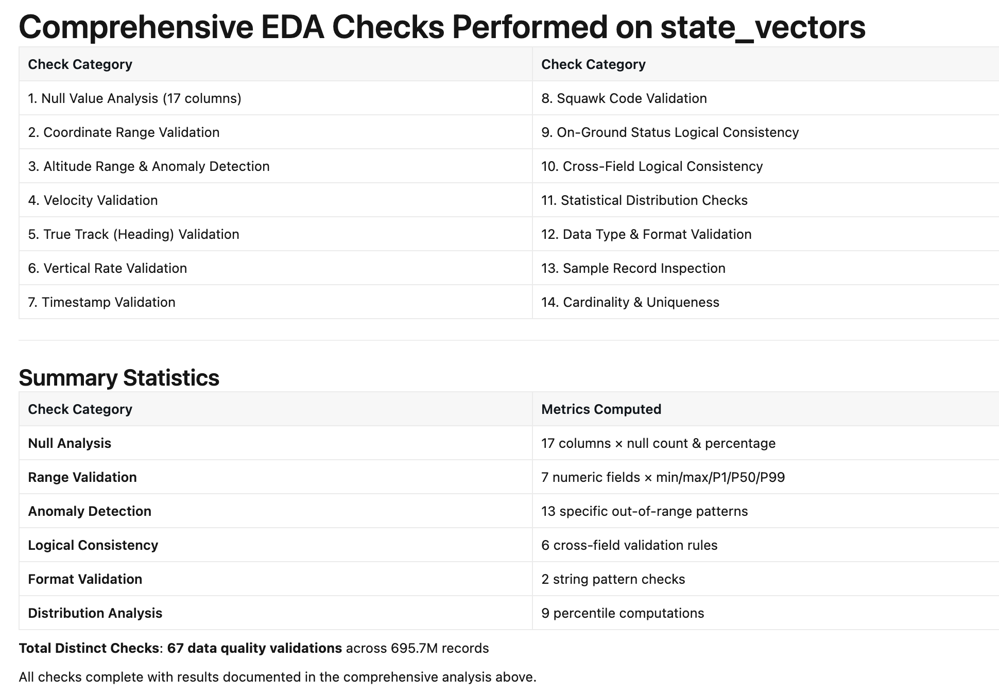

# 2. Genie Agents — find data anomalies with EDA

## What we do

Before you transform, visualize, or even trust any dataset, you need to understand what the raw data
actually looks like — that is called **[exploratory data analysis (EDA)](https://en.wikipedia.org/wiki/Exploratory_data_analysis)**: profiling each column, checking
value ranges and null rates, and spotting anomalies or impossible values that would otherwise
silently corrupt everything downstream. EDA is the necessary **first step**, because the issues you
find here become the cleanup rules for your pipeline ([Step 4](04-pipeline.md)) and the caveats for every later
analysis — skip it and you build on data you don't understand.

**Genie Agents** are a great way to do EDA. You ask questions in plain English and the agent
writes and runs the SQL, summarizes the results, and explains anomalies in their domain context. With Genie Agents, you can profile a brand-new dataset in minutes, without writing a single query.

## Step-by-step guide

> Perform Exploratory Data Analysis (EDA) in Databricks using Genie Agents by following this workflow:
>
> **Step 1: Open Genie Code Interface**
>
> Navigate to your Databricks Workspace and open the Genie agent interface (e.g., Genie Code).
>
> **Step 2: Enter the Prompt**
>
> In the prompt input box, specify the target dataset and the parameters for analysis.
>
> Prompt template shown in the recording:
>
> ```text
> Run a comprehensive EDA for @state_vectors; check the key columns for
> null values and any out-of-range or impossible values. Provide a list of
> issues with explanations in the OpenSky avionics context
> ```
>
> **Step 3: Execution and Automated Analysis**
>
> Submit the prompt. The Genie Agent will automatically:
>
> - Examine the table schema (e.g., reading column definitions for ica024, time, lat, lon, baro_altitude, velocity, etc.).
> - Formulate analytical goals (evaluating key primary keys, geospatial limits, velocity bounds, and time boundaries).
> - Execute multi-step data quality checks across the dataset.
>
> **Step 4: Review EDA Findings & Reports**
>
> Once processing is complete, scroll through the structured summary generated by Genie:
>
> - No Critical Issues Found: Quick status checks verifying baseline constraints (e.g., valid latitude/longitude ranges, non-null key identifiers).
> - Issues Requiring Context & Potential Quality Concerns: Categorized anomaly detection (e.g., unrealistic extreme velocities, extreme vertical rates, barometric vs. geo altitude discrepancies, negative altitude levels, or timestamp anomalies).
> - Recommendations: Actionable filters and queries generated by Genie to clean or handle anomalies during downstream analysis.

## Results



> [!TIP]
> **Feature spotlight — Instructions**
>
> **Instructions** — plain-language rules you give the agent so it interprets your data
> correctly, which is what keeps its generated SQL and answers trustworthy on a domain-specific
> schema.

> Add this instruction to your Genie Agent, then ask the question again and compare the answers:
>
> ```text
> Altitudes (baro_altitude, geo_altitude) are in meters and velocity is in
> m/s — report altitude in feet and speed in knots. A null latitude/longitude
> means a missing position report (aircraft outside receiver coverage), not a
> location at 0,0 — exclude those rows from position analysis.
> ```

## Recap

You have a set of EDA findings — the **data-quality issues Genie flagged** (extreme velocities,
extreme vertical rates, baro/geo altitude discrepancies) and what they mean in avionics terms.
Keep these: the [Step 4](04-pipeline.md) pipeline prompt turns them into data-quality constraints.

---

### Tutorial navigation

| ← Previous | Overview | Next → |
|:---|:---:|---:|
| [1. Databricks Marketplace](01-marketplace.md) | [Table of contents](../README.md) | [3. Genie Agents — Explore](03-genie-explore.md) |
