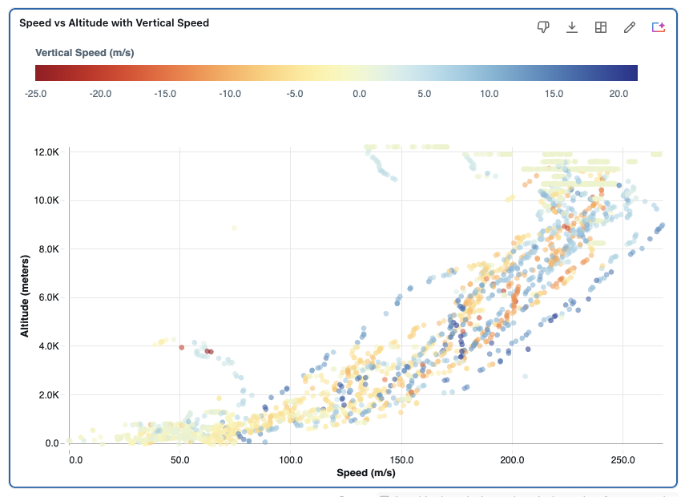

# 3. Genie Agents — explore and visualize the data

## What we do

With the data profiled in [Step 2](02-genie-eda.md), we now use a **Genie Agent** to answer questions on the data and
**visualize** the answers. 


Where [the EDA step](02-genie-eda.md) focused on data quality and finding anomalies, this step is
about *insight*: ask a question and Genie returns the SQL, the result table, and
an appropriate **chart or map**. You never have to write a query or build a dashboard manually. This is what Genie Agents does for you. 

## Step-by-step guide

> **Step 1: Open your Genie Agent**
>
> Create a new Genie agent on the table `marketplace.opensky.state_vectors`
>
> **Step 2: Ask for a visualization**
>
> Enter one of the prompts below in the chat box. Genie returns the generated SQL, the result set,
> and a chart or map — then ask follow-ups to refine it (change the chart type, add a filter, split
> by another column).

## Prompts to try

**1. Where is every plane, and how fast is it going?**

Plot each aircraft's last known position on a map, colored by speed.

```text
For each aircraft take its most recent position and plot it on a map, coloring each point by velocity. Use a red color scale.
```


**
**2. Altitude vs. speed**

Do faster aircraft fly higher?

```text
Create a scatter plot of altitude versus speed use vertical speed for color code.
```



## Recap

You've explored the OpenSky data and produced visualizations with Genie Agents — no query writing,
no dashboard setup. These views tell you what's worth operationalizing, which is exactly what the
pipeline in [Step 4](04-pipeline.md) and the app in [Step 5](05-app.md) build on.

---

### Tutorial navigation

| ← Previous | Overview | Next → |
|:---|:---:|---:|
| [2. Genie Agents — EDA](02-genie-eda.md) | [Table of contents](../README.md) | [4. Declarative Pipeline](04-pipeline.md) |
