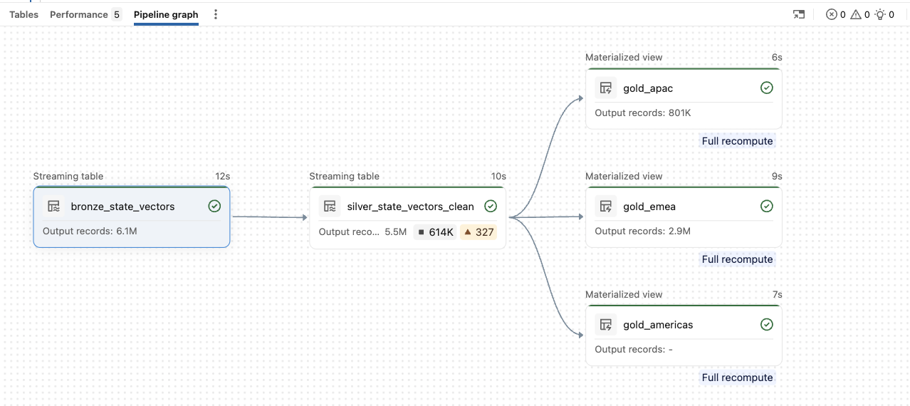

# 4. Spark Declarative Pipeline with Genie Code — ingest & clean

## What we do

We turn the raw table into clean, query-ready data with a **Spark Declarative Pipeline** (Lakeflow
Declarative Pipelines) — you declare *what* the data should look like and Databricks manages
orchestration, incremental refresh, and data-quality enforcement. We generate the pipeline with
**Genie Code**.

> [!IMPORTANT]
> **Free Edition — reduce the data first.** The full share is ~695M rows for one UTC day, more than
> Free Edition compute can process, so filter the bronze ingest to a deterministic sample of
> aircraft with the predicate below before running the pipeline. This keeps roughly 5% of aircraft
> but every state vector for each of them — so whole flight tracks stay intact — and it needs no
> clustering or index on the shared table.

```sql
SELECT *
FROM marketplace.opensky.state_vectors
WHERE mod(abs(crc32(icao24)), 20) = 0     -- ~5% of aircraft, whole tracks
```

Tune the divisor for the fraction you want (`20` ≈ 5%, `50` ≈ 2%). (Declarative Pipelines run on
serverless — use the serverless pipeline option.)

## Step-by-step guide

> To create a Data Pipeline using Delta Live Tables (DLT / SDP) with Genie Code, follow this step-by-step procedure:
>
> **1. Open Genie Code Interface**
>
> Navigate to your Databricks Workspace and open the Genie Code panel on the right side of your workspace.
>
> **2. Submit Initial Pipeline Prompt**
>
> In the prompt chat input box, enter the prompt describing the end-to-end pipeline creation requirements:
>
> ```text
> Create an SDP pipeline to process the OpenSky data with data-quality constraints based on the findings above. Create a separate gold table with data for each of the regions Americas, EMEA, and APAC.
> ```
>
> **3. Provide Source Confirmation**
>
> When prompted by Genie Code to clarify or confirm the dataset source, submit the response:
>
> ```text
> yes. table from marketplace.opensky for ingest
> ```
>
> **4. Automatic Architecture Proposal**
>
> Genie Code will generate a proposed Medallion Architecture structure:
>
> - Bronze Layer (bronze_state_vectors): Ingests raw OpenSky state vector data using streaming tables.
> - Silver Layer (silver_state_vectors_clean): Applies quality constraints (filtering invalid locations, velocities, and extreme values).
> - Gold Layer (Regional Tables): Creates individual tables partitioned by geographic coordinates:
>     - gold_americas
>     - gold_emea
>     - gold_apac
>
> **5. Review Pipeline Graph**
>
> Upon execution completion, Genie Code automatically builds the project files and generates the interactive Pipeline graph. Verify that the streaming tables flow from bronze_state_vectors → silver_state_vectors_clean (with applied expectations) → regional Gold outputs (gold_apac, gold_americas, gold_emea).

## Results

Genie Code's **proposed architecture** ([Step 4](#step-by-step-guide)), then the **Pipeline graph** it builds on execution
([Step 5](#step-by-step-guide)) — `bronze_state_vectors` → `silver_state_vectors_clean` (with its data-quality
expectations) → the three regional gold materialized views:




### The three regional gold tables

Genie Code produces one gold table per region from the cleaned silver data — typically split by
**aircraft longitude** — so each downstream consumer reads only the area it cares about. Confirm
the exact table names and boundaries in the generated pipeline; they'll look roughly like this:

| Gold table | Longitude band (approx.) | Region |
|---|---|---|
| `gold_americas` | −170° to −30° | North & South America |
| `gold_emea` | −30° to +75° | Europe, Middle East, Africa |
| `gold_apac` | +60° to +180° and −180° to −120° | Asia-Pacific — **the table the [Step 5](05-app.md) app visualizes** |

Splitting at the gold layer keeps each region small and fast to query, and lets you govern or
share regions independently — while the shared silver table guarantees they were all cleaned with
the same data-quality rules.

> [!TIP]
> **Feature spotlight — Generate whole assets (medallion architecture)**
>
> **Generate whole assets (medallion architecture)** — from one prompt, Genie Code produces a
> complete bronze → silver → gold Declarative Pipeline, so you scaffold a production-grade
> medallion data-engineering job in seconds instead of hand-writing each layer.

## Data-quality expectations (silver)

The silver table is where the **EDA findings from [Step 2](02-genie-eda.md) become enforced rules**. A Spark
Declarative Pipeline lets you attach *expectations* — named boolean constraints — to a table;
Databricks evaluates every row and tracks pass/fail counts in the pipeline UI. `expect_all_or_drop`
drops any row that fails a **hard** rule (so it never reaches the gold tables), while `expect`
**warns** but keeps the row — used here for softer outlier checks. This is the generated silver
definition, with the EDA anomalies encoded as constraints:

```python
from pyspark import pipelines as dp

@dp.table(
    name="silver_state_vectors_clean",
    comment="Cleaned OpenSky state vectors with data quality constraints",
    cluster_by=["icao24"]
)
@dp.expect_all_or_drop({
    "valid_position": "latitude IS NOT NULL AND longitude IS NOT NULL",
    "valid_latitude_range": "latitude BETWEEN -90 AND 90",
    "valid_longitude_range": "longitude BETWEEN -180 AND 180",
    "valid_icao24": "icao24 IS NOT NULL AND length(icao24) = 6",
    "valid_altitude": "baro_altitude IS NULL OR (baro_altitude >= -500 AND baro_altitude <= 50000)",
    "valid_velocity": "velocity IS NULL OR velocity >= 0",
    "valid_timestamps": "time_position IS NOT NULL AND last_contact IS NOT NULL"
})
@dp.expect("reasonable_geo_altitude", "geo_altitude IS NULL OR (geo_altitude >= -500 AND geo_altitude <= 50000)")
@dp.expect("valid_track", "true_track IS NULL OR (true_track >= 0 AND true_track < 360)")
def silver_state_vectors_clean():
    """
    Silver layer: Apply data quality constraints to filter invalid records.

    Quality checks:
    - Drop records with null or invalid position (lat/lon)
    - Drop records with invalid coordinate ranges
    - Drop records with missing aircraft identifier (icao24)
    - Drop records with unreasonable altitude or negative velocity
    - Drop records with missing timestamps
    - Warn on geo_altitude and track outliers
    """
    return spark.readStream.table("bronze_state_vectors")
```

The `expect_all_or_drop` rules (valid position and coordinate ranges, a 6-character `icao24`,
plausible altitude and non-negative velocity, present timestamps) are exactly why
`silver_state_vectors_clean` shows fewer rows than bronze in the graph above; the two `expect`
rules only flag `geo_altitude` and `true_track` outliers without dropping them.

## Recap

You now have three cleaned **gold** tables — `gold_americas`, `gold_emea`, and `gold_apac` — all
built on the same quality-checked silver table. Verify the APAC one (used by the app in [Step 5](05-app.md)):

```sql
SELECT * FROM gold_apac LIMIT 10;
```

_(Confirm the exact gold table names in the pipeline Genie Code generates — note the APAC one;
[Step 5](05-app.md) points the app at it.)_

---

### Tutorial navigation

| ← Previous | Overview | Next → |
|:---|:---:|---:|
| [3. Genie Agents — Explore](03-genie-explore.md) | [Table of contents](../README.md) | [5. Databricks App](05-app.md) |
