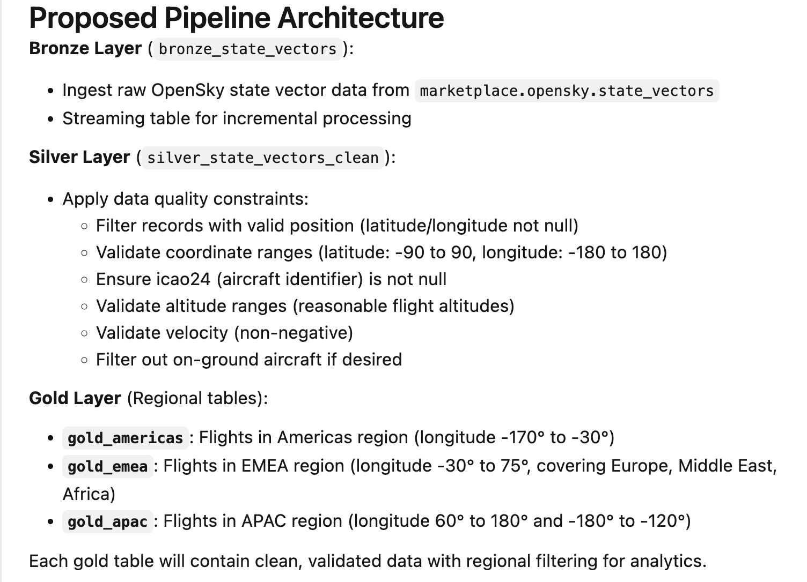

# 4. Spark Declarative Pipeline with Genie Code — ingest & clean

## What we do

We turn the raw table into clean, query-ready data with a **Spark Declarative Pipeline**. Declarative means you declare *what* the data should look like and Databricks manages
orchestration, incremental refresh, and data-quality enforcement. We generate the pipeline with
**Genie Code**.

> **Note — this isn't a full pipeline tutorial.** Here we focus on generating a working
> Spark Declarative Pipeline with Genie Code, not on teaching SDP from the ground up. If you want a
> deeper, hands-on walkthrough of Spark Declarative Pipelines — covering both open source and Lakeflow —
> see [How to get started with Spark Declarative Pipelines](https://www.databricks.com/discover/how-to-get-started-with-spark-declarative-pipelines).
> It's built on the *same avionics data*, but consumed as a **live stream** — so you can literally
> track the planes flying over your head right now.

## Step-by-step guide

> To create a Data Pipeline using SDP with Genie Code, follow this step-by-step procedure:
>
> **1. Open Genie Code Interface**
>
> Navigate to your Databricks Workspace and open the Genie Code panel on the right side of your workspace.
>
> **2. Submit Initial Pipeline Prompt**
>
> In the prompt chat input box, enter the prompt describing the end-to-end pipeline creation requirements. Make sure you have the EDA findings in the same Genie chat available or copy them over. Using the full marketplace dataset, the SDP would process close to 700 million records. To make this more suitable for Databricks free edition we reduce the amount of data ingested to the flights between 12:00 and 12:15. 
>
> ```text
> Create an SDP pipeline to process the OpenSky data from marketplace.opensky with data-quality constraints 
> based on the findings above. Create a separate gold table with data for each of 
> the regions Americas, EMEA, and APAC.
> Add a materialized view that provides analytics for all the gold tables.
> To reduce the data, only ingest flight data where the aircraft position timestamp 
> falls between 12:00 and 12:15
> ```

> **3. Automatic Architecture Proposal**
>
> Genie Code will propose a Medallion Architecture structure:
>
> - Bronze Layer (bronze_state_vectors): Ingests raw OpenSky state vector data using streaming tables.
> - Silver Layer (silver_state_vectors_clean): Applies quality constraints (filtering invalid locations, velocities, and extreme values).
> - Gold Layer (Regional Tables): Creates individual tables partitioned by geographic coordinates:
>     - gold_americas
>     - gold_emea
>     - gold_apac
> - Gold Layer Summary (gold_analytics_regional_summary): A materialized view with analytics across all three regional gold tables.
>
> **4. Review Pipeline Graph**
>
> Upon execution completion, Genie Code automatically builds the project files and generates the interactive Pipeline graph. Verify that the streaming tables flow from bronze_state_vectors → silver_state_vectors_clean (with applied expectations) → regional Gold outputs (gold_apac, gold_americas, gold_emea) → gold_analytics_regional_summary.

## Results

Genie Code's **proposed architecture** ([Step 3](#step-by-step-guide)), then the **Pipeline graph** it builds on execution
([Step 4](#step-by-step-guide)) — `bronze_state_vectors` → `silver_state_vectors_clean` (with its data-quality
expectations) → the three regional gold materialized views → `gold_analytics_regional_summary`:
## Medallion Architecture


## Pipeline Graph


### Silver layer with data-quality expectations

The silver table is where the **EDA findings from [Step 2](02-genie-eda.md) become enforced rules**. A Spark
Declarative Pipeline lets you attach *expectations* — named boolean constraints — to a table;
Databricks evaluates every row and tracks pass/fail counts in the pipeline UI. `expect_all_or_drop`
drops any row that fails a **hard** rule (so it never reaches the gold tables), while `expect`
**warns** but keeps the row — used here for softer outlier checks. This is the generated silver
definition, with the EDA anomalies encoded as constraints:

```python
from pyspark import pipelines as dp

@dp.table(
    name="silver_state_vectors_clean"
)
@dp.expect_all_or_drop({
    "valid_position": "latitude IS NOT NULL AND longitude IS NOT NULL",
    "valid_latitude_range": "latitude BETWEEN -90 AND 90",
    ...
})
@dp.expect("reasonable_geo_altitude", "geo_altitude IS NULL OR (geo_altitude >= -500 AND geo_altitude <= 50000)")
@dp.expect("valid_track", "true_track IS NULL OR (true_track >= 0 AND true_track < 360)")

def silver_state_vectors_clean():
    return spark.readStream.table("bronze_state_vectors")
```

The `expect_all_or_drop` rules are why
`silver_state_vectors_clean` shows fewer rows than bronze in the graph above.

Genie Code produces one gold table per region from the cleaned silver data — typically split by
**aircraft longitude** — so each downstream consumer reads only the area it cares about. Confirm
the exact table names and boundaries in the generated pipeline; they'll look roughly like this:

| Gold table | Longitude band (approx.) | Region |
|---|---|---|
| `gold_americas` | −170° to −30° | North & South America |
| `gold_emea` | −30° to +75° | Europe, Middle East, Africa |
| `gold_apac` | +60° to +180° and −180° to −120° | Asia-Pacific |

Splitting at the gold layer keeps each region small and fast to query, and lets you govern or
share regions independently — while the shared silver table guarantees they were all cleaned with
the same data-quality rules.


## 
## Recap

You now have three cleaned **gold** tables — `gold_americas`, `gold_emea`, and `gold_apac` — all
built on the same quality-checked silver table, plus the `gold_analytics_regional_summary`
materialized view with analytics across all three. Verify the APAC one:

```sql
SELECT * FROM gold_apac LIMIT 10;
```

_(Confirm the exact gold table names in the pipeline Genie Code generates.)_

---

### Tutorial navigation

| ← Previous | Overview | Next → |
|:---|:---:|---:|
| [3. Genie Agents — Explore](03-genie-explore.md) | [Table of contents](../README.md) | [5. Databricks App](05-app.md) |
