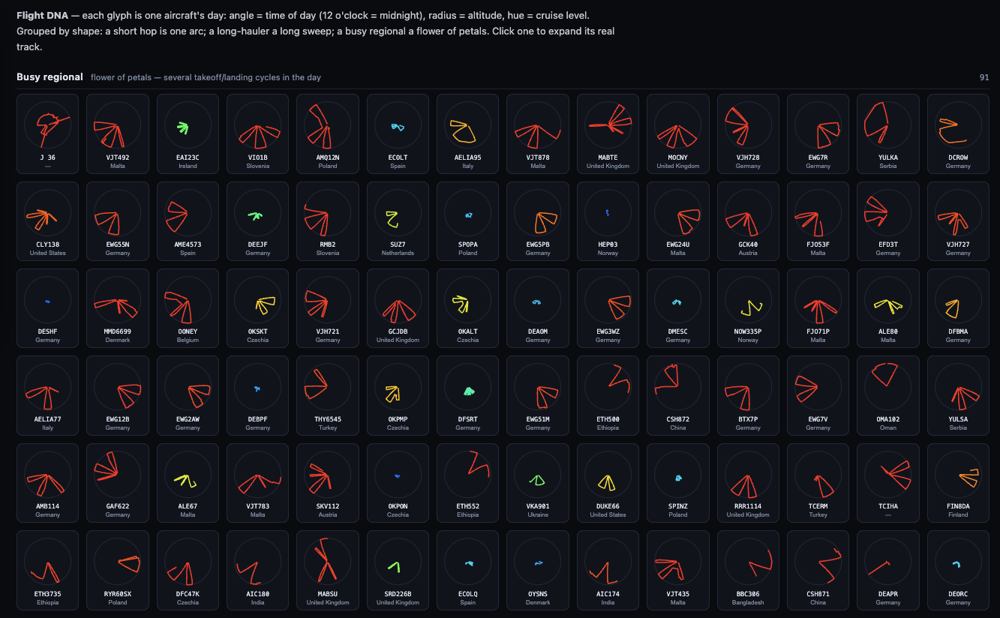
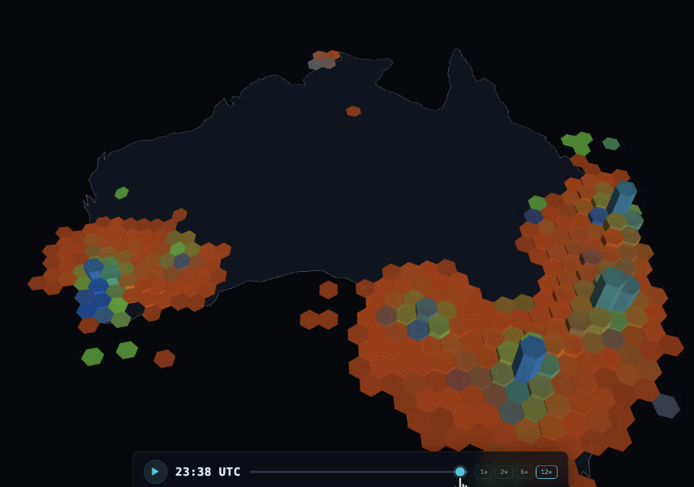

# 5. How do I build a Databricks App with Genie Code?

## What you'll do

You build an interactive **Databricks App** with **Genie Code**, a way to host web apps right next
to your data, with governed access and no separate infrastructure to manage. You describe the app
you want in plain English, and Genie Code generates, builds, and deploys it.

You build the app on top of one of the gold tables from the SDP pipeline, so it sits on cleaned, query-ready data. If you just want to try app creation with Genie Code, you can skip the pipeline and point the app at the raw table for a quick proof of concept, though that shortcut isn't meant for anything more serious.

## What Databricks Apps our team built based on the Avionics data set

Genie Code generates all kinds of visualizations and full applications from a plain-English prompt, the same way coding agents such as Codex and Claude Code do. Our Solutions Architects have used this OpenSky dataset for several proofs of concept. **Each one below runs as a [Databricks App](https://www.databricks.com/blog/announcing-general-availability-databricks-apps)** — hosted next to the data, with governed access and no separate infrastructure: one plots Flight DNA, one an [H3](https://docs.databricks.com/aws/en/sql/language-manual/sql-ref-h3-geospatial-functions) flight-density map of Australia, and one the holding patterns over Sydney Airport.

*Flight DNA: each glyph is one aircraft's day. The angle is time of day (12 o'clock is midnight), the radius is altitude, and the hue is cruise level. A short hop is one arc, a long-hauler a long sweep, and a busy regional a flower of petals. Click one to expand its real track. Runs as a Databricks App.*

*H3 flight-density map of Australia: flights binned into H3 hexagons, extruded and colored by density, with a time scrubber to play the day forward. Runs as a Databricks App.*

*Holding patterns over Sydney Airport — the tight loops are aircraft circling as they wait to land. Runs as a Databricks App.*

## Step-by-step guide

> **Step 1: Open Genie Code**
>
> Create a new **Databricks App** and open **Genie Code**.
>
> **Step 2: Generate the app**
>
> Describe the app you want in plain English: name the dataset (`marketplace.opensky.state_vectors`), say how the data should load, list the views and how to navigate between them, and ask Genie Code to build and deploy it.

## Genie Code — Beyond the Basics

A few things worth knowing once the basics work:

- **Workspace-aware discovery** — generated [Databricks App](https://docs.databricks.com/aws/en/dev-tools/databricks-apps/) code resolves fully-qualified Unity Catalog names and warehouse IDs from your workspace. Use it when you want the app to run without hand-editing table paths or resource IDs.
- **Pre-wire the warehouse and endpoints** — name the SQL warehouse or serving endpoint once and the generated code binds to it. Use it when the app needs governed, consistent access to a specific warehouse or model endpoint.
- **Runtime error diagnosis and inline fixes** — Genie Code catches errors when the app runs and proposes corrected code in place. Use it when generated queries or components fail on first run and you want the fix pinpointed.
- **Smoke test before deploy** — a generated smoke test exercises the app's data path and UI before you ship. Use it when you want early confirmation the generated app works end to end.

## Recap

You have a live, governed Databricks App, built and deployed straight from a Genie Code prompt and running right next to your data.

---

### Tutorial navigation

| ← Previous | Overview | Next → |
|:---|:---:|---:|
| [4. Declarative Pipeline](04-pipeline.md) | [Table of contents](../README.md) | [6. OpenSharing](06-opensharing.md) |

---

_Author: Frank Munz · Updated 2026-09-10_
