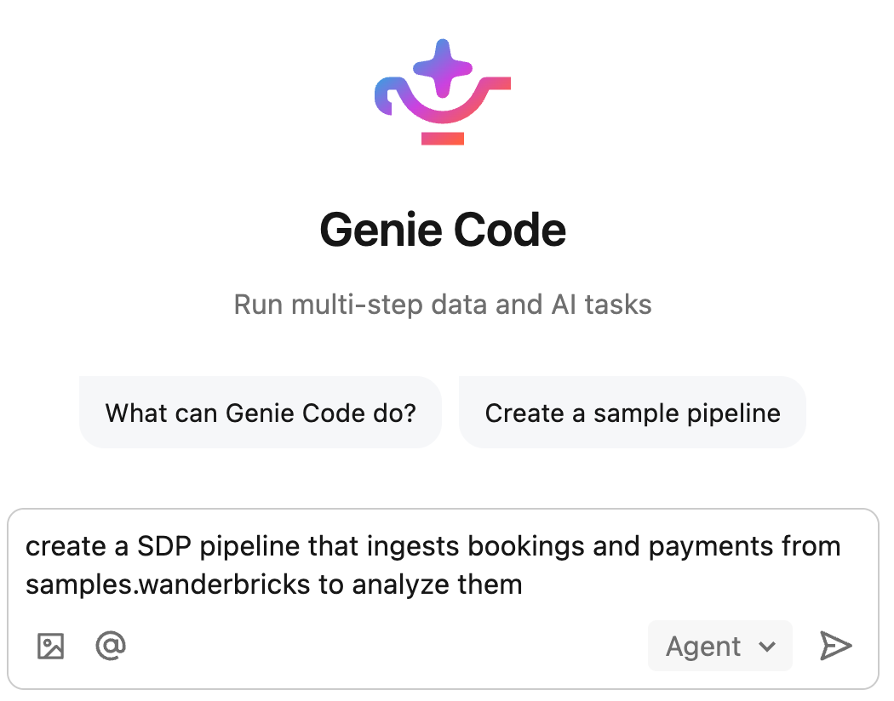
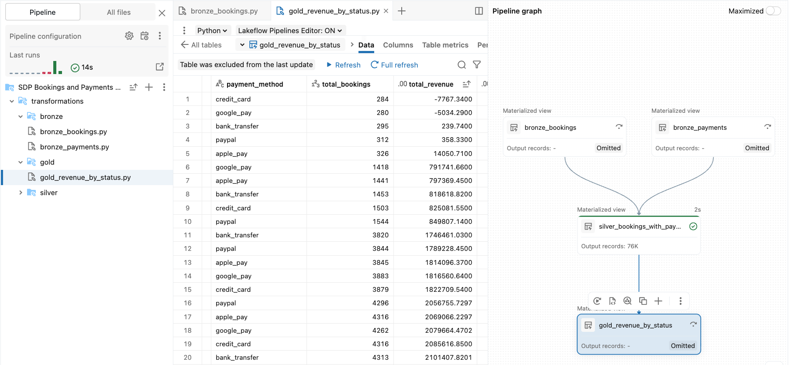

# 🚀 Building an AI-Powered ETL Pipeline in Databricks with Genie Code

Welcome to this mini-tutorial! This guide demonstrates how to rapidly build a data engineering pipeline in Databricks using the AI-powered **Genie Code** assistant. By the end of this tutorial, you will know how to go from a simple natural language prompt to a fully materialized Medallion Architecture (Bronze, Silver, Gold layers).

## 📋 Prerequisites
* Access to a Databricks Workspace.
* Proper compute resources and permissions to create pipelines.
* The source data is always available under  `samples.wanderbricks`

---

## 🛠️ Step-by-Step Guide

### Step 1: Initiate an AI-Assisted Pipeline
1. In your Databricks Workspace sidebar, click the **+ New** button.
2. Select **ETL pipeline** from the dropdown menu.
3. On the configuration screen, click the **Create pipeline with AI** button. This opens the **Genie Code** assistant on the right side of your screen.

### Step 2: Define the Pipeline Requirements
In the Genie Code chat box, type a natural language prompt detailing your pipeline's goal. The AI will analyze your request and fetch schema details from the specified sources.

**Example Prompt:**
> *"Create a SDP pipeline that ingests bookings and payments from samples.wanderbricks to analyze them."*

### Step 3: Review and Approve the Architecture
Genie Code will propose a pipeline architecture. It typically defaults to best practices, such as the **Medallion Architecture**:
* **🥉 Bronze Layer:** Raw data ingestion.
* **🥈 Silver Layer:** Cleaned, filtered, and joined data.
* **🥇 Gold Layer:** Aggregated data ready for business intelligence and analytics.

Review the proposed tables and descriptions in the chat. If everything looks good, simply reply **"ok"** to approve the plan.

### Step 4: Review and Accept Generated Code
1. The AI will generate the required transformations for each layer.
2. Click **Review next** in the editor to cycle through the generated files and inspect the transformation logic.
3. Genie Code will perform a "dry run" to validate the code.
4. Once validation passes, click **Accept All** (bottom right) to save the code to your workspace.

### Step 5: Run the Pipeline Update
Instruct the AI to run the pipeline (or accept its automated suggestion to do so). This triggers a **Pipeline update**, which executes the code and physically materializes your data into the target tables. You can track the progress directly in the chat panel.

### Step 6: Explore the Results and Pipeline Graph
Once the update finishes, you can ask the AI to show you a sample of the final dataset (e.g., the Gold revenue summary). 

To get a visual overview of your entire workflow:
1. Click the **Pipeline graph** tab at the top of the editor.
2. This displays the Directed Acyclic Graph (DAG) of your pipeline.
3. Click on any node (like your Gold table) and select the **View data preview** icon to inspect the data rows.

---

## 💡 Next Steps
* Explore adding data quality expectations to this pipeline.
* Schedule the pipeline to run on a daily trigger. Don't forget to disable this trigger once you are done.