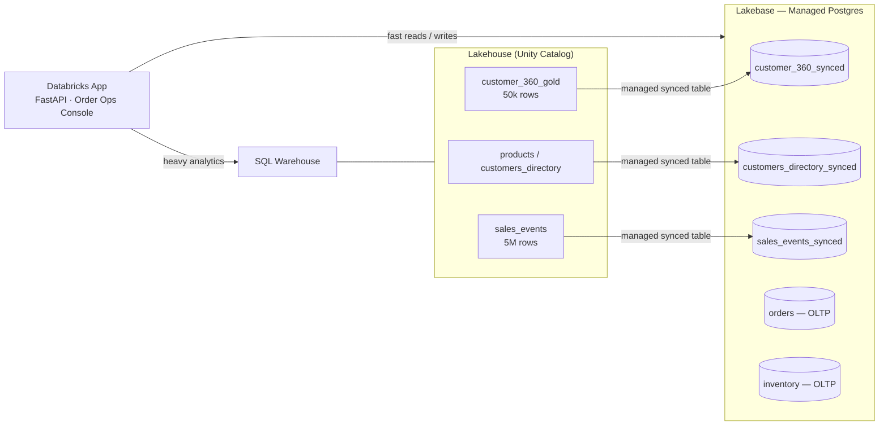

# Lakebase 101 — Order Ops Console

A hands-on demo of **[Lakebase](https://docs.databricks.com/lakebase/index.html)**: managed Postgres (OLTP) on Databricks, fed by **reverse ETL** from the lakehouse, fronted by a **Databricks App**.

It builds one story around a fictional "Order Ops Console":

1. **Reverse ETL** — a Delta *gold* table (`customer_360`) is continuously synced into Lakebase Postgres via a **managed synced table** (no pipeline code to write).
2. **OLTP speed** — the same point lookup runs against Lakebase vs. a SQL Warehouse, side by side, so you can watch millisecond operational reads beat lakehouse scans.
3. **Real transactions** — the app places orders against Lakebase (`INSERT` order + `UPDATE` stock, atomically) — genuine OLTP writes, not analytics.
4. **Right tool for the job** — a 5M-row aggregate join shows the lakehouse (SQL Warehouse) winning heavy analytics, reinforcing *when* to use each engine.

## Prerequisites

- A Databricks workspace with **Lakebase** and **Databricks Apps** enabled.
- The **[Databricks CLI](https://docs.databricks.com/dev-tools/cli/install.html)** (v0.230+), authenticated
- A **SQL Warehouse** you can use (for the speed comparison and analytics panes).
- Permission to create a catalog, a Lakebase project, and a Databricks App.

### Configure before deploying

Edit `databricks.yml` and set these for **your** workspace — the defaults are environment-specific and will not work elsewhere:

| Variable | Where | What to change |
|---|---|---|
| `warehouse_id` | `variables` | Your SQL Warehouse ID |
| `workspace.host` | `targets.dev` | Your workspace URL |

> **App source note:** the app deploys from GitHub (`resources/apps.yml` → `git_repository` on branch `main`). If you fork this repo, point that `url`/`branch` at your fork, and remember that **local edits to `src/app/` take effect only after you commit and push** them — `databricks bundle deploy` pulls the app code from Git, not from your local working copy.

---

## Deploy

The setup is 5 steps steps: clone the repository, bootstrap the Delta source data, deploy the bundle, wire up grants and OLTP tables then deploy and start the app.

1.  **Clone the Git Repository into your Workspace**:
    *   Navigate to **Workspace** in the sidebar.
    *   Click the **Create** button and select **Git folder**.
    *   In the "Create Git folder" dialog, paste the URL `https://github.com/databricks/tmm` of the Git repository.
    *   Select your Git provider (e.g., GitHub).
    *   Enable **Sparse checkout mode** and specify the path to this specific project folder ```Lakebase-101``` within the repository. This ensures you only clone the relevant project files.
    *   Click **Create Git folder**. The repository will be cloned into your workspace.

Then navigate in the folder -> tmm -> Lakebase-101

2. Run src/**00_Setup.ipynb** (generates tables and ~5 Mrows).

3. **Deploy Lakebase infra + synced tables + the app using a Databricks Bundle Asset (DAB)**

You can either deploy it via the UI, click on "Open in bundle edtior" next to Lakebase-101 folder or use the CLI, clone the repo on your machine and run the following in the Lakebase-101 folder:
```
databricks bundle deploy
```

4. Run src/**01_Post_Deploy**.ipynb (Grant the app's service **principal access + create/seed the Postgres OLTP tables)

5. **Start the app**

You can either start the app via in the UI. First go the Databricks Apps, then click on your app name ('lakebase-101-app') and click on Start and then on Deploy (provide 'main' as the branch name and Lakebase-101/src/app for the source code path)


Alternatively, via the CLI
```
databricks bundle run lakebase_101_app
```

Then open the app URL provided in your terminal or in the UI:

> **Order matters.** `00_Setup` must run *before* `bundle deploy` (synced tables reference the Delta sources), and `01_Post_Deploy` must run *after* the bundle deploy (it needs the app's service principal, which only exists once the app is deployed).

---

## Clean up

1.  **Detroy the bundle**:

Similarly, you can delete the bundle via the UI or the CLI. 

```
databricks bundle destroy
```

However, due to limitations today with DAB, Lakebase projects are soft-deleted, and can only be hard-deleted via the CLI. If you don't do the following, you will run into an error when deploying again via the DAB.

```
databricks postgres delete-project projects/lakebase-101-demo --purge
```

2. **Clean up**

To make sure you can redeploy safely, make sure to delete the data and remaining synced tables and table registration that may cause conflicts with further deployment.
```
    *   Run src/99_Cleanup.ipynb in the workspace.
```

---

## Using the app

The console (a FastAPI backend + static frontend) exposes:

| Pane | Endpoint | Shows |
|---|---|---|
| Customer search | `GET /api/customers?q=` | Search the 50k synced directory |
| Speed test | `GET /api/speed/{customer_id}` | Same lookup: Lakebase vs. SQL Warehouse (with speedup) |
| Analytics showdown | `GET /api/aggregate` | 5M-row join: warehouse wins (the "right tool" point) |
| Customer 360 | `GET /api/customer/{customer_id}` | Fast profile read + recent orders |
| Place order | `POST /api/order` | Atomic OLTP write (insert order, decrement stock) |
| Inventory | `GET /api/inventory` | Live stock levels |
| Sync now | `POST /api/sync` | Trigger the managed reverse-ETL pipeline |
| Health / debug | `GET /api/health`, `GET /api/debug` | Connection diagnostics — **hit `/api/debug` first if Lakebase access looks broken** |

---

## Architecture



Reverse ETL uses **native managed synced tables** (`SNAPSHOT` policy), so there is no pipeline code in this repo — the sync is declared in `resources/synced_tables.yml`. The app's `orders` / `inventory` tables are OLTP-native, created and owned in Postgres by the post-deploy step.

---

## Repository layout

```
Lakebase-101/
├── databricks.yml              # Bundle definition + variables + dev/prod targets
├── resources/
│   ├── lakebase.yml            # Lakebase project, branch, endpoint, role, database
│   ├── synced_tables.yml       # Managed reverse-ETL synced tables (Delta → Postgres)
│   └── apps.yml                # Databricks App resource (deploys from GitHub)
└── src/
    ├── 00_Setup.ipynb          # (before deploy) catalog + schema + Delta source tables
    ├── 01_Post_Deploy.ipynb    # (after deploy)  grants + Postgres OLTP tables + seed
    ├── 99_Cleanup.ipynb        # teardown (Delta tables, schema/catalog, sync pipelines)
    └── app/                    # FastAPI app (server/, static/) — source of truth on GitHub
```

---

## Cleanup

`src/99_Cleanup.ipynb` drops the Delta tables, the schema/catalog, and the synced-table pipelines (which `bundle destroy` does not remove). To also remove the Lakebase project, endpoint, and the app itself, run:

```bash
databricks bundle destroy --auto-approve
```

> Run the cleanup notebook first (to catch the auto-created sync pipelines), then `bundle destroy` for the declared infrastructure.

---

## How it works (a bit more detail)

- **Auth to Lakebase.** The app mints a short-lived Lakebase-scoped credential with `w.postgres.generate_database_credential(...)` (requires `databricks-sdk>=0.80.0`) and connects over standard Postgres/psycopg2. Tokens are refreshed before their ~1h expiry (`src/app/server/db.py`).
- **Synced tables** use `SNAPSHOT` scheduling with `create_database_objects_if_missing: true`, so the target Postgres tables are created and populated by the managed pipeline. The app reads them by their Postgres names (e.g. `lakebase_101_schema.customer_360_synced`).
- **OLTP tables** (`public.orders`, `public.inventory`) are created and owned in Postgres by `01_Post_Deploy`, which also grants the app's service principal read access to the synced schema and read/write on the OLTP tables.
- **App configuration** is injected via `src/app/app.yaml` env vars and resource bindings (SQL Warehouse, Lakebase database) — no secrets in code.
