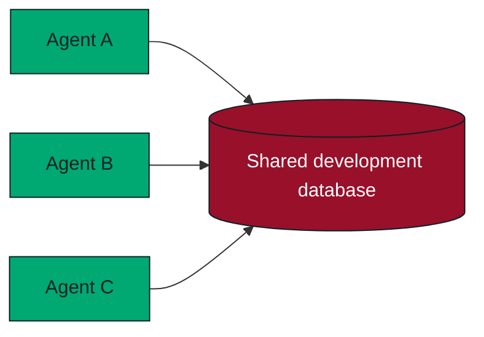
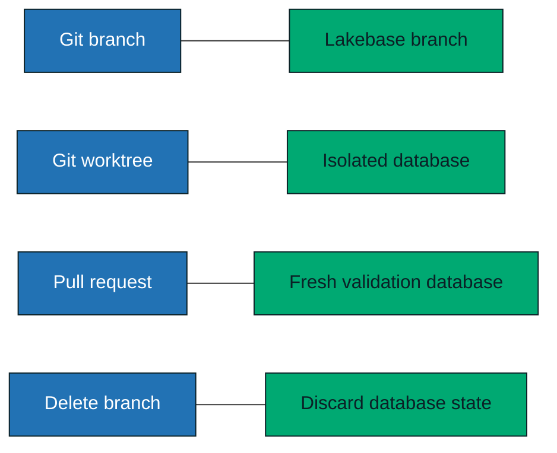
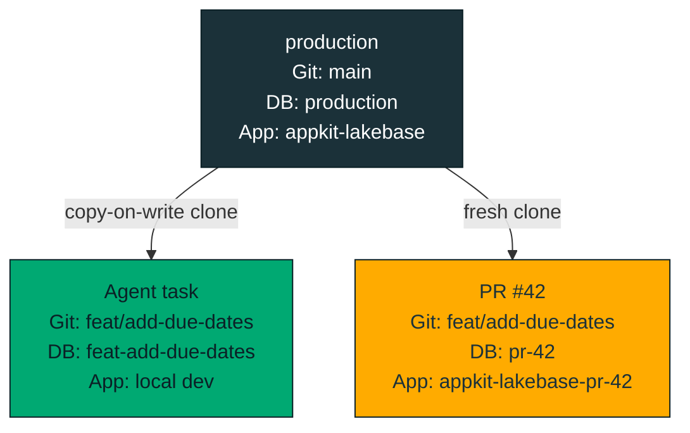
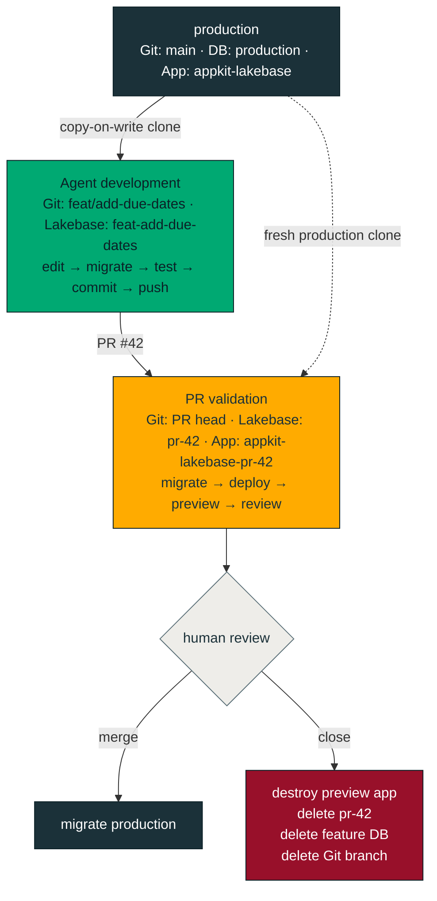
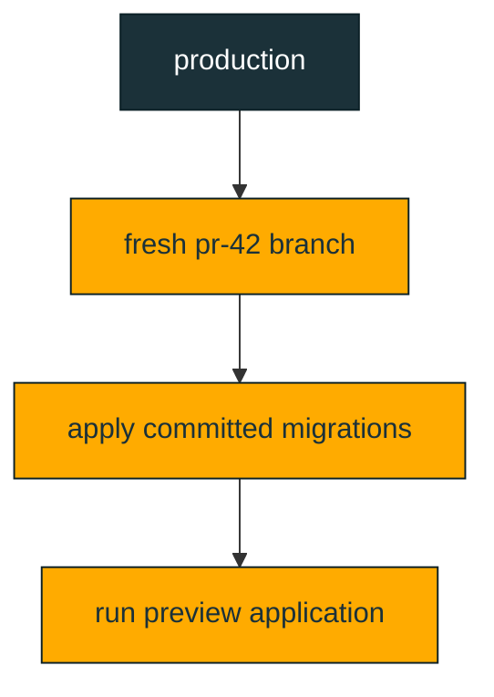
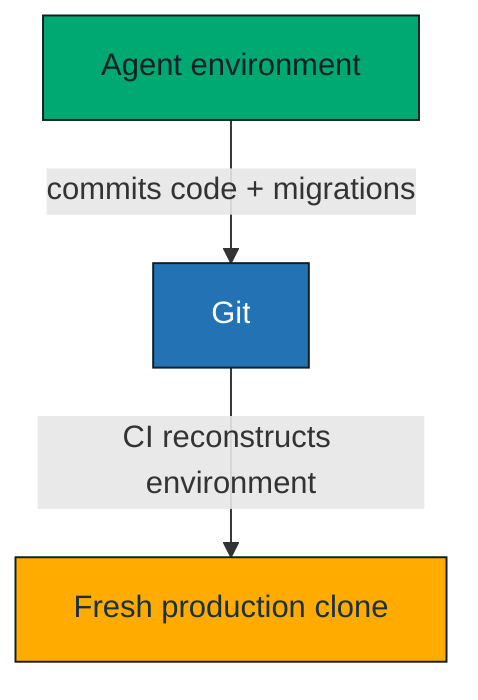
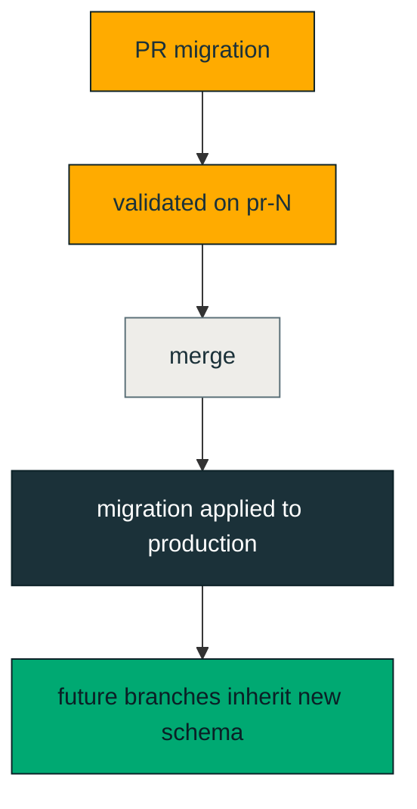

# 🤖 Agentic SDLC with Lakebase Branching

A working example of an **agentic software development lifecycle for AI coding agents** using Lakebase branching (copy-on-write Postgres), Git worktrees, GitHub Actions and hooks. 

> **The Git branch isolates code. The Lakebase branch provides an isolated database. Together, they give an AI coding agent an ephemeral development environment to safely experiment, test, and contribute full-stack changes.**

This repository demonstrates how Claude Code can independently modify application code, database schemas, migrations, and data without touching production or interfering with another task.

Each unit of work gets:

|                  | Production        | Agent development       | Pull request                  |
| ---------------- | ----------------- | ----------------------- | ----------------------------- |
| 🌿 **Git**       | `main`            | feature branch          | PR head                       |
| 🗄️ **Database** | `production`      | feature Lakebase branch | `pr-<number>`                 |
| 🚀 **App**       | `appkit-lakebase` | local development       | `appkit-lakebase-pr-<number>` |

When an agent starts a task in a Git worktree, a `SessionStart` hook gives it its **own** Lakebase branch — a copy-on-write clone of production — so it can change schema and data in full isolation from other agents and from production.

When a pull request is opened, CI creates a **second, fresh** database branch from production (`pr-<number>`), applies the committed migrations, deploys an ephemeral Databricks App, and posts both the schema changes and the preview URL for review.

When the PR merges, migrations are applied to production.

When the PR closes, the preview app and **both** ephemeral database branches (the agent's and the PR's) are deleted.

The application itself is deliberately simple: an [AppKit](https://developers.databricks.com/docs/appkit/v0/) React todo application backed by Lakebase Postgres.

The interesting part of this repository is the **agentic SDLC around the application**.

---

## 📚 Table of contents

* [💡 Why database branching matters for AI coding agents](#why-database-branching-matters-for-ai-coding-agents)
* [🏗️ Architecture](#architecture)
* [🔄 Agent lifecycle](#agent-lifecycle)
* [🧪 Example: an agent adds a database-backed feature](#example-an-agent-adds-a-database-backed-feature)
* [🤖 Agent environment provisioning](#agent-environment-provisioning)
* [🌿 Mapping Git branches to Lakebase branches](#mapping-git-branches-to-lakebase-branches)
* [🗄️ Database schema changes](#database-schema-changes)
* [📦 Why migrations are committed to Git](#why-migrations-are-committed-to-git)
* [🔍 Pull request validation](#pull-request-validation)
* [📝 Schema diff in code review](#schema-diff-in-code-review)
* [🧼 Fresh database validation](#fresh-database-validation)
* [🚀 Ephemeral Databricks App previews](#ephemeral-databricks-app-previews)
* [🏭 Production migrations](#production-migrations)
* [🧹 Automatic cleanup](#automatic-cleanup)
* [🛡️ Safety model](#safety-model)
* [🤖 Claude Code instructions](#claude-code-instructions)
* [📁 Repository layout](#repository-layout)
* [💻 Running locally](#running-locally)
* [🔌 Lakebase connectivity](#lakebase-connectivity)
* [📦 Databricks Asset Bundles](#databricks-asset-bundles)
* [⚙️ One-time CI setup](#one-time-ci-setup)
* [🔐 Postgres schema ownership](#postgres-schema-ownership)
* [👤 Configure `app_schema_owner`](#configure-app_schema_owner)
* [🔑 Preview application database access](#preview-application-database-access)
* [🔒 Least privilege](#least-privilege)
* [🧾 Dependency lockfile note](#dependency-lockfile-note)
* [⚠️ Important workflow behavior](#important-workflow-behavior)
* [🚧 Guardrails](#guardrails)
* [🧠 Design principles demonstrated by this repository](#design-principles-demonstrated-by-this-repository)
* [🔎 Search terms](#search-terms)
* [🏷️ GitHub topics](#github-topics)
* [📌 Summary](#summary)

---

## Why database branching matters for AI coding agents

An autonomous coding agent needs more than source-code isolation.

Without database branching, several coding agents may share the same development database:



That creates several problems:

* one agent's schema migration can break another agent's work
* test data is shared between unrelated tasks
* destructive testing becomes dangerous
* rollback becomes difficult
* agents need coordination around database state
* production-like data is difficult to provide safely
* database state outlives the code branch that created it

With Lakebase branching, the database follows the same lifecycle as the code:



A Lakebase branch is copy-on-write, so creating an isolated environment does not require making a traditional full copy of the database.

That makes **database branching for AI coding agents** practical as part of normal development.

---

## Architecture

Three layers are isolated together.

| Layer    | Production        | Agent development       | Pull request                  |
| -------- | ----------------- | ----------------------- | ----------------------------- |
| Git      | `main`            | feature branch          | PR head                       |
| Database | `production`      | feature Lakebase branch | `pr-<number>`                 |
| App      | `appkit-lakebase` | local development       | `appkit-lakebase-pr-<number>` |

For example:



There are deliberately **two ephemeral Lakebase branches**.

The feature branch is the agent's mutable development database.

The `pr-<number>` branch is a separate validation environment created by CI from a fresh clone of production.

This distinction is important.

**CI never promotes or trusts mutable database state created by the agent.**

Instead, it reproduces the proposed schema changes against a clean production clone using the migration files committed to Git.

---

## Agent lifecycle

A typical feature flows through the system like this:



Production is a **source for cloning**, not an agent workspace.

---

## Example: an agent adds a database-backed feature

Suppose the request is:

```text
Add due dates to todos.
```

The development lifecycle becomes:

```text
1. Agent starts in Git worktree feat/add-due-dates

2. SessionStart hook creates:

   Lakebase branch:
   feat-add-due-dates

3. Agent changes:

   app/server/db/schema.ts

4. Agent generates a migration:

   npm run db:generate

5. Agent applies the migration only to:

   feat-add-due-dates

6. Agent implements and tests the feature.

7. Agent commits and opens PR #42.

8. GitHub Actions creates a fresh branch:

   production → pr-42

9. CI applies the committed migrations to pr-42.

10. CI deploys:

    appkit-lakebase-pr-42

11. CI comments on the PR with:

    - migration SQL
    - preview URL

12. A human reviews the code, schema, and running application.

13. On merge:

    migrations → production

14. On close:

    preview app deleted
    pr-42 deleted
    feat-add-due-dates deleted
```

This is the main pattern demonstrated by this repository.

---

## Agent environment provisioning

This implementation uses Claude Code worktrees and hooks, although the architecture itself is not Claude-specific.

Any coding agent that can operate inside an isolated checkout and receive environment variables can use the same approach.

Claude Code runs the `SessionStart` hook configured in:

```text
.claude/settings.json
```

The hook runs:

```text
.claude/hooks/setup-lakebase.sh
```

Inside a Git worktree, the hook:

1. reads the active Git branch
2. converts it into a Lakebase-safe branch ID
3. creates a copy-on-write Lakebase branch from `production`
4. sets a TTL as a cleanup backstop
5. exports the branch resource identifiers to the agent session
6. removes production database environment variables

For example:

```text
Agent database environment:
  Git branch:      feat_add_charts
  Lakebase branch: feat-add-charts
  Database:        projects/appkit-lakebase-db/branches/feat-add-charts/databases/databricks-postgres
```

The session receives:

```text
AGENT_ENV
LAKEBASE_PROJECT_ID
LAKEBASE_PARENT_BRANCH
LAKEBASE_BRANCH
LAKEBASE_BRANCH_RESOURCE
LAKEBASE_DATABASE_RESOURCE
```

Database credentials are not exported by the hook.

Production database URLs are explicitly removed from the session:

```bash
unset PROD_DATABASE_URL
unset PRODUCTION_DATABASE_URL
```

The main checkout is not treated as an agent development environment, so the hook is a no-op there.

---

## Mapping Git branches to Lakebase branches

Lakebase branch IDs must follow a safe naming format.

The repository uses:

```text
scripts/branch-name.sh
```

to derive the Lakebase branch from the Git branch.

For example:

```text
Fix/BUG-123_edge
```

becomes:

```text
fix-bug-123-edge
```

The generated identifier follows RFC 1123-style rules:

```text
lowercase
[a-z0-9-]
maximum 63 characters
```

The same helper is used by both local development and CI cleanup.

That guarantees that all automation resolves a Git branch to the same Lakebase branch name.

---

## Database schema changes

The database schema is defined in code using **Drizzle**.

The source of truth is:

```text
app/server/db/schema.ts
```

Migration files live under:

```text
app/migrations/
```

To change the schema:

```bash
cd app

# edit server/db/schema.ts

npm run db:generate
npm run migrate
```

`db:generate` produces ordered SQL migration files.

`migrate` applies pending migrations to the database branch configured for the current environment.

During agent development, migrations must only be applied to the worktree's Lakebase branch.

Never apply migrations manually to `production`.

The application itself does not run DDL at startup.

Schema changes are owned exclusively by migrations.

The runtime application performs DML only.

---

## Why migrations are committed to Git

The database branch used during agent development is disposable.

It is not promoted to production.

The durable artifact of a schema change is the migration file committed alongside the application code.

That allows CI to reproduce the database change from scratch:



This makes the database change reviewable and reproducible in the same way as application code.

---

## Pull request validation

Opening, reopening, or pushing to a pull request triggers:

```text
.github/workflows/lakebase-preview.yml
```

The workflow:

1. checks out the PR head
2. determines the PR-specific resource names
3. computes the schema migration diff
4. comments the migration SQL on the PR
5. creates a fresh Lakebase branch from `production`
6. applies the PR migrations
7. deploys the Databricks App preview
8. grants the preview app access to the database
9. comments the preview URL on the PR

For PR `123`:

```text
Lakebase branch:
pr-123

Databricks App:
appkit-lakebase-pr-123
```

The preview app runs the code from the PR branch and connects only to `pr-123`.

---

## Schema diff in code review

The preview workflow compares migration files between the PR base and PR head.

If the PR introduces migrations, their SQL is posted directly on the pull request.

That means a reviewer sees both:

```text
Application code diff
+
Database schema diff
```

before merging.

For database-backed applications, this is useful because schema changes become part of the normal code review surface instead of being hidden behind deployment automation.

---

## Fresh database validation

PR validation does not reuse the agent's development database branch.

CI creates:

```text
production → pr-123
```

and then runs the migration from scratch.

This provides an important trust boundary:



The preview therefore verifies that the migration can actually be applied to production-shaped state.

---

## Ephemeral Databricks App previews

The `preview` target is defined in:

```text
databricks.yml
```

Each pull request gets a separate Databricks App:

```text
appkit-lakebase-pr-<number>
```

and separate bundle state:

```text
.../.bundle/appkit-lakebase/preview/pr-<number>
```

This allows multiple pull requests to deploy concurrently without contending for one shared Databricks bundle lock.

The preview application connects to:

```text
projects/<project>/branches/pr-<number>
```

instead of the production database branch.

---

## Production migrations

When a migration reaches `main`, the workflow:

```text
.github/workflows/lakebase-migrate-prod.yml
```

runs automatically.

It applies pending migrations against the `production` Lakebase branch.

This keeps production synchronized with the code that has been merged.

It is especially important because all future agent and PR branches clone from production.

If production's schema were stale, every newly created branch would inherit that stale schema.

The lifecycle is therefore:



---

## Automatic cleanup

Closing or merging a PR triggers:

```text
.github/workflows/lakebase-cleanup.yml
```

The workflow removes:

```text
Databricks preview app
pr-<number> Lakebase branch
feature Lakebase branch
Git feature branch
Databricks bundle state
```

For PR `123` created from `feat_add_charts`, cleanup removes:

```text
appkit-lakebase-pr-123
pr-123
feat-add-charts
feat_add_charts
```

Lakebase branches also receive a TTL.

The TTL is a safety net for abandoned agent work where a PR is never created or normal cleanup does not run.

Normal cleanup still happens immediately when the PR closes.

---

## Safety model

The main guardrail is simple:

> **An agent may mutate its own environment, but not production.**

The repository enforces this through several layers.

### Git isolation

Each feature runs in its own Git worktree.

Agents are instructed not to switch branches inside that worktree.

### Database isolation

Every worktree gets its own Lakebase branch.

The agent only receives identifiers for that branch.

### Production credentials

Production database URL environment variables are explicitly removed from the agent session.

### Migration promotion

Agents do not directly migrate production.

Production migrations happen only through CI after code reaches `main`.

### Preview reconstruction

CI creates a fresh database branch rather than relying on mutable database state created by the coding agent.

### Human review

The PR contains:

```text
code diff
schema migration SQL
running preview application
```

before merge.

---

## Claude Code instructions

The repository contains:

```text
CLAUDE.md
```

with repository-specific instructions for coding agents.

Among other things, it tells the agent to:

* remain on the assigned Git branch
* modify only its Lakebase branch
* never connect directly to production
* generate migrations through Drizzle
* run checks before completion
* commit all relevant changes
* push the feature branch
* create a draft pull request
* verify GitHub Actions
* mark the PR ready for review
* never merge its own pull request

A feature task is considered complete only when:

```text
changes are committed
changes are pushed
a pull request exists
checks pass
the pull request is ready for review
```

---

## Repository layout

```text
.
├── .claude/
│   ├── hooks/
│   │   └── setup-lakebase.sh
│   └── settings.json
│
├── .github/
│   └── workflows/
│       ├── lakebase-preview.yml
│       ├── lakebase-migrate-prod.yml
│       └── lakebase-cleanup.yml
│
├── app/
│   ├── migrations/
│   ├── server/
│   │   └── db/
│   │       └── schema.ts
│   └── ...
│
├── scripts/
│   └── branch-name.sh
│
├── CLAUDE.md
├── databricks.yml
└── README.md
```

The application lives under:

```text
app/
```

All npm and AppKit commands run from that directory.

The repository root contains the infrastructure for the agentic development lifecycle:

```text
.claude/
.github/
scripts/
databricks.yml
```

---

## Running locally

Run application commands from:

```bash
cd app
```

Install dependencies:

```bash
npm install
```

Run the development server:

```bash
npm run dev
```

Build:

```bash
npm run build
```

Run the production build:

```bash
npm start
```

Quality checks:

```bash
npm run typecheck
npm run lint
npm run format
```

Autofix variants are also available where configured:

```bash
npm run lint:fix
npm run format:fix
```

---

## Lakebase connectivity

Lakebase connectivity uses the environment expected by the AppKit Lakebase plugin.

See:

https://developers.databricks.com/docs/appkit/v0/plugins/lakebase

For local configuration:

```bash
cp app/.env.example app/.env
```

Then configure the relevant Databricks and Lakebase values.

---

## Databricks Asset Bundles

Deployment configuration is defined in:

```text
databricks.yml
```

There are two targets.

### Production

```text
default
```

deploys:

```text
appkit-lakebase
```

from:

```text
main
```

and connects to:

```text
production
```

### Preview

```text
preview
```

deploys:

```text
appkit-lakebase-pr-<number>
```

from the PR's Git branch and connects to:

```text
pr-<number>
```

Deployment commands run from the repository root.

---

## One-time CI setup

The GitHub Actions workflows authenticate to Databricks using a service principal over OAuth M2M.

The service principal needs enough permissions to:

* create and delete Lakebase branches
* run migrations
* deploy preview applications
* configure preview database access

### 1. Create a CI service principal

Create a Databricks service principal and generate an OAuth client secret.

This becomes the identity used by GitHub Actions.

### 2. Grant workspace access

The service principal needs the:

```text
workspace-access
```

entitlement.

Without it, Lakebase API requests can fail because the API is unavailable to identities without workspace access.

### 3. Grant access to the Lakebase project

Grant the CI service principal:

```text
CAN_MANAGE
```

on the Lakebase project.

For example:

```bash
databricks permissions update database-projects appkit-lakebase-db --json '{
  "access_control_list": [
    {
      "service_principal_name": "<CI_SP_CLIENT_ID>",
      "permission_level": "CAN_MANAGE"
    }
  ]
}'
```

### 4. Configure GitHub Actions

Configure these repository or organization variables:

| Kind     | Name                       | Value                            |
| -------- | -------------------------- | -------------------------------- |
| Variable | `DATABRICKS_HOST`          | Databricks workspace URL         |
| Variable | `DATABRICKS_CLIENT_ID`     | CI service principal client ID   |
| Variable | `LAKEBASE_PROJECT_ID`      | for example `appkit-lakebase-db` |
| Secret   | `DATABRICKS_CLIENT_SECRET` | CI OAuth secret                  |

The workflows resolve the branch endpoint and Postgres host dynamically.

A static `PGHOST` is not required.

---

## Postgres schema ownership

Schema migrations require DDL privileges.

DDL operations such as:

```text
CREATE
ALTER
DROP
```

generally require ownership of the relevant Postgres objects.

This repository uses a shared database role:

```text
app_schema_owner
```

That role owns the application schemas.

The CI service principal becomes a member so it can run migrations.

Each preview app uses its own Databricks-generated service principal, so CI grants that identity access to the schema after creating the preview app.

Because Lakebase branches are copy-on-write clones, database roles and object ownership defined on production are inherited by newly created branches.

---

## Configure `app_schema_owner`

On the production branch, as the current schema owner:

```sql
CREATE ROLE app_schema_owner;

GRANT app_schema_owner TO current_user;

ALTER SCHEMA app
OWNER TO app_schema_owner;

ALTER TABLE app.todos
OWNER TO app_schema_owner;

ALTER SCHEMA appkit
OWNER TO app_schema_owner;
```

Reassign additional tables, sequences, or other database objects as required.

Then allow the CI service principal to administer membership:

```sql
GRANT app_schema_owner
TO "<CI_SP_CLIENT_ID>"
WITH ADMIN OPTION;
```

This is a Postgres permission.

It is separate from Databricks control-plane permissions such as:

```text
Admin
CAN_MANAGE
```

`WITH ADMIN OPTION` allows the CI identity to grant membership in `app_schema_owner` to the dynamically created preview application identity.

---

## Preview application database access

Each Databricks App runs as its own service principal.

After deploying a preview application, CI discovers that identity and grants it access to the database.

Conceptually:

```sql
GRANT app_schema_owner
TO "<preview_app_service_principal>";
```

The preview application then inherits access to the relevant schemas.

---

## Least privilege

The current example makes preview application identities members of:

```text
app_schema_owner
```

That is convenient, but broader than necessary for an application that only performs DML.

A stricter production implementation could grant only:

```text
USAGE
SELECT
INSERT
UPDATE
DELETE
```

to preview application identities.

Migration privileges would remain with the CI service principal.

This would further separate:

```text
migration identity
```

from:

```text
runtime application identity
```

---

## Dependency lockfile note

Installing packages through an internal Databricks npm proxy may write internal proxy URLs into:

```text
package-lock.json
```

GitHub-hosted runners cannot access those internal URLs.

After modifying dependencies, run:

Each Databricks App runs as its own service principal.

After deploying a preview application, CI discovers that identity and grants it access to the database.

Conceptually:

```sql
GRANT app_schema_owner
TO "<preview_app_service_principal>";
```

The preview application then inherits access to the relevant schemas.

---

## Least privilege

The current example makes preview application identities members of:

```text
app_schema_owner
```

That is convenient, but broader than necessary for an application that only performs DML.

A stricter production implementation could grant only:

```text
USAGE
SELECT
INSERT
UPDATE
DELETE
```

to preview application identities.

Migration privileges would remain with the CI service principal.

This would further separate:

```text
migration identity
```

from:

```text
runtime application identity
```

---

## Dependency lockfile note

Installing packages through an internal Databricks npm proxy may write internal proxy URLs into:

```text
package-lock.json
```

GitHub-hosted runners cannot access those internal URLs.

After modifying dependencies, run:

```bash
npm run lockfile:fix
```

and commit the updated lockfile.

CI checks for internal proxy URLs and fails early if any remain.

---

## Important workflow behavior

GitHub `pull_request` workflows execute the workflow definition associated with the PR context.

As a result, changes to the preview or cleanup workflow itself may not affect older pull requests in exactly the same way as newly created ones.

For changes to SDLC automation, test with a new branch and pull request after the workflow change reaches `main`.

---

## Guardrails

When working in an agent worktree:

```text
Do not switch Git branches.

Do not connect directly to the production Lakebase branch.

Do not modify production data.

Do not use production database credentials.

Do not manually create or delete preview Databricks Apps.

Do not manually delete Lakebase branches.

Do not apply migrations directly to production.

Do not merge your own pull request.
```

The automation owns environment creation, validation, promotion, and cleanup.

---

## Design principles demonstrated by this repository

This example is built around a few broader ideas.

### Branch state, not only source code

For stateful applications, Git isolation alone is incomplete.

Database branching allows code and state to share the same lifecycle.

### Give agents disposable environments

Agents can operate more autonomously when mistakes are cheap to discard.

A branch should be easier to delete than to repair manually.

### Reproduce rather than promote

Mutable development state should not become production state.

CI reconstructs the proposed database change from migrations against a fresh production clone.

### Keep production outside the agent loop

Agents develop against disposable copies.

Production changes happen through controlled automation.

### Make database changes reviewable

Schema migrations should appear alongside code changes during review.

### Tie cleanup to the pull request lifecycle

When the unit of work disappears, its infrastructure should disappear too.

---

## Search terms

This repository may be useful if you are researching or implementing:

```text
agentic SDLC
AI coding agent workflow
coding agent infrastructure
database branching for AI coding agents
database branch per pull request
branch per PR database
ephemeral database environments
ephemeral preview environments
AI agent database isolation
isolated development databases
copy-on-write Postgres
Postgres database branching
schema migration testing
database migration CI/CD
production-like development databases
Git worktrees for AI agents
Claude Code worktrees
Claude Code hooks
Databricks Lakebase
Lakebase branching
Lakebase Postgres
Databricks Apps preview environments
AppKit
```

---

## Summary

This repository demonstrates a practical pattern for giving AI coding agents safe autonomy over stateful applications.

Each task receives:

```text
isolated code
+
isolated database
+
isolated preview
```

The agent can independently implement and test full-stack changes.

CI then reconstructs those changes against a fresh production clone for human review.

On merge, migrations are promoted through automation.

On close, the entire environment is discarded.

**Git branches isolate code. Lakebase branches isolate state. Together they make branch-per-task full-stack development practical for coding agents.**
