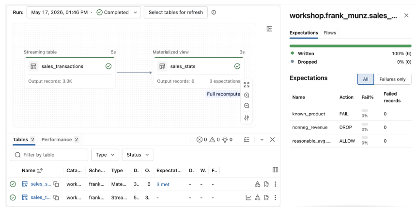
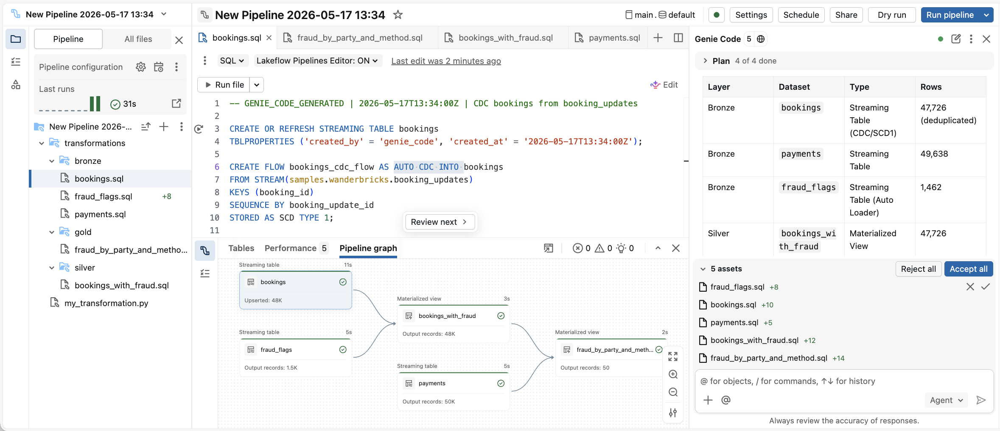

# AI-powered data engineering with Lakeflow

**Version 2.0 - May 2026**

👋 Welcome. This is the lab guide for the **quarterly Databricks Data Engineering workshop**. We're glad to have you here.

Over the next 90 minutes we'll work through the core data engineering knowledge every data engineer should have — **ingestion, transformation, and orchestration** — using the core technologies and OSS frameworks listed in the labs.

Take your time, ask questions, and don't worry about breaking anything — your schema is yours alone. Let's build. 🚀

> **Audience**: entry- to mid-level data engineers, with little or some prior Databricks knowledge. The environment is already set up for you — you have an empty workspace in an account with a pre-assigned schema `de_workshop.USER_ID`.
> This is an instructor-led course. Not a DIY manual. 

### Overview

- **Lab 1 — Manually code an SDP pipeline**: streaming table in **Python**, materialized view in **SQL** with three data-quality expectations wired in from the start. Reference files in [`labs/01-SDP/`](./labs/01-SDP/).
- **Lab 2 — Learn how to use Genie Code as a data engineer**: all-**SQL** pipeline (AutoCDC + Auto Loader + join gold MV), produced from a single Genie Code prompt — and verified by you before it runs. Reference files in [`labs/02-GenieCode/`](./labs/02-GenieCode/).
- **Lab 3 — Work with Zerobus Ingest to push IoT data** *(live instructor demo; attendees may follow along)*: one `ingest_record(...)` call via the official `databricks-zerobus-ingest-sdk` (gRPC) lands a row in `de_workshop.zerobus.measurements`, with credentials fetched from a shared UC config table. Reference files in [`labs/03-Zerobus/`](./labs/03-Zerobus/).
- **Lab 4 — Real-Time Mode for SDP** *(optional)*: deploy a continuous pipeline running in Real-Time Mode (RTM), watch sub-second latency aggregates land in the driver console, and read the engine latency from the driver logs. Reference bundle in [`labs/04-SDP-RTM/`](./labs/04-SDP-RTM/).
- **Lab 5 — CI/CD via Declarative Automation Bundles** *(optional)*: clone a public repo with a DAB, retarget two variables to `de_workshop.USER_ID`, and deploy it from the **Workspace UI**. The equivalent CLI path with `databricks bundle deploy` is included as the CI/CD pattern.

## Important — your user ID

This workshop is designed so it can be run with thousands of participants in a single Databricks account sharing a number of workspaces. We therefore use your **USER_ID** (derived from your login email) to separate schemas and pipelines and avoid namespace clashes.

To get your user ID, check your login email by clicking on the user avatar (e.g. **L**) at the **top right** of the workspace. Example: `labuser10148895_1745997814@vocareum.com` means your user ID is `labuser10148895_1745997814`.

Throughout this guide, replace `USER_ID` with that exact value. Your pre-assigned schema is `de_workshop.USER_ID`.

## Prerequisites (already done by the setup notebook)

- Your catalog `de_workshop` / your schema `de_workshop.USER_ID` already exists and is writable.
- A shared volume exists at `/Volumes/de_workshop/shared/landing/` with a seeded subdirectory `booking_fraud_flags/` containing JSON fraud markers keyed by `booking_id`. The volume is **read-only** for attendees (every attendee has `READ_VOLUME`, nobody has `WRITE_VOLUME`), so one attendee cannot disrupt another.
- The Zerobus target table `de_workshop.zerobus.measurements` (`id, city, temperature, comment`), the shared service principal `workshop-zerobus-sp` (with `USE CATALOG` on `de_workshop`, `USE SCHEMA` on `de_workshop.zerobus`, and `MODIFY + SELECT` on the table), and the config table `de_workshop.zerobus.config` (single row holding `client_id`, `client_secret`, `workspace_url`, `workspace_id`, `zerobus_endpoint`) are all pre-provisioned for Lab 3.
- This lab runs completely serverless.
- You can read `samples.bakehouse.*` and `samples.wanderbricks.*` (public sample data).

### Substitutions

Three placeholders show up throughout — resolve them once here, then paste blocks run as-is.

| Placeholder | What to use |
|---|---|
| `USER_ID` | Your user ID, derived from your login email (see preceding row). Example: `labuser10148895_1745997814`. Your schema is `de_workshop.USER_ID`. Throughout the lab, replace USER_ID with your own user ID. |
| `de_workshop` | The catalog used for all labs. This is fixed. No need to change this. |
| `<course_warehouse_name>` / `<course_warehouse_id>` (Lab 3 only) | The course SQL warehouse provisioned for you by the training materials. Your instructor shares the exact name and ID. |
| `prod_warehouse_id` (Lab 5 only) | A running SQL warehouse ID. Find it in sidebar **SQL Warehouses** → click a warehouse → copy the ID from the URL. |

## One-time setup — Clone this workshop repo

Clone this repo into your Workspace once at the start. You get this lab guide and all the labs locally. We use **sparse checkout** so you only pull the workshop subdirectory, not the entire `databricks/tmm` repo.

1. Workspace sidebar → **Workspace** → **Create** → **Git folder**.
2. In the **Create Git folder** dialog:
   - **Git repository URL**: `https://github.com/databricks/tmm`
   - **Git provider**: GitHub
   - **Git folder name**: `de-workshop-repo`
   - Enable **Sparse checkout mode**
   - **Sparse checkout path**: `Lakeflow-DataEng-Workshop-V2`
3. Click **Create Git folder**. The `Lakeflow-DataEng-Workshop-V2/` subdirectory clones into `de-workshop-repo/` in your workspace.


Most of those lab folders have reference files only. Some folders include notebooks that you can run directly, as described below.


## Lab 1 — Manually code a Lakeflow SDP pipeline and Job


In this lab you'll hand-code an end-to-end SDP pipeline: one **streaming table** in Python over the well-known Bakehouse sample dataset, and a **materialized view** implemented in SQL with three data quality constraints. One pipeline. Two files only. 

### Set up the pipeline in the Lakeflow Pipelines Editor

Before you write a single line, create the pipeline that hosts Steps 1a and 1b:

1. Workspace sidebar → **New** → **ETL pipeline**. The **Lakeflow Pipelines Editor** opens with a default name `New Pipeline <date> <time>`.

2. a. **Update pipeline name** Click the name of the pipeline, next to the pipeline symbol at the top of the editor → rename to `pipeline_USER_ID`. Note you must have a unique pipeline name, this is why we use the USER_ID here.  

    b. The editor automatically created a pipeline root folder under your home (`/Workspace/Users/<your-email>/New Pipeline DATE TIME`). Although not necessary, you may decide to rename it to something prettier, such as `pipeline-lab1`.  

3. **Update catalog/schema** Right of the pipeline name, click the catalog/schema selector. Set it to the following values:
   - **Default catalog**: `de_workshop`
   - **Default schema**: copy your `USER_ID` and click **Save**. Make sure to use your correct schema name, since it is writable for you but other schemas aren't writable. **So the pipeline will only run if you select the correct schema.** 
   
   The dropdown sometimes only offers *"Create schema"* even though your `USER_ID` schema already exists — ignore that, the typed/copied literal is accepted. 


4. The default file `my_transformation.py` is already Python and Step 1a below uses Python. 

### Step 1a — streaming table (Python)

Use the **copy** button at the top-right of the code block to grab the snippet, then paste it into the editor. 

(If you ever see an `unexpected indent` error, it's because the editor auto-indented an empty leading line, then use Genie with /fix to correct the data set).

```python
from pyspark import pipelines as dp


@dp.table(
    name="sales_transactions",
    comment="Raw bakery transactions streamed from samples.bakehouse.sales_transactions",
)
def sales_transactions():
    # spark.readStream.table(...) inside @dp.table ⇒ streaming table
    return spark.readStream.table("samples.bakehouse.sales_transactions")
```

Rename the file to `sales_transactions.py` by clicking the file name in the **tab bar** (the title preceding the editor cell) and typing the new name.

Click **Run file**. The DAG sidebar shows one node `sales_transactions` (~3,333 rows). Run file run this transformation only, and not the whole pipeline. 

### Step 1b — materialized view with data-quality expectations (SQL, copy and paste)

Asset browser (the "+" symbol) → **Add → Transformation** → name it `sales_stats`, language **SQL** → **Create**. Paste the block below; it's the materialized view with three expectations wired in:

```sql
CREATE OR REFRESH MATERIALIZED VIEW sales_stats (
    --    Violations are counted in the event log; rows are still written.
    CONSTRAINT reasonable_avg_value
        EXPECT (avg_txn_value BETWEEN 1 AND 1000),

    --    Violating rows are excluded from the target; pipeline continues.
    CONSTRAINT nonneg_revenue
        EXPECT (gross_revenue >= 0) ON VIOLATION DROP ROW,

    --    Any violation aborts the whole pipeline update with the constraint name.
    CONSTRAINT known_product
        EXPECT (product IS NOT NULL) ON VIOLATION FAIL UPDATE
)
COMMENT 'Sales KPIs grouped by product, with data-quality expectations'
AS SELECT
    product,
    COUNT(*)                     AS txn_count,
    SUM(quantity)                AS units_sold,
    ROUND(SUM(totalPrice), 2)    AS gross_revenue,
    ROUND(AVG(totalPrice), 2)    AS avg_txn_value,
    COUNT(DISTINCT customerID)   AS unique_customers,
    COUNT(DISTINCT franchiseID)  AS franchises_selling
FROM sales_transactions
GROUP BY product;
```

Click **Run pipeline**, this run the entire pipeline. The DAG now shows `sales_transactions → sales_stats` (6 rows, one per product). Under Tables in the Expectations column you can see the data quality constraints and open the side panel.

SDP has **one** constraint syntax — `CONSTRAINT <name> EXPECT (<predicate>)` — and **three** violation behaviors: *log* (default), *drop row*, and *fail update*. For didactic reasons, we are wiring all three into one data set.

You might notice, that when running the pipeline the streaming table is not updated again (because it was run run before) since it append new data only once. You could run the pipeline with a full refresh to see this data loaded again or explicitly run that file again. 

**Key teaching points**
- Python for the streaming table 
- SQL for the materialized view. The relative name `sales_transactions` resolves against the pipeline's default catalog + schema.
- You can mix Python and SQL files — no special configuration needed.
- The bakehouse sample data is clean, so all three expectations pass and row counts match a constraint-free version.

**Is this MV incrementally maintained or fully recomputed?**

A materialized view is either *incrementally maintained* (only the rows that changed are reprocessed) or *fully recomputed* on refresh, depending on whether the SDP planner can rewrite the query as an incremental update. Simple projections, filters, and many aggregations qualify for incremental maintenance; `COUNT(DISTINCT …)` — which `sales_stats` uses twice — typically forces a **COMPLETE refresh** because distinct tracking isn't incrementally maintainable without a lot more state.

See Tables / Expectations for the details if a table is incrementalized or not. 

### Step 1c (Optional) — use Lakeflow Jobs to create a Workflow with SDP and a downstream action

Wrap the SDP pipeline and a downstream consumer notebook into a two-task job:

1. Workspace sidebar → **Jobs & Pipelines** → **Create** → **Job**. 
* Name it `workflow_USER_ID`.
2. **Task 1**
* Select **Add another task type** and **ETL Pipeline**
    * Task name **my_pipeline**
    * Type **Pipeline**
    * For **Pipeline** select your `pipeline_USER_ID` from Lab 1. 
    * Save Task
3. **Task 2**
    * Click on **Add task** select Notebook. 
    * Task name: `downstream`. 
    * Type **Notebook**
    * path `labs/01-SDP/downstream.py`  
    * Under **Depends on**, select `pipeline`.
4. Click **Run now**. 
* Verify the job executes. The pipeline runs first; on success the notebook fires and prints to its task log.
* Check out the possible triggers for a job


### Lab 1 take-away

In a few lines, you've built a streaming table ingest of bakehouse transactions, a materialized view that summarizes sales by product, and three data-quality expecations with different actions. 


The same shape, written without SDP, would be a streaming job, a batch job, and a scheduler — three separate systems to wire together and keep in sync. Here it lives in one pipeline, expressed as the *target table* you want, and the platform owns the rest.

Running the pipeline with an addtional downstream action as a multi-step workflow gave you a production ready job that can be invoked by any Job trigger. 





---

## Lab 2 — learn how to use Genie Code as a data engineer

In Lab 1 you typed every line. Lab 2 you type *one* — the prompt. Genie Code is the AI-powered tooling that builds an entire SDP pipeline. It ingests from three different sources in SQL, creates JOINs and a gold table:
* AutoCDC on the `booking_updates` CDC feed
* Auto Loader on a JSON volume of fraud markers for certain bookings
* a plain streaming table on payments

You prompt, you review, you approve.

The skill this lab teaches isn't typing SQL. It's catching the draft that *looks* right and isn't.

### Set up a fresh pipeline

1. Workspace sidebar → **New** → **ETL pipeline**. Rename to `pipeline_USER_ID_lab2`. The editor auto-creates a workspace folder of the same name under your home — Genie Code writes the five SQL files it generates there.
2. Set **Default catalog** to `de_workshop` and **Default schema** to `USER_ID` (same as Lab 1).


### Open Genie Code

1. Upper-right of the workspace → click **Genie Code**. The side panel opens.
2. At the bottom of the Genie Code pane, confirm the **Agent** mode selector is set to **Agent** (not **Chat**).
3. Expect approval prompts (Allow / Decline / Allow in this thread / Always allow) whenever Genie Code wants to create a file or run code — **never** click *Always allow* in this lab; reviewing each diff is the point.

### The prompt

Paste the following into Genie Code Agent:

```text
build a SQL pipeline with SDP that answers:
"Is fraud risk related to party size and payment method?"

Inputs:
1. samples.wanderbricks.booking_updates — a CDC stream of booking state-update events 
2. samples.wanderbricks.payments streaming data 
3. /Volumes/de_workshop/shared/landing/booking_fraud_flags/with JSON files marking fraudulent bookings 

* mark all bookings with fraud in bookings_with_fraud.
* gold materialized view fraud_by_party_and_method: use bookings_with_fraud and payments 


Run the pipeline, report row counts, and answer the question about fraud and its correlation.
```

This prompt is deliberately higher-level — it states the *business question* and the *inputs*, and lets Genie Code plan the solution (table names, columns, join shape, aggregation form). This is the honest way to use an AI data engineering agent.

### Verify — the step that matters most

Because the prompt is rather high-level, Genie Code has room to make choices. **Don't worry if your solution looks slightly different, Genie Code is continuously improved.**

Before clicking **Allow** on each proposed file, check it against the reference SQL below. Expected properties of a good generation:

- `bronze/bookings.sql` uses the **AutoCDC** pattern from `samples.wanderbricks.booking_updates`
- `bronze/fraud_flags.sql` uses Auto Loader with `STREAM(read_files(...))` on the JSON volume
- `bronze/payments.sql` is a plain stream over the Delta source
- `silver/bookings_with_fraud.sql` is a materialized view that joins bookings with fraud flags

- A gold table joins data from all three input sources

Note, that AutoCDC with SDC1 is a time-lapse, not a scrapbook. Every update collapses into one current row per `booking_id` — the latest state wins, history fades.

**`SCD TYPE 1` vs `SCD TYPE 2`.** Type 1 keeps only the current row per `booking_id` — every update overwrites in place, no history. Type 2 keeps every historical version with `__START_AT` / `__END_AT` columns so you can query *as of* a past time. The lab uses Type 1 because the gold question asks about current state.

### Ask Genie Code in chat mode

Switch Genie Code to **Chat** mode and ask:

```text
Explain the data flow in this pipeline end-to-end. Which node is incrementally maintained versus fully recomputed on refresh, and why?
```

### What you should see



The Lakeflow Pipelines Editor shows Genie Code's plan on the right, the generated SQL in the centre, and the resolved DAG with row counts at the bottom — three bronze streaming tables, one silver streaming table, and a gold materialized view. Use the row counts as your sanity check against the [Verify](#verify--the-step-that-matters-most) section.

---

## Lab 3 — Work with Zerobus Ingest to push IoT data

Lab 3 flips the script: until now you ingested data that was available to you (sample tables, a JSON volume, a CDC stream). Now **you** are the IoT producer, emitting IoTs events to Zerobus Ingest which stores data in a Delta table in the Lakehouse.

**What's already provisioned for you:**

- **Zerobus table** — a Delta table `de_workshop.zerobus.measurements` (`id STRING, city STRING, temperature FLOAT, comment STRING`). Every event lands here.
- **Producer identity** — a service principal `workshop-zerobus-sp` with `USE CATALOG` on `de_workshop`, `USE SCHEMA` on `de_workshop.zerobus`, and `MODIFY + SELECT` on that one table. The SDK authenticates as this SP from your notebook (the full UC chain is required for the OAuth `authorization_details` payload).
- **Config table** — This is only required to execute the lab. Typically these values are available in your IoT producer. We use the table `de_workshop.zerobus.config`, a single row holding `client_id`, `client_secret`, `workspace_url`, `workspace_id`, and `zerobus_endpoint`. The notebook (IoT producer) reads its config data from here.

**Overview of what you do:** open the notebook, set three parameters (city, temperature, comment), use the official **Databricks Zerobus Ingest SDK**, which opens a gRPC stream, ingests one event with a fresh UUID, flushes for durability, closes. 

Then you verify the event landed — first inside the notebook, then from a SQL warehouse as a downstream consumer.

**Shared Zerobus table, thousands of simultaneous producers.** This same `de_workshop.zerobus.measurements` table is the target for *every* attendee in the workshop. When the instructor signals go, all of you fire `ingest_record` and write to the same Delta table. Zerobus is built to absorb exactly this shape of load: many concurrent streams converging on one table. 

By the end of the lab you'll see every attendee's events sitting alongside your own — a live demo of what a real fleet of IoT producers looks like on the wire.

### Target

| catalog | schema | table | columns |
|---|---|---|---|
| `de_workshop` | `zerobus` | `measurements` | `id STRING, city STRING, temperature FLOAT, comment STRING` |


### Step 3a — Open the notebook from the cloned repo

In the Workspace sidebar, navigate to your cloned `de-workshop-repo/Lakeflow-DataEng-Workshop-V2/labs/03-Zerobus/send_temperature.py` and click to open it. The notebook runs directly from the Git folder. 

The notebook ships with `databricks-zerobus-ingest-sdk` already declared in its **Environment** (top-right Environment icon). On first attach, the serverless runtime builds that dependency into the notebook's cached venv — no manual click-through, no `%pip install`, no per-session install delay. 

### Step 3b — Fill in the widgets at the top

- **City** — your city (e.g. `Munich`)
- **Temperature (°C)** — any float (e.g. `21.5`)
- **Comment (optional)** — a free-form note (e.g. `Hello Zerobus`); leave the default or blank if you don't care.

### Step 3c — run the **Submit** cell

That cell calls `submit_temperature(CITY, TEMPERATURE, COMMENT)`, which the notebook's plumbing cell defines. The plumbing cell is marked **⛔ DO NOT MODIFY** 

```python
sdk = ZerobusSdk(_SERVER_ENDPOINT, unity_catalog_url=_WORKSPACE_URL)
stream = sdk.create_stream(_CLIENT_ID, _CLIENT_SECRET, table_props, options)
stream.ingest_record(json.dumps(record))
stream.flush()
stream.close()
```

The SDK handles the OAuth token exchange and scoping internally — the attendee never sees an `authorization_details` payload or a bearer token. On success you'll see:

```
✅ Sent to de_workshop.zerobus.measurements: {'id': '…', 'city': 'Munich', 'temperature': 21.5, 'comment': 'Hello Zerobus'}
```

### Step 3d — Verify your row landed

Pick **one** of the two surfaces below. The data is the same governed Delta table either way; the choice is whether you read it from the notebook (still attached to the serverless runtime that just wrote it) or from a SQL warehouse (the consumer view a dashboard would use).

Zerobus is **at-least-once** at the protocol level — durability ACKs come back per record, and a client that retries on transport errors may produce duplicates. Order isn't guaranteed across producers.

**Option A — in the notebook.** The last cell runs a `%sql` query against `de_workshop.zerobus.measurements`, ordered by city and temperature. Find your row by the city you typed at the top — it appears within a few seconds.

**Option B — in Databricks SQL.** Read the table as a downstream consumer. This proves the row is a real row in a real governed table, queryable by anything that can talk to a SQL warehouse — a BI dashboard, a downstream pipeline, a JDBC client, `ai_query(...)`.

1. Workspace sidebar → **SQL Editor** → **New query**.
2. In the top-right warehouse picker, select the **course warehouse** — `<course_warehouse_name>` (ID `<course_warehouse_id>`). It was provisioned for you by the training materials, so it's already running; you don't need to start a warehouse of your own.
3. Paste and run:

```sql
SELECT id, city, temperature, comment
FROM de_workshop.zerobus.measurements
ORDER BY city, temperature;
```

You should see every attendee's row, including your own. In a real production deployment this is the query a dashboard would run, refreshed on a schedule — same table, same grants, no separate serving tier.


### What to take away

- **Direct-to-Delta ingest** — one `ingest_record` call, one row, no intermediate bus. The SDK holds a gRPC stream with durability ACKs, so it scales from a single-record demo like this to high-throughput production producers.
- **Fine-grained OAuth — like a hotel keycard, not a master key.** The SDK mints tokens scoped via `authorization_details` to one table: even if the SP's client_secret leaked, the only thing it could do is append rows to `measurements`. No `SELECT *`, no `DELETE`, no `DROP`.
- **SDK over REST** — the `databricks-zerobus-ingest-sdk` uses gRPC with a persistent stream and durability ACKs (higher throughput, simpler retries) and handles all the OAuth + `authorization_details` plumbing internally. The Zerobus REST API is available too.

> Reference notebook: [`labs/03-Zerobus/send_temperature.py`](./labs/03-Zerobus/send_temperature.py).

---

## Lab 4 — Real-Time Mode for SDP (optional)

> **Optional.** Skip if you're short on time — nothing else in the workshop depends on it. The whole demo is a single file deployed via a Declarative Automation Bundle, ~5 minutes hands-on.

Standard SDP runs as micro-batches. The new **Real-Time Mode (RTM)** pushes end-to-end latency into the millisecond range by combining long-running batches, simultaneous stage scheduling, and streaming shuffle. This lab shows **how to enable RTM** for an SDP pipeline — the three config steps you need, deployed as a bundle.

**Public Preview:** Currently, RTM for Lakeflow SDP requires the SDP **PREVIEW** channel.

_This lab assumes that the latest update with the syntax used in the pipeline code is rolled out (end of May 2026)._

### The three config steps to enable RTM

1. **Continuous mode** at the pipeline level.
2. **`spark.databricks.streaming.realTimeMode.enabled = true`** in the pipeline's Spark config.
3. **An `@dp.update_flow`** (not `@dp.table` / `@dp.view`) with `pipelines.trigger: "RealTime"`.

All three are already wired into the bundle you're about to deploy.

### What you'll deploy

A minimal pipeline in one file: a synthetic `rate` source, a sliding-window aggregation (10-second window, 2-second slide), and a `console` sink so the windowed rows land in the driver log where you can see them.

### Step 4a — Open the RTM bundle

You already cloned the workshop repo at the start of this workshop. Navigate to the `labs/04-SDP-RTM/` subdirectory — it has `databricks.yml` and `sdp-rtm-rate-source/transformations/temperature_rtm.py` ready to deploy.

### Step 4b — Adjust the bundle for your schema

Open `labs/04-SDP-RTM/databricks.yml`. Two variables drive the deploy — set them to your values:

```yaml
variables:
  catalog_name:
    default: de_workshop       # leave as-is for this workshop
  schema_name:
    default: USER_ID           # ← replace with your own USER_ID
```

`continuous: true`, `serverless: true`, `channel: PREVIEW`, and the RTM enable flag are already set. Leave them as-is. The pipeline's `root_path` is set to `./sdp-rtm-rate-source` so the Lakeflow Pipelines Editor treats that subfolder as the project tree root.

The flow file `sdp-rtm-rate-source/transformations/temperature_rtm.py` is the actual RTM pipeline — note the `@dp.update_flow` decorator with `pipelines.trigger: "RealTime"`, the synthetic `rate` source, and the windowed aggregation:

```python
from pyspark import pipelines as dp
from pyspark.sql.functions import avg, col, count, expr, max as max_, min as min_, window

dp.create_sink(
    "hot_temperatures_sink",
    "console",
    {"mode": "append", "truncate": "false"},
)


@dp.update_flow(
    name="temperature_rtm_flow",
    target="hot_temperatures_sink",
    spark_conf={
        "pipelines.trigger": "RealTime",
        "pipelines.trigger.interval": "2 minutes",
    },
)
def temperature_rtm_flow():
    return (
        spark.readStream
        .format("rate")
        .option("rowsPerSecond", "100")
        .load()
        .withColumnRenamed("timestamp", "source_timestamp")
        .withColumn("temperature_c", expr("19 + rand() * 7"))
        .withWatermark("source_timestamp", "10 seconds")
        .groupBy(window(col("source_timestamp"), "10 seconds", "2 seconds"))
        .agg(
            count("*").alias("event_count"),
            avg("temperature_c").alias("avg_temp_c"),
            min_("temperature_c").alias("min_temp_c"),
            max_("temperature_c").alias("max_temp_c"),
        )
        .select(
            col("window.start").alias("window_start"),
            col("window.end").alias("window_end"),
            col("event_count"),
            col("avg_temp_c"),
            col("min_temp_c"),
            col("max_temp_c"),
        )
    )
```


### Step 4c — deploy and run from the Workspace UI

1. Open the `labs/04-SDP-RTM/` folder in your Workspace. Because `databricks.yml` is present, the **Deployments** icon (🚀) appears in the left pane.
2. Click **Deployments** → pick the **`prod`** target (the only one defined in this bundle) → **Deploy**.
3. After validation and deployment finish, open the deployed `sdp-rtm-rate-source` pipeline. **Note:** because the pipeline is `continuous: true`, the deploy already auto-started the first update — there's nothing to click. 

If you do click **Run** but the pipeline is running already, you might see *"An active update already exists for pipeline …"*, which is expected. Just leave the existing update running.

### Step 4d — Verify the pipeline output

Open the driver log to confirm the pipeline is producing output:

1. In the Lakeflow Pipelines Editor, with your `sdp-rtm-rate-source` pipeline open, click **Compute** at the top.
2. In the compute pane, click **Driver logs**.

**Console sink batch tables — the windowed aggregate landing in the sink.** These are visual confirmation that data is flowing through the RTM flow:

```
+--------------------+--------------------+-----------+------------------+------------------+------------------+
|window_start        |window_end          |event_count|avg_temp_c        |min_temp_c        |max_temp_c        |
+--------------------+--------------------+-----------+------------------+------------------+------------------+
|2026-05-15 09:42:18 |2026-05-15 09:42:28 |1000       |22.51             |19.00             |25.99             |
```


* You can opt to register a `StreamingQueryListener` to display the [latency of RTM](https://docs.databricks.com/aws/en/structured-streaming/stream-monitoring).
* Alternatively, check the log4j output for entries with the substring `e2eLatencyMs`.

### Step 4e — Stop the pipeline when you're done and remove it 

The pipeline is **continuous and serverless**, so it keeps consuming compute until you stop it. Always stop it when you've finished observing latency:

- In the Lakeflow Pipelines Editor with the pipeline open, click **Stop** at the top, **or**
- Remove the deployment using the same UI with the rocket symbol that was used for deployement. 


---

## Lab 5 — CI/CD via Declarative Automation Bundles (optional)

> **Optional / take-home.** Skip if you're short on time. The whole demo is a sparse-clone of an external repo plus a few clicks in the **Deployments** pane. ~10 minutes hands-on.

A modern data application lives in more than one place — a pipeline, a job, a dashboard, a connector flow. A **Declarative Automation Bundle** (DAB — formerly *Databricks Asset Bundle*) collapses all of that into one folder: `databricks.yml` plus `resources/`, versioned like code. No shell recipes, no drift between envs, no screenshot-driven promotion.

You'll sparse-clone `databricks/tmm/Lakeflow-Gourmet-Pipeline` into your workspace, retarget two variables, and deploy, run it. 

The Gourmet Pipeline lab showcases a global restaurant chain that is seeking AI insights based on live data for their marketing campaigns
 — SQL medallion architecture 
 - SDP pipeline, `gourmet-workflow` 
 - job with `ai_query` enrichment, if/then, SDP, notebooks etc. 
 - AI/BI dashboard 
 -  all deployed entirely from the **Workspace UI**. 
 
 
### Prerequisites

- A running SQL warehouse in your workspace; copy its ID from sidebar **SQL Warehouses** → click a warehouse → URL.

### Step 5a — sparse-clone the bundle (Workspace UI)

Clone only the bundle subdirectory into your workspace, not the whole `databricks/tmm` repo. Same flow you used for the workshop repo at the start.

1. Workspace sidebar → **Workspace** → **Create** → **Git folder**.
2. In the **Create Git folder** dialog:
   - **Git repository URL**: `https://github.com/databricks/tmm`
   - **Git provider**: GitHub
   - **Git folder name**: `gourmet`
   - Enable **Sparse checkout mode**
   - **Sparse checkout path**: `Lakeflow-Gourmet-Pipeline`
3. Click **Create Git folder**. The `Lakeflow-Gourmet-Pipeline/` subdirectory clones into `gourmet/` in your workspace.

### Step 5b — Retarget two variables

In the cloned `gourmet/Lakeflow-Gourmet-Pipeline/` folder, open `databricks.yml` in the workspace editor and edit the `variables` block:

```yaml
variables:
  catalog_name:
    default: de_workshop       # ← was daiwt_gourmet
  prod_warehouse_id:
    default: <your-warehouse-id>   # ← paste from SQL Warehouses
  schema_name:
    default: ${workspace.current_user.short_name}
                               # leave as-is unless your USER_ID schema differs
```

If your `USER_ID` schema doesn't match `${workspace.current_user.short_name}`, override `schema_name` to the literal `USER_ID` value. Also check `targets.presenter` — if it overrides `schema_name`, point it at the same value.

> **Retargeting is mandatory, not optional.** The default catalog `daiwt_gourmet` does not exist in the workshop workspace, so the deploy fails unless you change `catalog_name` to `de_workshop` (and supply a real `prod_warehouse_id`).

### Step 5c — deploy to the `presenter` target (Workspace UI)

1. In the cloned `gourmet/Lakeflow-Gourmet-Pipeline/` folder in your Workspace, the **Deployments** icon (🚀) appears in the left pane because `databricks.yml` is present.
2. Click **Deployments** → pick the **`presenter`** target (the only one defined in this bundle) → **Deploy**.

Deploy uploads the bundle assets (notebooks, SQL files, resource definitions), creates/updates the SDP pipelines, the `gourmet-workflow` job, and the AI/BI dashboard — all in one click.

### Step 5d — run the workflow (Workspace UI)

After deploy completes, the **Deployments** pane shows the deployed resources with links into the workspace.

1. From the Deployments pane, open `gourmet-workflow` (or navigate to it in **Workflows**).
2. Click **Run now** at the top of the job page.

The run ingests franchise / supplier / transaction data, runs the SDP medallion transformations, executes the AI enrichment steps (`ai_query`, sentiment, translation), and refreshes the dashboard. Watch progress on the run page until completion.

### Step 5e — Tear down (Workspace UI, recommended after the workshop)

1. Open the **Deployments** pane in the cloned bundle folder.
2. Pick the **`presenter`** target → **Destroy**.

This removes everything the deploy created: pipelines, job, dashboard. Source data and the cloned repo are untouched.

### CLI alternative — the basic command set

The Workspace UI **Deployments** pane is one entry point; the **Databricks CLI** is the other. Same bundle, same `databricks.yml`, same `presenter` target — just driven from a terminal. This is the path a CI runner takes on every commit. The commands below are the basic shape; production runs add more flags (auth profile, log level, parameter overrides, `--var` injections, …).

| Command | Purpose |
|---|---|
| `databricks bundle validate` | Parse + check resource shapes; no side effects. |
| `databricks bundle deploy -t <target>` | Upload bundle assets and create/update resources for a target. |
| `databricks bundle run <resource> -t <target>` | Trigger a deployed job/pipeline. |
| `databricks bundle summary -t <target>` | Show what's deployed under this target (URLs, IDs). |
| `databricks bundle destroy -t <target>` | Remove all resources the bundle created in that target. |

To use these, install the Databricks CLI and authenticate once (`databricks auth login --host <your-workspace-url>`), then run them from inside the bundle folder. In a real CI/CD setup you'd add `dev` and `prod` targets to `databricks.yml`, give them environment-specific overrides for `catalog_name` / `prod_warehouse_id` / `mode`, and run `databricks bundle deploy -t dev` on PR open and `databricks bundle deploy -t prod` on merge to main — same bundle, different target.

### Troubleshooting

| Symptom | Likely cause | Fix |
|---|---|---|
| Deploy fails on warehouse ID | `prod_warehouse_id` doesn't exist in your workspace | paste a real warehouse ID from **SQL Warehouses** |
| `SCHEMA_NOT_FOUND` during run | `schema_name` resolved to something that doesn't exist in your catalog | override the `schema_name` default in `databricks.yml` to your literal `USER_ID` value |
| `databricks bundle deploy` prints `Warning: source-linked deployment is available only in the Databricks Workspace` | running the CLI from a terminal (outside the Workspace UI) — `source_linked_deployment: true` only takes effect in the UI Deployments pane | harmless — ignore the warning; the bundle still deploys correctly |

### What to take away

- **A full Lakeflow application in one bundle — Lakeflow Connect, Jobs, and Pipelines together.** The Gourmet bundle isn't a single pipeline; it's an end-to-end data product: three **Lakeflow Connect** ingest flows (franchises, suppliers, transactions), an SDP medallion **pipeline** for transformations, a **`gourmet-workflow` job** that orchestrates ingest → transform → enrich → publish, and an AI/BI dashboard on top. That's the realistic shape of a production data product — multiple Lakeflow surfaces wired together — and DABs let you ship all of it as one unit.
- **AI Functions turn messy sales data into business insights.** Inside the pipeline, `ai_query`, `ai_classify`, `ai_translate`, and friends run inline as SQL functions over the silver tables — no separate model-serving deployment, no glue code. The output answers questions a marketing team actually asks: *which campaigns to run, in which region, in which language, for which product line*. AI moves out of a separate notebook and into the same SQL the medallion is already speaking.
- **DABs make complex data products deployable.** `databricks.yml` + `resources/*.yml` captures pipelines, jobs, dashboards, and Connect flows as versioned code — one file tree, committable, reviewable, deployable from either the **Workspace UI Deployments pane** or `databricks bundle deploy` in CI. Targets (`dev`, `prod`, `presenter`) carry per-environment overrides; branch promotion is just `-t dev` → `-t prod`. Same bundle, different target.

---

## References and other demos

* [Get to know Genie Code: Lakeflow and Analytics](https://www.databricks.com/resources/demos/videos/get-know-genie-code)
* Complete [Lakeflow Demo: From messy sales data to AI insights](https://www.databricks.com/resources/demos/videos/lakeflow-action-gourmet-pipeline-demo-daiwt) (source for Lab 5)
* [Declarative Automation Bundles documentation](https://docs.databricks.com/aws/en/dev-tools/bundles/) (Lab 5)
* [Lakeflow-Gourmet-Pipeline source repo](https://github.com/databricks/tmm/tree/main/Lakeflow-Gourmet-Pipeline) (Lab 5)
* Getting Started with [OSS Apache SDP, VS Code](https://github.com/databricks/tmm/tree/main/OSS-SDP-OpenSkyNetwork)
* [Lakeflow SDP — Real-Time Mode Basics](https://github.com/databricks/tmm/tree/main/Lakeflow-SDP-RTM-Basics) (source for Lab 4)
* RTM demo to watch: [Air Traffic Control with Apache Spark Structured Streaming — Real-Time Mode](https://www.databricks.com/resources/demos/videos/air-traffic-control-with-apache-spark-structured-streaming-real-time-mode)
* Looking for the next Data Engineering workshop, or other [Databricks workshops](https://www.databricks.com/events?event_type=workshop&region=all) for DBSQL, AI, Unity Catalog
