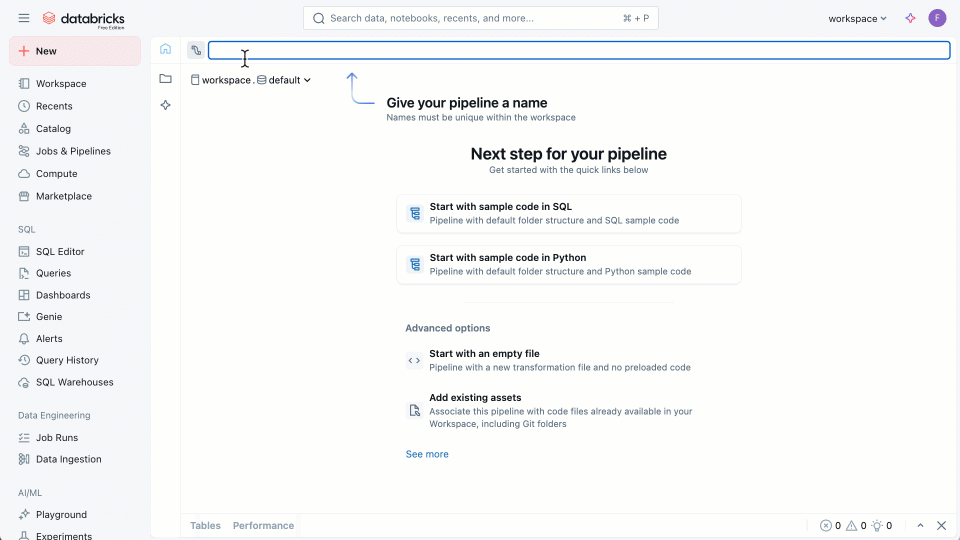
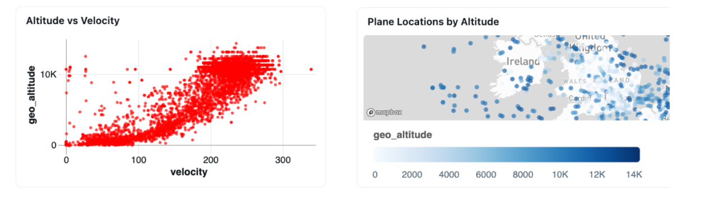
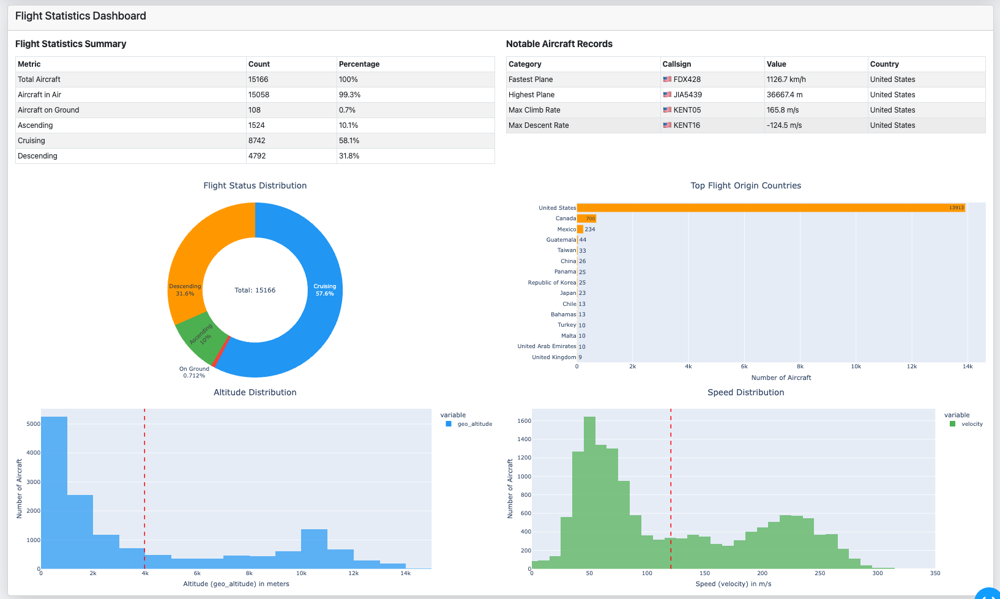

# Processing Millions of Events from Thousands of Aircraft with One Declarative Pipeline

### Fast Track To Lakeflow Declarative Pipelines


This repository provides a small, self-contained Declarative Pipelines example that you can run on the Free Edition of the Databricks Platform. It demonstrates how to build a IoT pipeline using streaming tables, materialized views, and AI-powered queries. We use a custom PySpark data source that connects to real-time aircraft data from the OpenSky Network. 

Learn how to use ingestion, aggregation, and interactive analytics—all with minimal setup and code. This tutorial is based on my Databrick blog about [Building Scalable Systems with Lakeflow Declarative Pipelines and PySpark Custom Data Sources](https://www.databricks.com/blog/processing-millions-events-thousands-aircraft-one-declarative-pipeline). 

---

### Key Features

-   **IoT Streaming Data at Scale:** Ingest, process, and analyze billions of real-time avionics events from aircraft globally.
-   **Declarative:** Focus on *what* you want to build, not *how* to wire it together. Lakeflow handles the orchestration, dependencies, and incremental processing for you.
-   **AI-Driven Analytics:** Unlock natural language queries and rapid insights from your streaming data using AI/BI Genie.
-   **Works on Databricks Free Edition:** No paid account required to get started.

---

## What You'll Build

This hands-on guide walks you through the entire process from data to dashboard in four simple steps:

1.  **Create a Pipeline with a Streaming Table:** You'll use the Lakeflow Pipelines Editor to create a new pipeline and ingest live flight data using a custom PySpark data source with a streaming table.
2.  **Create a Materialized View for Analytics:** You'll add a SQL-based transformation to continuously aggregate the raw data into a summary table for fast analytics.
3.  **Run the Pipeline:** You'll execute the pipeline and watch as Lakeflow automatically manages dependencies and processes the data.
4.  **Explore with Natural Language:** You'll connect your new tables to AI/BI Genie and ask questions in plain English to generate charts and maps instantly.



## Prerequisites

-   A Databricks account. [**Sign up for the Free Edition here**](https://login.databricks.com/signup?provider=DB_FREE_TIER&dbx_source=lf_fm1).
-   Familiarity with the Databricks workspace and the new Lakeflow Pipeline Editor. To learn more, see the [**Lakeflow Pipelines Editor documentation**](https://docs.databricks.com/aws/en/dlt/dlt-multi-file-editor). 
-   Approximately 3-5 minutes.


---

### Step 0: Chose your Path

I thought I'd give you options to learn. 
* I recommend to learn about the Lakeflow Pipelines Editor first and then follow this "Fast Track Guide" hands-on. I am sure this will maximise your learning. 
* If you prefer a detailed step by step walkthrough, expand the [Step-by-Step Guide to Declarative Pipelines](Lakeflow-Pipelines-StepByStep-Instructions.md)
* Stay tuned for video tutorial...

### Step 1: Create Your Streaming Table (Live Aircraft Feed)

The first step is to create a pipeline and ingest live aircraft positions from the OpenSky Network. The Lakeflow Editor works with files. We'll start with a Python file.

```python

# use OSS pyspark package for declarative pipelines
from pyspark import pipelines as dp

# import and register the OpenSky datasource 
from pyspark_datasources import OpenSkyDataSource
spark.dataSource.register(OpenSkyDataSource)

# declare a streaming table
@dp.table
def ingest_flights():
    return spark.readStream.format("opensky").load()
```


#### Environment Setup

Next, you need to add the OpenSky data source to your pipeline's environment. This is the equivalent of running `pip install` for your serverless pipeline.

1.  In your pipeline, navigate to **Settings** → **Environment**.
2.  Add the following package dependency:
    ```
    pyspark-data-sources
    ```

---

### Step 2: Create a Materialized View (Aggregated Flight Statistics)

Next, let's add a second transformation that calculates statistics on the incoming flight data. A materialized view pre-computes results, making it perfect for powering fast analytics and dashboards. We'll create our materialized view using plain SQL.

```sql
-- create a materialized view in SQL
CREATE MATERIALIZED VIEW flights_stats AS
  SELECT
    COUNT(*) AS num_events,
    COUNT(DISTINCT icao24) AS unique_aircraft,
    MAX(vertical_rate) AS max_asc_rate,
    MIN(vertical_rate) AS max_desc_rate,
    MAX(velocity) AS max_speed,
    MAX(geo_altitude) AS max_altitude,
    TIMESTAMPDIFF(SECOND, MIN(time_ingest), MAX(time_ingest)) AS observation_duration
  FROM ingest_flights;
```
---

### Step 3: Run the Pipeline

With your transformations defined, click the **Run pipeline** button. You can explore the pipeline graph, click on the nodes to preview data, and view the **Performance** and **Data** tabs at the bottom of the IDE to see your pipeline in action.

---

### Step 4: Explore with Natural Language Queries

With Genie, you can create a new space and connect the `ingest_flights` and `flights_stats` data tables. Once your data is connected, you can analyze it by asking natural language questions, such as _explain the data set_ to understand the schema or _how many unique flights did we spot?_ to query specific metrics.

Genie also generates visualizations directly from your requests; for instance, ask to _plot the locations of planes with unique call signs_ to create an interactive map, or _plot altitude vs velocity_ to produce a scatter plot analyzing flight characteristics. Try asking the following questions in the prompt box at the bottom:




---

## Visualization Options

-   Use **AI/BI Genie** for instant dashboards and natural language insights.
-   Build custom visualizations with **Databricks Apps** using any modern web framework.
-   Create interactive real-time maps with frameworks like **Dash** and **OpenLayers**.



---

## Optional Configurations

The example above is standalone and should work out of the box. However, you can fine-tune your pipeline for specific regions, authentication, or advanced data filtering.

### Regional Filtering

The data source provides built-in regions to limit data to your area of interest: `AFRICA`, `EUROPE`, `NORTH_AMERICA`, `SOUTH_AMERICA`, `AUSTRALIA`, `ASIA`, and `GLOBAL` (for worldwide coverage)

### Authentication

For production use and higher rate limits, register for API credentials at [opensky-network.org](https://opensky-network.org/):

-   **Anonymous:** 100 calls per day
-   **Authenticated:** 4,000 calls per day
-   **Data contributors:** 8,000 calls per day

### Advanced Streaming Table Configuration

This example adds data quality rules with `@dlt.expect` and configures the data source with a specific region and credentials.

```python
from pyspark_datasources import OpenSkyDataSource
spark.dataSource.register(OpenSkyDataSource)

@dlt.expect("icao24_not_null", "icao24 IS NOT NULL")
@dlt.expect_or_drop("coord_exist", "latitude IS NOT NULL AND longitude IS NOT NULL")
@dlt.table
def ingest_flights():
    return (
        spark.readStream
        .format("opensky")
        .option("region", "EUROPE")
        .option("client_id", CLIENT_ID)
        .option("client_secret", CLIENT_SECRET)
        .option("interval", INTERVAL)
        .load()
    )
```

---

## Learn More

-   [Blog: Bringing Declarative Pipelines to the Apache Spark™ Open Source Project](https://www.databricks.com/blog/bringing-declarative-pipelines-apache-spark-open-source-project)
-   [Documentation: Lakeflow Declarative Pipelines](https://docs.databricks.com/aws/en/dlt)
-   [Documentation: PySpark Custom Data Sources](https://docs.databricks.com/aws/en/pyspark/datasources)
-   [OpenSky Network](https://opensky-network.org/)
-   [Feed your own data to OpenSky](https://opensky-network.org/feed)

---

## FAQ

<details>
<summary>What about Lakeflow Connect and Jobs?</summary>

**Answer:**
This project focuses on Lakeflow Declarative Pipelines for data ingestion and transformation. In this example, the custom connector is provided for you. Lakeflow Connect can orchestrate large-scale ingestion from databases, SaaS apps, and message queues--no custom code required. Lakeflow Jobs helps you schedule, orchestrate, and manage complex workflows that combine pipelines, ML models, and business processes across your data platform. For example, you could use Jobs to integrate these pipelines into a broader logistics workflow.
</details>

<details>
<summary>What about Databricks DLT and Databricks Delta Live Tables?</summary>

**Answer:**
At Data + AI Summit in June 2025, Databricks released Lakeflow. Lakeflow unifies Data Engineering with Lakeflow Connect, Lakeflow Declarative Pipelines (previously known as DLT), and Lakeflow Jobs (previously known as Workflows). DLT is now Lakeflow Declarative Pipelines. 
</details>

<details>
<summary>Can I use Declarative Pipelines for batch processing as well as streaming?</summary>

**Answer:**
Yes! The same code works for both batch and streaming data. You can choose to run the pipeline continuously or schedule it at specific times (for example, every Friday at 3:30 PM). Streaming tables always ingest data incrementally, so batch data is only read once when it's new.
</details>

<details>
<summary>Is it legal to access sensor data from flying planes?</summary>

**Answer:**
The OpenSky Network API provides public access to crowd-sourced aircraft data for private and academic use via their official REST API. Be sure to review their [terms of use](https://opensky-network.org/about/terms-of-use) for any specific limitations or attribution requirements.
</details>

<details>
<summary>Why might I stop seeing new avionic data coming in after a while?</summary>

**Answer:**
OpenSky Network enforces a fair use policy to keep its free service sustainable. Anonymous users face stricter rate limits, which can cause data gaps during peak usage. Creating a [free account](https://opensky-network.org/community/registration) increases your request allowance. For even higher limits, contribute your own ADS-B receiver data--contributors get priority access and help expand global coverage.
</details>

