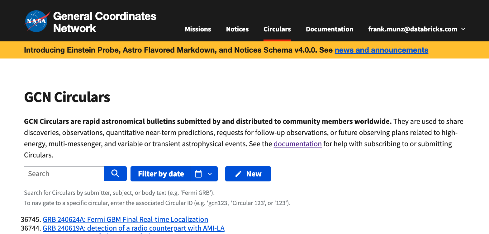
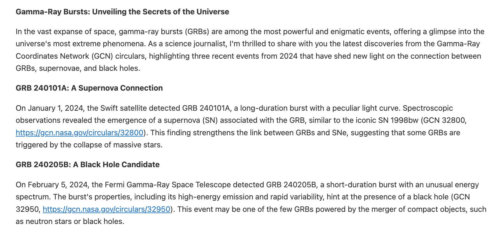

# Streaming Data Pipelines: From Supernovas to LLMs (Circulars + RAG/LLMs)

## Overview 

This project accompanies the Data + AI Summit 2024 presentation "Streaming Data Pipelines: From Supernovas to LLMs", which is available [here](https://www.databricks.com/dataaisummit/session/streaming-data-pipelines-supernovas-llms).

**Note:** This is not a beginner tutorial, nor is it a step-by-step guide. For easy to replicate tutorials, please visit [databricks.com/demos](https://databricks.com/demos).

## Project Description

This hands-on, in-depth project demonstrates the use of 36,000 NASA circulars for a compoind AI application (RAG + LLL). 

* Get the Circulars in packed JSON format from [here](https://gcn.nasa.gov/circulars/archive.json.tar.gz)

* Upload them to a Databricks UC managed volume and extract them
* Use the use the provided DLT pipeline to ingest the data, make sure to specify the right folder to read from
* Chunk the data (as a reference, have a look at the provided data prep notebook) 
* Create a Vector DB endpoint and index using the UI. 

* Define a Langchain template with a question and RAG content. (as a reference have a look at the provided RAG chain notebook) 
* Examine the output and iterate over the prompt. Note that unlike without RAG, this version contains precise data from 2024 and no hallucinations. 

## Additional Resources

- Make sure to read the Databricks documentation about [DLT](https://docs.databricks.com/en/delta-live-tables/index.html) and [Vector DB](https://docs.databricks.com/en/generative-ai/vector-search.html).
- [Slides](https://speakerdeck.com/fmunz/from-supernovas-to-llms-streaming-data-pipelines)
- [Session](https://www.databricks.com/dataaisummit/session/streaming-data-pipelines-supernovas-llms)

## License

The code is provided "as is" without any warranty.

## Contact

For questions about Databricks products, use our forum at community.databricks.com.

## Acknowledgements

We would like to express our gratitude to the following individuals for their contributions and support:

- Judith Rascusin (NASA)
- Alex, Nicolas, Raghu, Praveen, Neil, Eric (Databricks)
