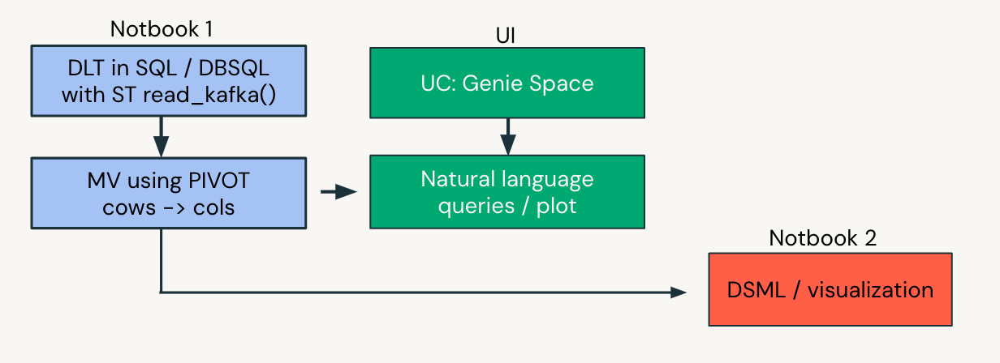
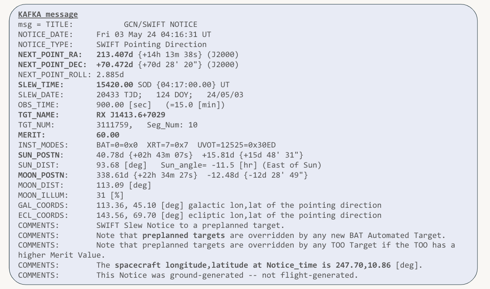

# Streaming Data Pipelines: From Supernovas to LLMs

## Overview

This project accompanies the Data + AI Summit 2024 presentation "Streaming Data Pipelines: From Supernovas to LLMs", which is available [here](https://www.databricks.com/dataaisummit/session/streaming-data-pipelines-supernovas-llms).

**Note:** This is not a beginner tutorial, nor is it a step-by-step guide. For introductory tutorials, please visit [databricks.com/demos](https://databricks.com/demos).

## Project Description

This hands-on, in-depth project demonstrates the use of live streaming data with the Databricks Intelligence Platform, focusing on data engineering. The main challenge addressed is the analysis of real-time data from collapsing supernovas that emit gamma-ray bursts, provided by NASA's GCN project.

Key aspects of the project include:

1. Ingesting data from message buses
2. Comparing Delta Live Tables, DBSQL, and Databricks Workflows for stream processing
3. Coding ETL pipelines in SQL, including Kafka ingestion
4. Demonstrating natural language analytics using Databricks Data Rooms

## Prerequisites

- Intermediate knowledge of data engineering concepts
- Familiarity with Databricks platform
- Basic understanding of streaming data and ETL processes

## Getting Started

This read me assumes that you have watched the original [From Supernovas to LLMs](https://www.databricks.com/dataaisummit/session/streaming-data-pipelines-supernovas-llms) session at DAIS which explains all the context and walks you through the steps required to make this run

## Project Structure

## Usage

1. Clone project notebooks into your Databricks workspace using sparse checkout to get this folder only

2. Get your GCN credentials (clientId and secret) from https://gcn.nasa.gov/quickstart

3. Store the credentials as Databricks secrets using the Databricks CLI
   * We do not recommend using the secrets hardcoded directly

4. Run one of the data ingestion notebooks to start streaming data from GCN 

5. If the data ingestion works, use the provided code to configure a triggered DLT pipeline using serverless compute
   * Make sure to reference the correct secrets from the pipeline code

6. Explore how streaming tables and materialized views are used in the pipeline
   * The pipeline uses streaming tables for ingestion with read_kafka()
   * Materialized views are used for complex transformations such as pivot()
   * With serverless compute, materialized views are recomputed incrementally (if possible)

7. Use the final materialized view from the DLT pipeline and explore it in Unity Catalog "sample data"
   * Right-click on the name of the materialized view in Unity Catalog and enable a Genie Data Room for it

8. Explore the data by asking questions about:
   * The first event
   * The last event
   * The total number of events
   * The distribution of merit values
   * Plot the DEC and RA coordinates (in the DAIS session)

9. Try asking questions in other languages (e.g., Spanish, German, or French) if you speak them

Congratulations! You are now exploring a data stream coming from all of space using natural language.

(Optional) Explore the cleaned and processed data using Databricks SQL or your preferred analysis tools

## Additional Resources

- [Link to the DAIS 2024 presentation]
- [Any relevant documentation or external resources]

## License

The code is provided "as is" without any warranty.

## Contact

For questions or further information, please contact [Your Name/Organization].