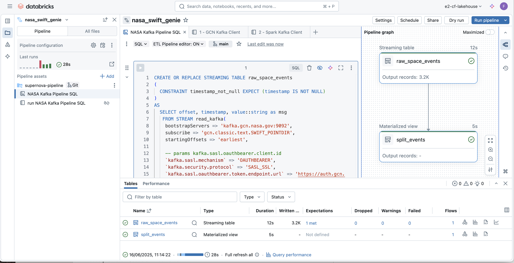
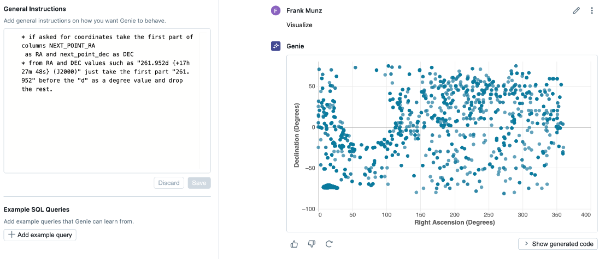

# From Supernovas to Streaming Data Pipelines
###(Lakeflow Declarative Pipelines, Genie, UC, Serverless) 

## Overview

This git project accompanies the Data + AI Summit 2024 presentation "Streaming Data Pipelines: From Supernovas to LLMs", which is available [here](https://www.databricks.com/dataaisummit/session/streaming-data-pipelines-supernovas-llms).

**Note:** This is not a beginner tutorial, nor is it a step-by-step guide. You can find a [getting started guide here](https://docs.databricks.com/aws/en/getting-started/data-pipeline-get-started). For more demos please visit [databricks.com/demos](https://databricks.com/demos).

To better understand the context, I suggest you have read the blog [Supernovas, Black Holes and Streaming Data](https://www.databricks.com/blog/supernovas-black-holes-and-streaming-data) or watched the original DAIS session [From Supernovas to LLMs](https://www.databricks.com/dataaisummit/session/streaming-data-pipelines-supernovas-llms), which provides all the context and walks you through the steps required to make this run.

## Project Description

This hands-on, in-depth project demonstrates the use of live streaming data with the Databricks Intelligence Platform. The main challenge addressed is the analysis of real-time data from collapsing supernovas that emit gamma-ray bursts, provided by NASA's GCN project.

Key aspects of the project include:

1. Ingesting data in SQL from Kafka with read_kafka() and OIDC
2. Comparing Delta Live Tables, DBSQL, and Databricks Workflows for stream processing (see recording)
3. Coding ETL pipelines in SQL with Lakeflow, including Streaming Tables and Materialized Views
4. Demonstrating natural language analytics using Genie Data Rooms

## Prerequisites

- Intermediate knowledge of data engineering concepts
- Familiarity with Databricks platform
- Basic understanding of streaming data and ETL processes

## Usage

1. Clone project notebooks into your Databricks workspace using sparse checkout to get this folder only.

2. Get your GCN credentials (clientId and secret) from https://gcn.nasa.gov/quickstart.

3. Store the credentials as Databricks secrets using the Databricks CLI.
   * I don't **not** recommend putting secrets in the code directly.

4. Run one of GCN of Spark Kafka client ingestion notebooks to start streaming data from GCN. 

5. If the data ingestion works, use the provided code to configure a triggered pipeline using serverless compute.
   * Make sure to reference the correct secrets from the pipeline code.

6. Explore how streaming tables and materialized views are used in the pipeline.
   * The pipeline uses streaming tables for ingestion with read_kafka().
   * Materialized views are used for complex transformations such as pivot().
   * With serverless compute, materialized views are recomputed incrementally (if possible).

7. Use the final materialized view from the pipeline and explore it in Unity Catalog under **sample data** and **Lineage**, then enable a Genie Data Room for it.

8. Explore the data by asking questions about:
   * The first event
   * The last event
   * The total number of events
   * The distribution of merit values
   * Plot the DEC and RA coordinates 

9. Try asking questions in other languages (e.g., Spanish, German, or French) if you speak them.

Congratulations! You are now exploring a data stream coming from all of space using natural language.

(Optional) Explore the cleaned and processed data using Databricks SQL or your preferred analysis tools.

## Additional Resources

- [Slides](https://speakerdeck.com/fmunz/from-supernovas-to-llms-streaming-data-pipelines)

## License

The code is provided "as is" without any warranty.

## Contact

For questions about Databricks products, please use our forum at community.databricks.com.

## Acknowledgements

I would like to express my gratitude to the following individuals for their contributions and support:

- Judith Rascusin (NASA)
- Alex, Nicolas, Raghu, Praveen, Neil, Eric (Databricks)

Their expertise and assistance have been invaluable in the development of this project.
