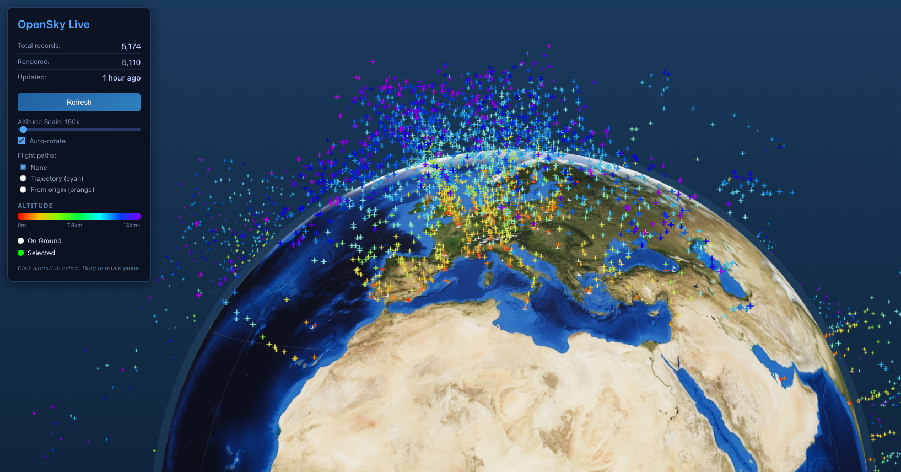

# Avionics 3D

Real-time 3D visualization of worldwide aircraft traffic on an interactive globe.



## Features

- **Interactive 3D Globe** - NASA Blue Marble textured Earth with orbit controls and graticule
- **Live Aircraft Data** - Real-time positions from OpenSky Network API
- **Altitude Color Coding** - Rainbow gradient from low (red) to high (violet) altitude
- **Flight Path Visualization**
  - **Trajectory Mode** - 5-minute forward projection based on heading and velocity (cyan arcs)
  - **Origin Mode** - Great circle arcs connecting aircraft to their country of origin (orange arcs)
- **Aircraft Selection** - Click any aircraft for detailed information panel
- **Hover Tooltips** - Quick info on hover showing callsign, country, and altitude
- **Tether Lines** - Selected aircraft show vertical line to surface
- **Auto-rotation** - Slowly rotating globe (can be toggled)
- **Adjustable Altitude Scale** - Exaggerate altitude for better visibility (100x - 5000x)

## Tech Stack

- **Vite** - Build tool and dev server
- **React** - UI framework
- **TypeScript** - Type safety
- **Three.js** - 3D rendering
- **React Three Fiber** - React renderer for Three.js
- **Drei** - Useful helpers for R3F

## Prerequisites

- Node.js 20.19+ or 22.12+
- npm

## Installation

```bash
npm install
```

## Development

```bash
npm run dev
```

Then open [http://localhost:5173](http://localhost:5173) in your browser.

## Production Build

```bash
npm run build
npm run preview
```

## Architecture

```
src/
├── App.tsx              # Main app component with state management
├── App.css              # Global styles
├── types.ts             # TypeScript interfaces
├── lib/
│   ├── opensky.ts       # OpenSky API fetch and parsing
│   ├── geo.ts           # Coordinate conversion utilities
│   ├── countries.ts     # Country centroid data for origin arcs
│   └── format.ts        # Display formatting helpers
├── components/
│   ├── ControlPanel.tsx # Controls and stats UI
│   └── AircraftInfo.tsx # Selected aircraft details
└── scene/
    ├── Scene.tsx        # R3F Canvas and lighting
    ├── Globe.tsx        # Earth sphere with atmosphere
    └── Aircraft.tsx     # InstancedMesh aircraft markers
```

### Data Flow

1. App fetches from `/api/opensky/states/all` (proxied to OpenSky during dev)
2. OpenSky response is parsed, filtering invalid positions
3. Aircraft state is passed to Scene component
4. InstancedMesh efficiently renders thousands of aircraft markers
5. Interactions update selected/hovered state for UI display

## OpenSky API Notes

- **Anonymous access** is limited to the most recent state vectors
- Anonymous users have **400 API credits per day**
- Anonymous requests get **10-second time resolution**
- This app fetches once on load + manual refresh (no polling)

### Adding Authenticated Access

For higher rate limits and historical data, OpenSky supports OAuth2 authentication. To add this:

1. Create a backend proxy endpoint (e.g., Express server)
2. Implement OAuth2 client credentials flow
3. Store tokens server-side (never in browser)
4. Proxy requests through your backend

Note: OpenSky deprecated basic username/password auth on March 18, 2026. Use OAuth2 for new authenticated integrations.

## Known Caveats

- Large numbers of aircraft (5000+) may impact performance on older devices
- Altitude exaggeration is visual only; actual values shown in info panel
- OpenSky may return partial data during high-traffic periods
- No historical playback in this version

## License

MIT
