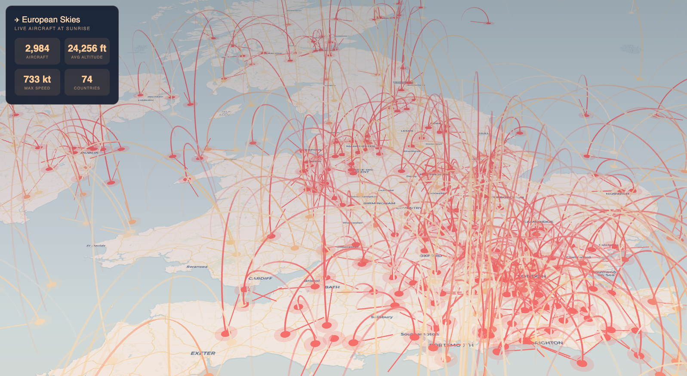

# European Flight Visualization - OpenSky API Demo

A visual proof-of-concept (POC) demonstrating real-time flight data visualization using the OpenSky Network REST API. This project serves as a mockup that may later be integrated into an **Apache Spark Declarative Pipeline (SDP)** example for streaming aviation data processing.


## Overview

This visualization displays live aircraft positions over Europe with a sunrise-themed aesthetic. It fetches data from the OpenSky Network API and renders aircraft on an interactive map with trajectory indicators.


## Purpose

- **Visual mockup** for the OpenSky REST API capabilities
- **Proof of concept** for aviation data visualization
- **Future integration** with Apache Spark Declarative Pipelines (SDP) for real-time streaming data processing examples

## Technology Stack

| Component | Technology | Purpose |
|-----------|------------|---------|
| Map Rendering | [MapLibre GL JS](https://maplibre.org/) v3.6.2 | Open-source map rendering with WebGL |
| Data Visualization | [deck.gl](https://deck.gl/) v8.9.33 | High-performance WebGL overlay layers |
| Base Map Tiles | [CARTO](https://carto.com/) | Light/Dark raster tile basemaps |
| Flight Data | [OpenSky Network API](https://opensky-network.org/) | Real-time aircraft state vectors |

## Features

- **Real-time flight data** from OpenSky Network (Europe bounding box: 35°N-72°N, 15°W-45°E)
- **Altitude-based coloring**: Red (<15k ft) → Gold (15-30k ft) → White (>30k ft)
- **Trajectory lines** showing aircraft heading and direction
- **Interactive tooltips** with flight details (callsign, altitude, speed, heading, vertical rate)
- **Map style toggle** between Light and Dark themes
- **Statistics panel** showing aircraft count, average altitude, max speed, and country count

## API Usage

The application makes a single REST API call to OpenSky Network:

```
GET https://opensky-network.org/api/states/all?lamin=35&lomin=-15&lamax=72&lomax=45
```

### Response Fields Used

| Index | Field | Description |
|-------|-------|-------------|
| 0 | icao24 | ICAO 24-bit transponder address |
| 1 | callsign | Aircraft callsign |
| 2 | origin_country | Country of registration |
| 5 | longitude | WGS-84 longitude |
| 6 | latitude | WGS-84 latitude |
| 7 | baro_altitude | Barometric altitude (meters) |
| 8 | on_ground | Ground/airborne status |
| 9 | velocity | Ground speed (m/s) |
| 10 | true_track | Heading in degrees |
| 11 | vertical_rate | Climb/descent rate (m/s) |

## Project Structure

```
avionics_gl/
├── index.html      # Single-file application (HTML + CSS + JS)
├── README.md       # This file - project documentation
└── CLAUDE.md       # Development context and technical details
```

## Running Locally

1. Clone or download this repository
2. Open `index.html` in a modern web browser
3. No build step or server required

```bash
# macOS
open index.html

# Linux
xdg-open index.html

# Windows
start index.html
```

## Future Integration: Apache Spark SDP

This POC demonstrates the data format and visualization approach that could be used with an Apache Spark Declarative Pipeline for:

- **Streaming ingestion** of OpenSky data via Spark Structured Streaming
- **Real-time transformations** (filtering, aggregations, geospatial calculations)
- **Delta Lake storage** for historical flight tracking
- **Dashboard integration** via this visualization layer

## Limitations

- OpenSky API has rate limits for anonymous users (~10 requests/day)
- Single snapshot of data (no continuous updates in this POC)
- Simplified trajectory prediction (linear extrapolation)

## License

MIT License - Free for educational and demonstration purposes.

## Acknowledgments

- [OpenSky Network](https://opensky-network.org/) for the free flight tracking API
- [MapLibre](https://maplibre.org/) for open-source map rendering
- [deck.gl](https://deck.gl/) by Vis.gl for WebGL visualization
- [CARTO](https://carto.com/) for basemap tiles
