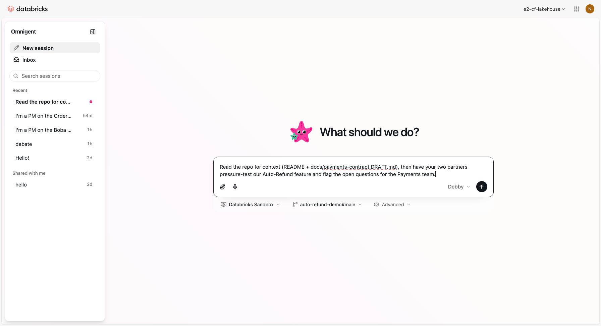
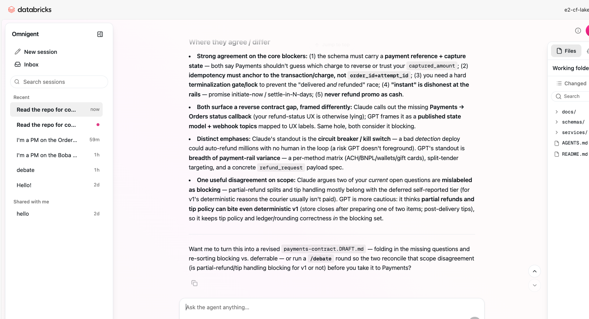
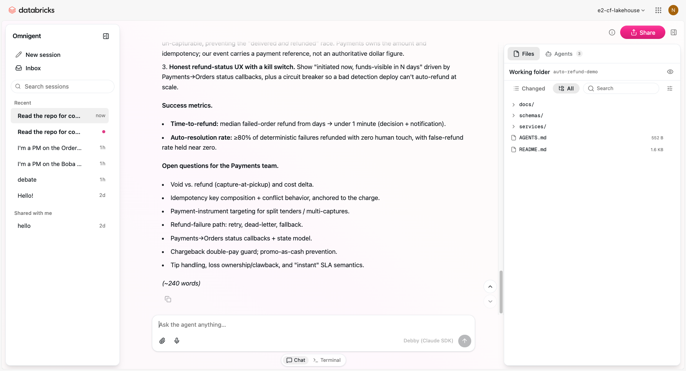
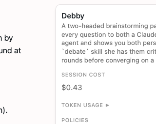
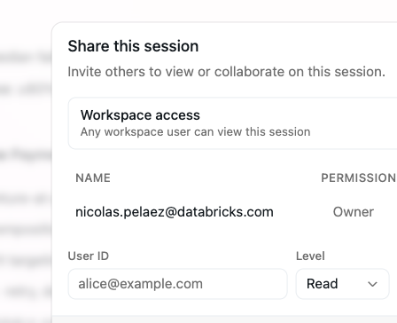
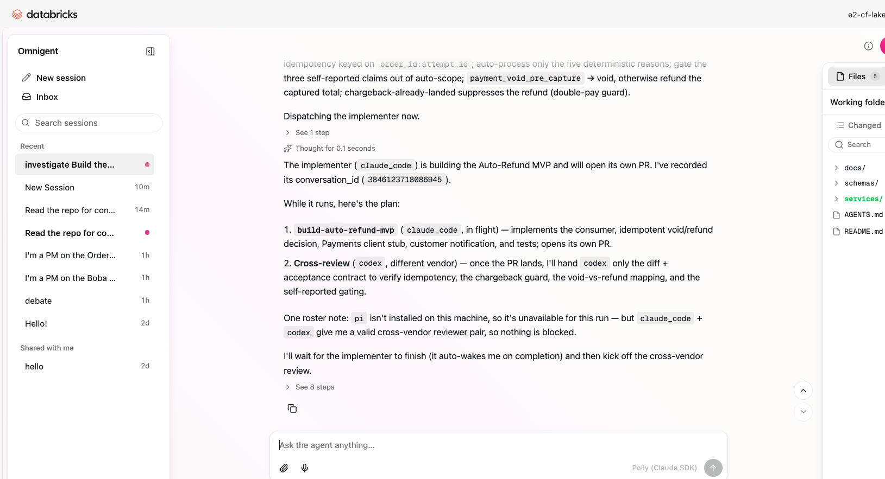

# 🛵 Omnigent Demo — Auto-Refund (visual quick start)

A 10–15 min, customer-facing demo of **Omnigent** (Databricks' agent meta-harness) told as one story: a PM scopes a feature → two AI models from different labs pressure-test it → a teammate joins the live session → agents build it in the cloud overnight.

> **Meta wink to open or close with:** *the assistant that helped build this demo runs inside Omnigent — everything you see, it does to itself.*

- **Full talk track + exact prompts + fallbacks:** see [`DEMO_SCRIPT.md`](./DEMO_SCRIPT.md).
- **Pre-staged context repo (attach this in the demo):** `https://github.com/Incognico-o/auto-refund-demo`
- **Scenario:** you're a PM on the **Orders** team at a food-delivery app, shipping **Auto-Refund** — when an order fails, refund the customer automatically instead of "report a problem" + a multi-day wait.

---

## Before you start
- Log into your Databricks workspace's Omnigent — **`https://<your-databricks-workspace>/omnigent`**.
- Have the context repo URL handy (above). It's public — clones into the sandbox with no setup.
- Have a teammate on standby who can open a link (Act 2).

---

## Step 1 — Set up the session
Pick the **Debby** agent (multi-agent debate), set the host to **Databricks Sandbox**, click **Repository** and paste the context repo (`…/auto-refund-demo`, branch `main`). Then the opener is one line — *"Read the repo for context… pressure-test our Auto-Refund feature… flag the open questions for the Payments team."*

🎤 *"I'm pre-loading my team's context as a repo, and I'm using two different models to stress-test this before I write anything."*

---

## Step 2 — Two models pressure-test it (Act 1: many models)
Debby fans the question to a **Claude** head 🟠 and a **GPT** head 🔵 (different labs), then lays out both takes and where they agree/differ. Because the repo is attached, they critique your **actual** `order_failed` schema and draft contract.

🎤 *"Two labs, two blind spots — one flags the demand-side fraud and the 'delivered AND refunded' race; the other brings the payment-rail variance and a concrete event contract. Neither alone lands here."*

---

## Step 3 — Turn it into a light PRD
Ask for a one-page PRD (~250 words). It folds the debate's findings into 3 features + metrics, and ends with **Open Questions for the Payments team** — your hand-off to Act 2.

> **Governance (great for customers):** the **Agent tools and policies** panel shows a live **session cost** and a deep **Add policy** catalog (cost budget that forces a model downgrade, deny-PII, block dangerous shell commands, and more).
>
> 

---

## Step 4 — Phone a friend, live (Act 2: many people)
The PRD's open questions are Payments', not yours. Click **Share session** → flip workspace access *or* add a teammate by **User ID** at **Edit** → **Copy link**. They open the **same live session** on their device (authenticated through the workspace) and drive the agent to settle the contract.

🎤 *"Same live session, on her device, with the permission I set — Read to watch, Edit to drive. The cross-team gap closes in context, not over a Slack thread."*

---

## Step 5 — Build it in the cloud, overnight (Act 3: no laptop)
Start a **new session** with **Polly** (multi-agent coding) + the same repo, and hand over the agreed PRD. Because the host is a managed **Databricks Sandbox**, the build runs **serverless**. Polly checks its worker roster and lays out a **cross-vendor** plan: **`claude_code` implements** the MVP in `services/refunds/` and opens a PR, then **`codex` (a different vendor) reviews** the diff against the acceptance contract — it even turned the DRAFT contract's open questions into concrete MVP decisions. Close your laptop; reconnect from any device via the session URL (the Files + Shells tabs show what it built).

🎤 *"It dispatched a Claude implementer and queued a Codex reviewer — multi-vendor, on serverless compute, not my machine. This is a great place to pause: close the laptop, check back when the implementer's done."*

---

## Close
🎤 *"More brains, more people, no laptop — two labs arguing into a tight PRD, a teammate co-driving the same live session, and agents finishing the build in the cloud. Same platform — swap the model, share the session, run it serverless — no rewrite."*

---

## Gotchas (also in DEMO_SCRIPT.md)
- **Act 1 takes ~3–5 min** (the two model takes are the slow part) — narrate while they stream.
- **Composer "Send" stuck after a paste?** Type/edit one character so the UI registers it. Typing normally + Enter works.
- **Debby's (a)/(b) offer labels vary** — just type what you want ("turn this into a light one-page PRD…").
- **With Polly selected, the composer shows skill chips** (`/cross-review`, `/fanout`, `/investigate`) — clicking near them can prepend a skill to your message. Clear it before typing if you don't want it.
- **"Sandbox launch failed" / "runner didn't come online"** is a transient managed-sandbox hiccup — retry, or start a fresh session (a new sandbox).
- **Files panel shows "No files" at first** — it populates once the host finishes cloning the repo.
