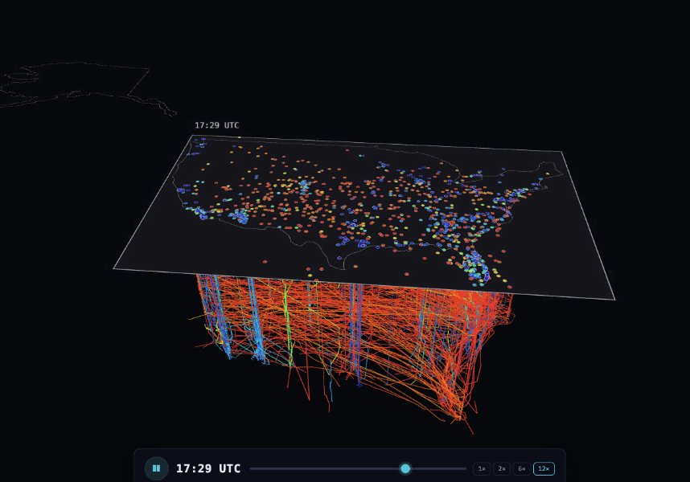

# A Day Over — OpenSky Marketplace Visualization

An interactive visualization of **one full UTC day of OpenSky flight data** (2026‑03‑01) across
three regions — Europe, North America, Australia — deployed as a **Databricks App**.

The data comes from the **free** [OpenSky flight‑data listing on Databricks
Marketplace](https://marketplace.databricks.com/details/feb64bf4-77a8-4f6a-8e21-94c51042e41f/Databricks_OpenSky-Networks-full-day-avionics-dataset) —
installable into any Databricks workspace at no cost (the underlying data is also open, via the
[OpenSky Network](https://opensky-network.org/)). The app ships a pre‑computed snapshot so it runs
anywhere, and can **optionally regenerate that data live** from the Marketplace table.

> **What this is (and isn't).** This is a **showcase of what you can build on a Marketplace
> dataset** — not a demo of real‑time data replication. A visualization app is only one angle:
> you could equally point a **Genie agent** at the same table for natural‑language insights, or use
> notebooks/SQL to dig into anomalies (see [Beyond the app](#beyond-the-app--explore-the-same-data-with-genie)).

<br><sub>North America — Space-Time Prism</sub>

## What it does

Six self‑contained visualizations, switchable from a single control panel:

- **Space‑Time Prism** — time is the vertical axis; each flight's day is a 3D ribbon, with a rising "now" plane.
- **Breathing Sky** — animated H3 density field that inhales/exhales with the daily rush.
- **Contrails Canvas** — additive 2D trails that burn in busy corridors as the day plays.
- **Flight DNA** — a wall of radial per‑flight "fingerprints," grouped by flight shape.
- **Anomaly Board** — emergency squawks (7500/7600/7700) + steepest climbs, with a reason breakdown.
- **Airport Pulse** — approach/departure funnel and hourly throughput for preset hubs.

## Beyond the app — explore the same data with Genie

A visualization app is just one way to use the dataset. Because it's a governed table in Unity
Catalog, you can also point a **Genie agent** at it and ask questions in plain language — for
example, surfacing interesting facts about the day's traffic or generating a map of last-observed
aircraft positions by country — or drop into a notebook / SQL to explore anomalies.

## Architecture

The source table (`marketplace.opensky.state_vectors`, ~695M rows) is far too large to query from a
browser, and the day is static — so heavy SQL aggregation is **pre‑computed into compact gzipped
JSON** that is baked into the app and served statically by a tiny stdlib Python server. No live
queries in the hot path; the app boots instantly.

**Optional Marketplace ingest (add‑on):** when the OpenSky dataset is available in your workspace, a
startup pop‑up offers to **regenerate the same artifacts live** — it runs the extraction SQL on a SQL
warehouse, compacts the results to byte‑compatible JSON, and stores them in a **Unity Catalog
volume**. The server then serves `/data/*` **volume‑first, bundled‑fallback**. The bundled snapshot
stays the fast default (and the fallback on workspaces without the dataset). See `DESIGN.md`.

## Tech stack

Vite · React · TypeScript · **deck.gl v9** (WebGL) · `h3-js` · hand‑written CSS.
Backend: stdlib Python (`server.py`); `databricks-sdk` only for the optional ingest. Deployed via
Databricks Asset Bundles.

## Deploy

This folder is self‑contained — `dist/` is committed, so it deploys with no Node build. From inside
the folder:

1. **Prerequisites.** The [Databricks CLI](https://docs.databricks.com/dev-tools/cli/) and an auth
   profile for your workspace:
   ```bash
   databricks auth login --host <workspace-url> --profile <name>
   ```
   Plus Python 3. The deploying identity needs rights to create the app, create the UC schema/volume,
   grant `SELECT` on the Marketplace dataset, and `CAN_USE` on the warehouse (the script warns but
   continues if a grant is refused). `npm` only if you rebuild the frontend.

2. **Configure.**
   ```bash
   cp .env.example .env
   ```
   Edit `PROFILE`, `TARGET`, `OPENSKY_CATALOG`/`OPENSKY_SCHEMA` (where the Marketplace dataset is
   installed), `OPENSKY_WAREHOUSE_ID`, and the `VOL_*` / `OPENSKY_VOLUME_ROOT` volume settings (a
   **writable** catalog — some workspaces have `workspace` but no `main`). The workspace host comes
   from your CLI profile. `.env` is gitignored — never commit it.

3. **Deploy.**
   ```bash
   ./deploy.sh          # flags: --no-build, --target dev|dogfood, --profile NAME
   ```
   Builds the frontend from a sibling `../app` if present (else ships the committed `dist/`), ensures
   the UC volume, runs `bundle deploy` + `run`, grants the app service principal, and prints the URL.

4. **Open it.** The startup pop‑up checks whether `catalog.schema` is available: if so it offers
   *Regenerate from Marketplace* (~8–12 min, background) or the bundled snapshot (instant); if not,
   the app runs on the bundled snapshot.

> Manual (no‑script) deploy: `databricks bundle deploy -t dev --profile <name> --var=…` then
> `databricks bundle run opensky_vis -t dev --profile <name>`.

## Data

`marketplace.opensky.state_vectors` — one UTC day (2026‑03‑01), regions Europe / North America /
Australia. The bundled snapshot in `dist/data/` is derived from it; the optional ingest regenerates
the identical artifacts live.
