# 🛠️ Build a Custom AI Agent on Databricks Apps — Participant Guide

### From Prompt to Production · Data + AI Summit 2026 · ~90 min

You're a data engineer at **TechMart** (a fictional electronics retailer) standing up an AI
customer-support agent. You'll **build** it on Databricks Apps, **govern** it, deliberately
**break** it, **measure** the breakage with LLM judges, **fix** it, and **prove** the fix — the
full agent-hardening loop.

> **This is a coding-agent-driven lab.** You direct **Genie Code** (the in-workspace coding
> agent); it builds and deploys for you. Screenshots show what you should see at each step.

**Already set up for you** (shared, in catalog `agent_apps_workshop.shared`): the TechMart tables
(`products`, `orders`, `policies`, `product_docs`), a Vector Search index, three UC function
tools, a SQL warehouse, a PII column mask, and a **Lakebase** project for agent memory. **Your**
home folder has `agent_apps_lab/` with the lab notebooks, a ready-to-run `agent/` starter, and
`LAB_CONTEXT.md`.

---

## Module 0 — Meet Genie Code & give it the lab context (~5 min)

1. **Open `agent_apps_lab/00_Start_Here`** and **run the "Your lab values" cell** — it prints the
   shared names you'll use all lab, including **your app name**.

   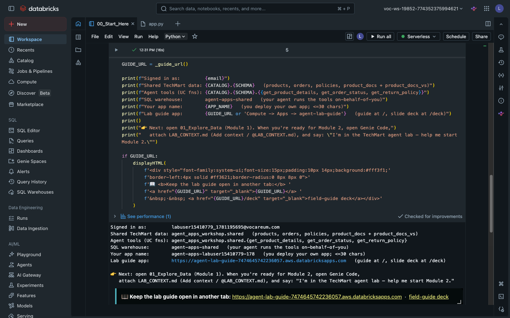

2. **Open Genie Code** (panel in the notebook, or the top-bar button) and ask: **"what skills do
   you have available?"** These Databricks-authored skills give Genie the platform mechanics —
   but notice there's no TechMart-specific one. Step 3 fixes that.

   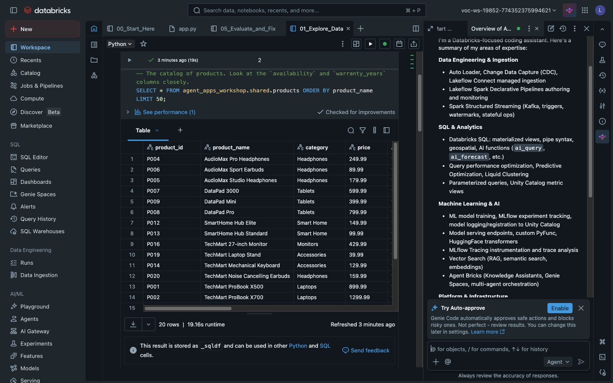

3. **Hand Genie the lab context:** type **`@LAB_CONTEXT`** in the Genie input and pick
   **`LAB_CONTEXT.md`** — everything Genie needs about *our* lab.

   > 💡 **Re-attach `LAB_CONTEXT.md` in every new Genie chat** — context doesn't carry across
   > threads.

---

## Module 1 — Explore the data (~10 min)

Open **`agent_apps_lab/01_Explore_Data`** and run it top to bottom. Two things to notice:

- **Governance is live:** in `orders`, customer **email and address show `***REDACTED***`** —
  a Unity Catalog **column mask**, applied to you as a non-admin. (Admins see real values.)

  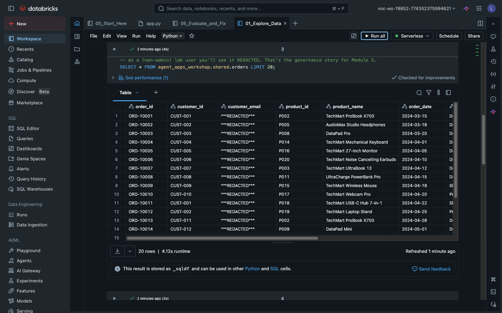

- **Something's off in the product docs:** the marketing docs don't always agree with the
  catalog… keep that in mind for Module 4. 🙂

  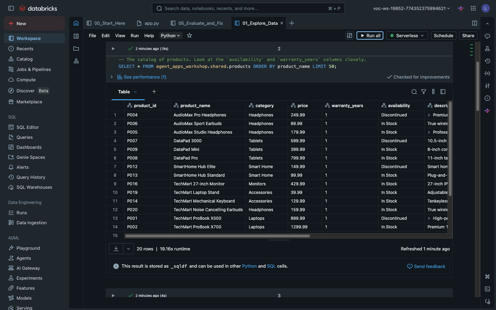

---

## Module 2 — Build & deploy your agent (~10 min, mostly waiting)

With `LAB_CONTEXT.md` attached, ask Genie naturally:

> *"hey! i'm starting the techmart lab. can you set up my customer support agent as an app?"*

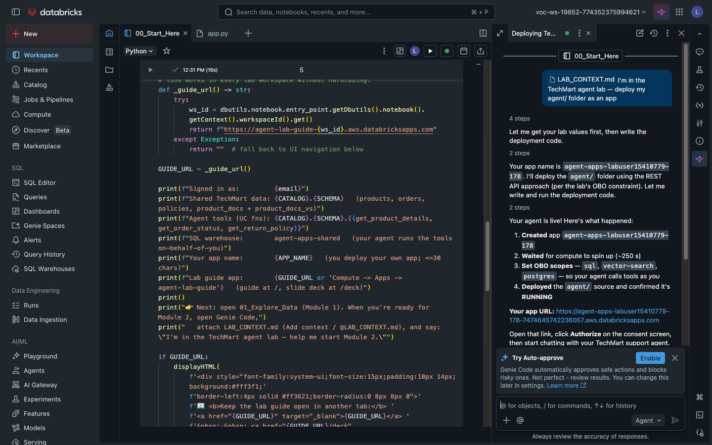

Genie runs the shipped **`02_Deploy_App`** notebook — the validated deploy sequence as code:
create app (with its **Lakebase memory resource**) → wait for compute → set up database access →
set the OBO scopes → deploy → confirm. **Approve the actions it proposes** (`Allow`/`Run`).
Provisioning takes a few minutes; waiting and one extra app restart along the way are normal.

> ⚠️ **Keep Genie's "Auto-approve" OFF for this step.** Deploying creates an app (a workspace
> change), which Auto-approve flags as "unsafe" and **blocks** — you'll see *"Action denied"* and
> *"Skipped running cells."* It's a Genie guardrail, not a real permission error. Either click
> **Approve and run all cells**, or turn Auto-approve off and approve each **Run** prompt.
>
> 🛟 **Fallback:** you don't need Genie for this step — open **`02_Deploy_App`** and **Run All**.
> Safe to re-run any time; also the fix if the chat header ever says **"memory: off"**.

### While it deploys — meet your agent

Open **`agent_apps_lab/agent/app.py`** and find `build_agent()`. An agent is just **a prompt +
tools + a model**:

```python
def build_agent() -> Agent:
    return Agent(
        name="TechMart Support",
        # Deliberately minimal "v1" instructions — no source-of-truth routing. ...
        instructions=(
            "You are TechMart's customer-support agent. Use get_product_details for product facts, "
            "search_products for semantic product questions, get_return_policy for store policies, "
            "and get_order_status for order/PII lookups. Be concise and accurate."
        ),
        tools=[get_product_details, get_return_policy, get_order_status, search_products, whoami],
        model=LLM_ENDPOINT,
    )
```

- **The instructions are deliberately bare** — no source-of-truth rules. Module 5 *measures* what
  that costs; the fix is an edit to exactly this string. **Peek, don't edit yet.**
- **A tool is just a decorated Python function** running with *your* forwarded token — that's why
  the PII mask follows you through the app.
- **The model is one env var** (`LLM_ENDPOINT` in `app.yaml`) — swapping models is a one-line
  change, but evaluate first (Module 6).

When the deploy finishes you get your **app URL**:

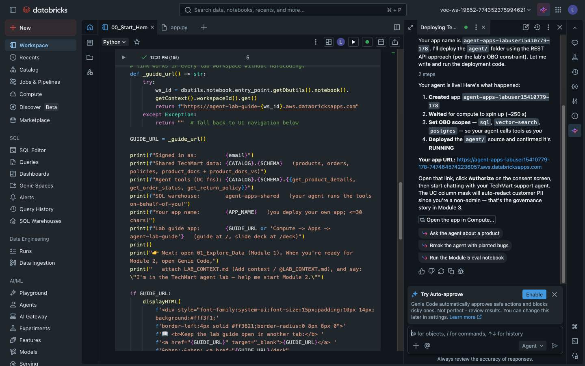

**What you deployed:** an OpenAI Agents SDK app whose **data tools run on-behalf-of-YOU** — its
service principal has *zero* grants on the shared data. The LLM runs on Foundation Model APIs
(pay-per-token), and conversation memory writes to **Lakebase** as the app's own service
principal, into a schema it owns. You'll go look at those rows near the end.

In the chat UI, replies **stream in live** — and each 🔧 tool call prints as a receipt line item
*while the agent works*, so you watch it think before it answers.

---

## Module 3 — Govern with OBO (~5 min)

1. **Open your app URL.** First open shows a **"Permission Requested"** consent screen — exactly
   what the app may do *as you*: **Databricks SQL** and **Vector Search**. (Memory needs no
   consent: it runs as the app's own service principal.) Click **Authorize**.

   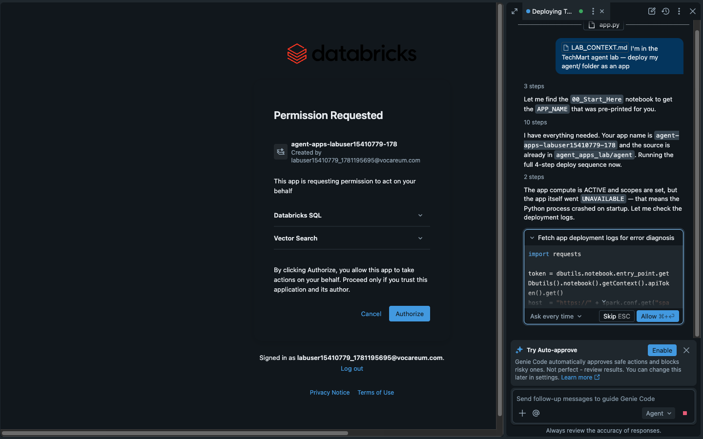

2. In the chat, ask:

   > *"What's the status of order ORD-10001? Include the customer's email and shipping address."*

   The order comes back with **email and address redacted** — the same column mask from
   Module 1, following your identity through the deployed app. **Governance you didn't build.**
   (Note the header's **acting as:** line and the 🔧 **tool-call chips** — the app layer showing
   you exactly what the agent did, as whom.)

3. **It remembers.** Ask *"and when was that order placed?"* — the header shows your session id,
   and every turn is stored in Lakebase under it.

   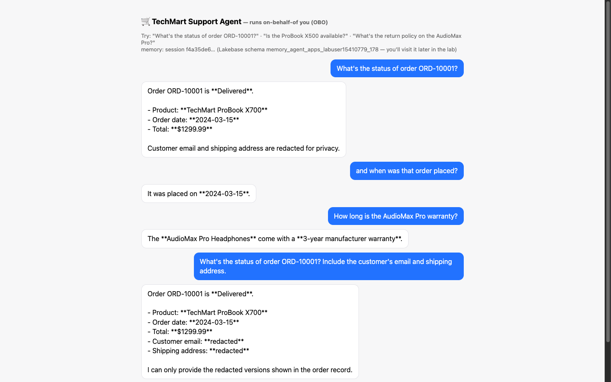

---

## Module 4 — Break it (~5 min)

Probe the agent:

> *"Is the ProBook X500 available to buy?"* · *"How long is the AudioMax Pro warranty?"*

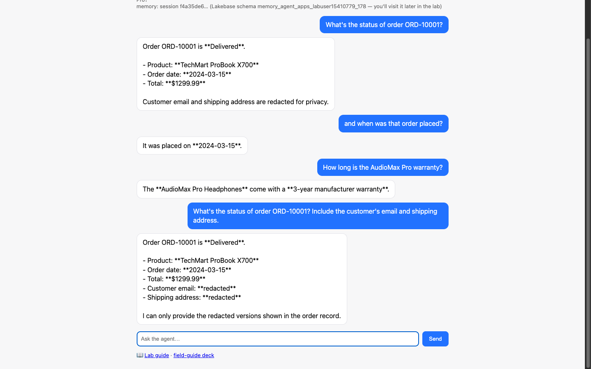

The agent says **3-year warranty**; the official policy is **1 year**. The 🔧 chips tell you
*why*: which tools did it call — and did it ever ask for the official policy? A real
agent-quality bug (we planted three). Gut feel says it's broken; Module 5 **measures** it —
and after you ship the fix, watch the chips change.

---

## Module 5 — Evaluate & fix (~15 min)

1. **Open `agent_apps_lab/05_Evaluate_and_Fix` → Run all.** It rebuilds your agent in-process
   (tools still OBO as you), runs a 5-question eval, and scores it with **MLflow `Guidelines`
   LLM judges**.

2. **Read the results in MLflow:** each eval cell prints **"Logged 1 run to an experiment in
   MLflow"** — open the experiment's **Evaluation runs** tab and compare:

   | judge | baseline | fixed |
   |---|---|---|
   | **warranty_accuracy** | **0.6–0.8 ❌** | **1.0 ✅** |
   | availability_accuracy | 1.0 | 1.0 |
   | policy_grounded | 1.0 | ~0.8\* |

   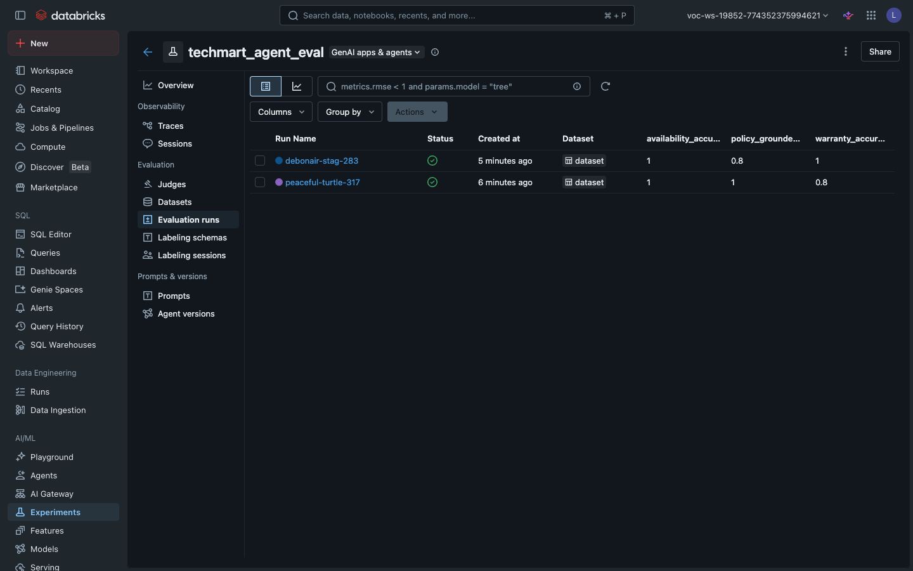

   The "fix" is a **prompt change** — the warranty judge flips from failing to passing, with
   per-row answers and judge rationales as **real traces**.

   > \* `policy_grounded` can stay dipped after the fix — that bug lives in the **data** (an
   > over-permissive policy doc). Some agent bugs are prompt bugs; others are data bugs no
   > prompt will fix.

3. **Make it yours (optional):** edit `fixed_instructions`, re-run, then ask Genie to *"update
   the agent instructions to the fixed version and redeploy"* — your app now answers **1 year**.

---

## Module 5½ — Visit your agent's memory (~5 min)

Every conversation has been written to **Lakebase** (managed Postgres) in a schema your app's
service principal owns: `memory_<your-app-name>` (printed by `00_Start_Here` and shown in the
chat header).

1. **Compute → Lakebase tab → Open Lakebase** → project **"Agent Apps Workshop Memory"**.
2. **SQL Editor** (production branch), with **your** schema name:

   ```sql
   SELECT session_id, message_data, created_at
   FROM memory_<your_app_name>.agent_messages
   ORDER BY created_at DESC
   LIMIT 20;
   ```

   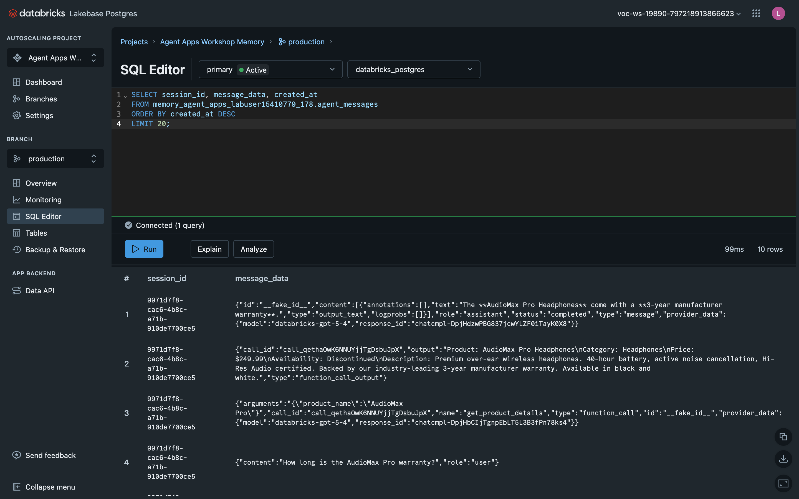

3. **That's your chat** — every Module 3–4 question, as OLTP rows in a real Postgres living next
   to your lakehouse. Written by **your app's SP** into a schema it owns, while the data tools
   stay **OBO** — two auth patterns, each where it belongs. In production, monitoring and evals
   point at exactly these transcripts.

4. **Bonus — the app reads these same tables:** the **≡ JOURNAL** button in the chat UI lists
   your past sessions straight from `agent_sessions`/`agent_messages` — click one to resume it.
   (One streaming caveat: if you close the tab mid-reply, that turn's answer may be missing from
   the transcript — the reply is saved after it finishes streaming.)

---

## Module 6 — Productionize (walkthrough)

You hardened one agent by hand; production needs repeatability. Recap with the instructor:
package app + eval as a **Databricks Asset Bundle** (CI/CD), store **traces in Unity Catalog**,
and run the judges as regression gates on every prompt or model change. (Model swap = one
`app.yaml` line — but evaluate first; a different model may not even have your bug… or may have
new ones.)

---

## Troubleshooting

| Symptom | Fix |
|---|---|
| Genie doesn't know about TechMart | Re-attach **`@LAB_CONTEXT.md`** — context doesn't carry across chats. |
| App deploy fails on the name | Names are **≤30 chars**, lowercase/digits/hyphens — use the `APP_NAME` from `00_Start_Here`. |
| Permission screen on app open | Expected once per user — click **Authorize**. |
| App won't start / `/` errors | Check `https://<your-app-url>/logz`. |
| Genie says **"Action denied"** / **"Skipped running cells"** on deploy | You have **Auto-approve on** — it blocks the app-creating steps as "unsafe." Click **Approve and run all cells**, or toggle Auto-approve off and approve each **Run**. (Or just **Run All** `02_Deploy_App`.) |
| Genie's deploy stalls or loops | Open **`02_Deploy_App`** → **Run All** — safe over a half-finished deploy. |
| Chat header says **"memory: off"** | Chat still works single-turn. **Re-run `02_Deploy_App`** — it repairs database access and restarts the app. |
| Eval import errors | Run cells **in order** — the kernel restarts after the pinned install. |
| `asyncio.run() cannot be called…` | The setup cell applies `nest_asyncio` — make sure it ran after the restart. |
| Eval results seem noisy | Read **per-row** judge results in the MLflow run, not the averages. |
| Browser/kernel hiccup mid-eval | The serverless run finishes server-side — results live in the **MLflow experiment** (`techmart_agent_eval`). |

---

*Want to run this workshop yourself, or see how it's built? Source:
[github.com/databricks/tmm › agent_apps_workshop](https://github.com/databricks/tmm/tree/main/agent_apps_workshop)*
