# Agentic Workshop

## Setup

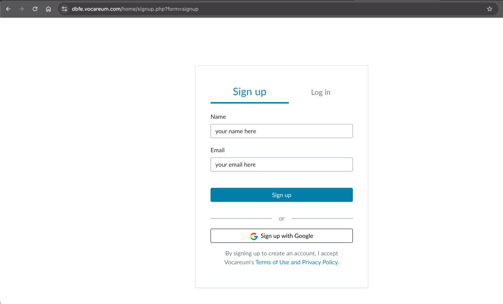

In Chrome or Edge, go to https://dbm.vocareum.com/, then click on `Sign up` if you do not already have an account, or `Log in` if you already do. Key in your email address, and leave password blank. Click on `Send one-time code`. Check your inbox for the OTP and key it in.

> If you get an error which says `Security verification failed`, use Chrome or Edge, and do NOT use incognito.

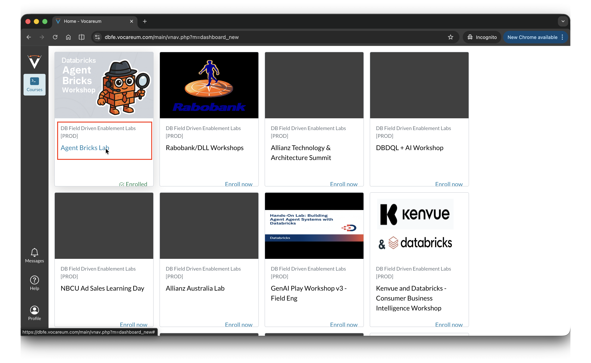

Click on `Agent Bricks Lab[April23]` to start the lab.

Enter the access code given by the instructor.

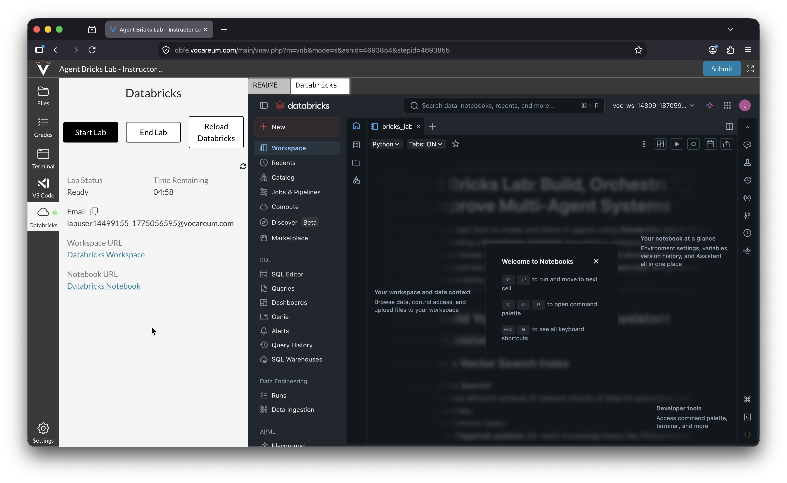

If the `Lab Status` does not say `Ready`, click on `Start lab`. The lab should take a few minutes to start. Once the `Lab Status` says `Ready`, you should see the Databricks console.

> If you see an error message which says `Lab ended` or `Budget exceeded` or `Your total lab usage time of 240 minutes has exceeded the total allocated time of 240 minutes`, please inform the instructor. Instructors, please go to `Class`, search for student's email, click on `Budget`, and set `Total time budget` to `User specfic` and `3000 minutes`. Do the same for `Monthly time budget` and click `Save`. Ask student to click on refresh button in the Vocareum lab page, lab should automatically start.

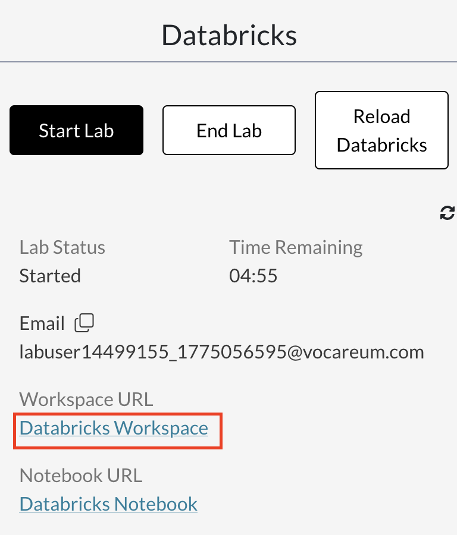

Next click on `Databricks Workspace`. It should bring you to the Databricks console in a new tab. You will be doing the rest of the lab here.

Familiarise with the Databricks workspace layout above.

## Part 1: Build a Knowledge Assistant for querying indexes (knowledge base and support tickets indexes)

### 1.0 Explore tables in a Catalog

Let's start with some low hanging fruit - creating a knowledge agent that’s able to answer questions related to your company’s products and policies. For our purposes, we’re going to use a knowledge base that our fictional telco company has curated that covered typical product questions. We’ll also use some historical support tickets to augment our knowledge agent with a constantly updating source of information.

**Unity Catalog (UC)** is Databricks’ unified governance layer for organizing data and AI assets. Assets are named in three levels: **catalog** → **schema** → **table** (or other objects). In this lab, `bricks_lab` is the catalog, `default` is the schema, and tables such as `billing` and `customers` live under that schema.

Steps:
1. Click on `Catalog` on the left panel.
2. Expand `bricks_lab`.
3. Expand `default`.
4. Expand `Tables`.
5. Click on `billing`.
6. Click on `Sample Data` tab.
7. Click on `Select compute` button.

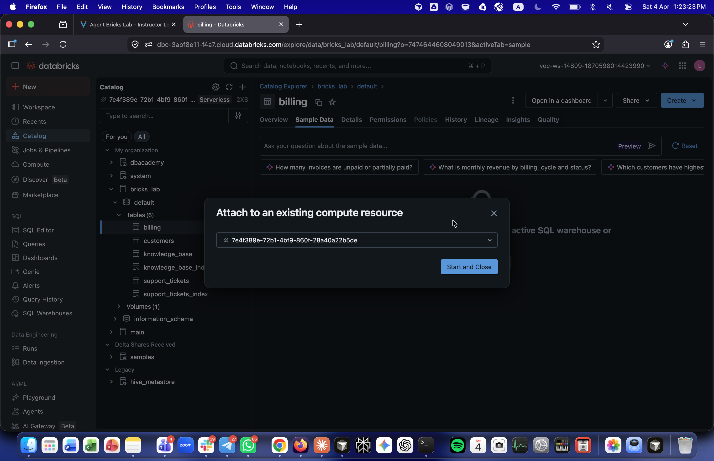

In the popup, there should be already a resource selected for you. Otherwise click on the drop down and select the only resource there. Click on `Start and Close`.

Wait a few minutes until you see that the resource has started. Once ready, the sample data should load. Examine the sample data here. This is one of the tables we will be using to create our Knowledge Assistant.

### 1.1 Explore a Vector Search Index

Now the first step to making this data work for us is to create a vector search index. Why? We need an efficient way for your agent to retrieve relevant chunks of data to better answer your user’s question. Fortunately, this is super easy. We’ve already created the indexes for you so you do NOT need to create the index (it takes a while to spin up), but your instructor will show you how easy it is to create one.

Why Vector Search?

- It provides efficient retrieval of relevant chunks of data for grounding LLM responses.
- Two common **sync** modes for indexes:
  - **Triggered updates** — best when the source changes rarely (e.g. FAQs and policies).
  - **Continuous updates** — best when the source changes often (e.g. support tickets that arrive daily).

A **vector search index** turns text into embeddings so the system can find semantically similar passages even when the user’s wording does not match your documents exactly. Your instructor can show how to choose triggered vs continuous when you create an index.

Click on `knowledge_base_index`, then `Sample Data` to see sample data from the knowledge base index. We will create a knowledge assistant which queries this index later. You can also click on `support_tickets_index` to view the support tickets index.

At a high level, **source tables** in Unity Catalog feed **vector search indexes** (sync jobs load from tables into indexes); the **Knowledge Assistant** at query time retrieves from those indexes (not from the raw tables). In the diagram, **vector search indexes** are drawn **above** their source **tables**; each downward arrow **pairs** one index with its table (not the direction of the sync job).

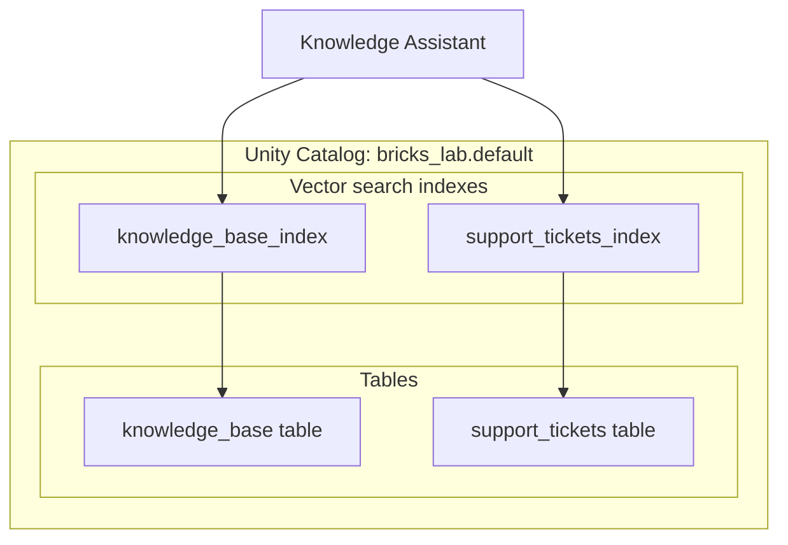
```mermaid
flowchart TB
  ka_agent[Knowledge Assistant]
  subgraph uc_ka ["Unity Catalog: bricks_lab.default"]
    direction TB
    subgraph uc_ka_idx ["Vector search indexes"]
      kb_index[knowledge_base_index]
      st_index[support_tickets_index]
    end
    subgraph uc_ka_tbl ["Tables"]
      kb_table[knowledge_base table]
      st_table[support_tickets table]
    end
    kb_index --> kb_table
    st_index --> st_table
  end
  ka_agent --> kb_index
  ka_agent --> st_index
```

### 1.2 Build the Knowledge Assistant Agent

Click on `Agents` on the left side panel, then click on `Create Agent`.

Click on `Knowledge Assistant`.

Fill in the name as `[YourName]-BricksLab-TechnicalSupport` (e.g. `Jarrett-BricksLab-TechnicalSupport`) and description as `This agent provides customer support for a Telecommunications company and references multiple knowledge sources.`. The better you describe resources in Databricks, the better Databricks will be able to give you the right answers (e.g. Genie, agents)

First, add the first index for knowledge base. Under `Configure Knowledge Sources`:
1. For `Type`, select `Vector Search Index`.
2. For `Source`, click on the `All` tab, then navigate to `bricks_lab`, `default`, `knowledge_base_index`, and click `Confirm`.
3. For `Name`, it will be auto-populated as `knowledge_base_index`, leave it.
4. For `Doc URI Column`, select `kb_id`.
5. For `Text Column`, select `formatted_content`.
6. For `Describe the content`, key in `Knowledge base containing company details such as policies, frequently asked questions, and procedures.`.

Next, add the second index for support tickets. Again, under `Configure Knowledge Sources`, click `Add` to add a second index, then:

1. For `Type`, select `Vector Search Index`.
2. For `Source`, click on the `All` tab, then navigate to `bricks_lab`, `default`, `support_tickets_index`, and click `Confirm`.
3. For `Name`, it will be auto-populated as `support_tickets_index`, leave it.
4. For `Doc URI Column`, select `ticket_id`.
5. For `Text Column`, select `formatted_content`.
6. For `Describe the content`, key in `Knowledge base containing historical tickets and resolutions of past customer issues.`.

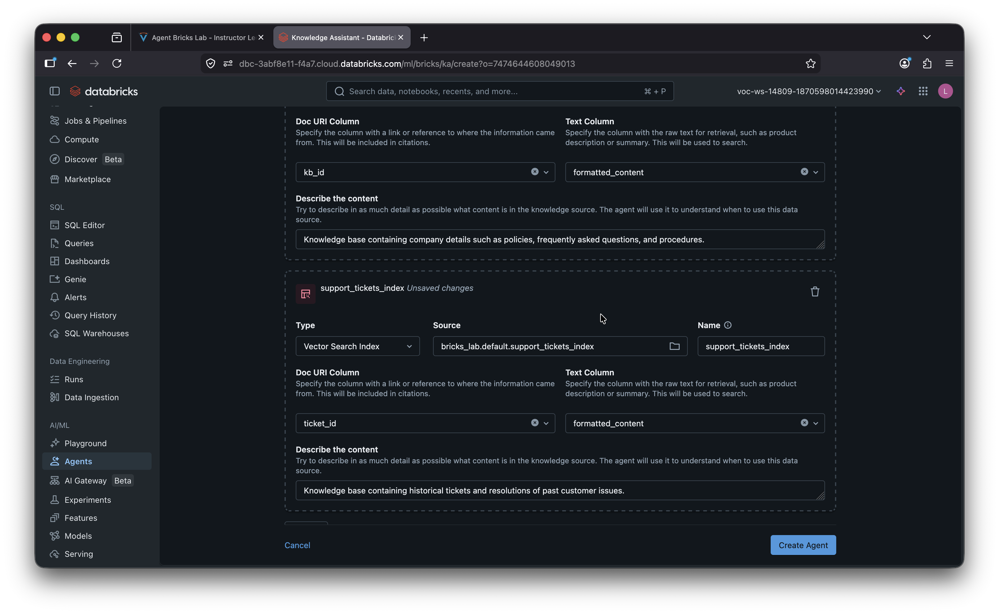

Finally, click on `Create Agent`. Wait for a few minutes for the agent to create.

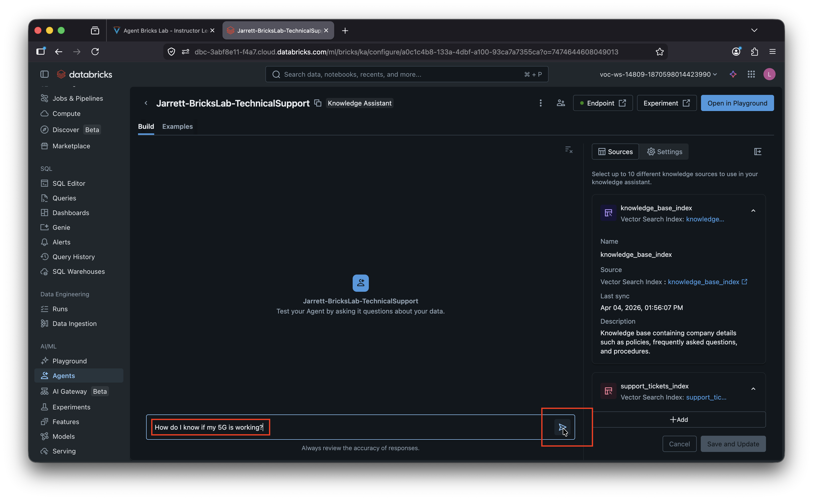

Once the agent is created, we’ll want to give it a test! Let's ask it a question in the text box: `How do I know if my 5G is working?` and click the send button (or press Enter).

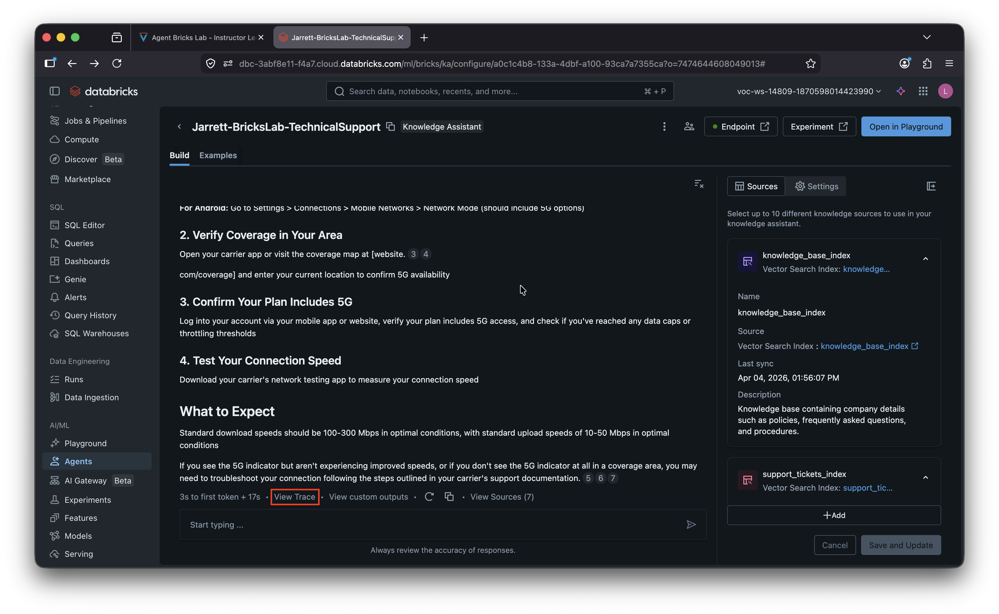

You’ll see a pretty verbose response with a number of footnotes. We’re going to make it more concise later, but what you can see here is that the Knowledge Assistant bases its responses heavily on our sources!

Click on `View trace` to explore the documents which have been pulled from your knowledge base (index).

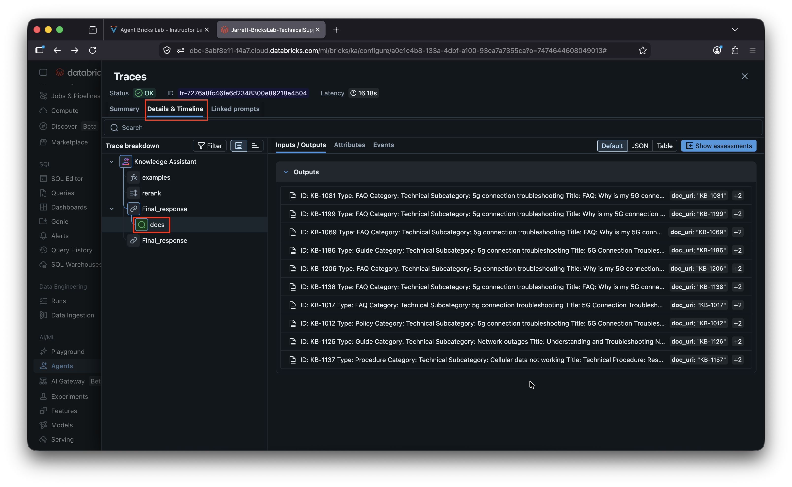

Very cool, we’ve easily put together our first agent. However, real questions are often a bit more personal to a specific user (e.g. a specific customer) and that data is not available in our knowledge base. Let's see how we can contextualise answers in the next part of this workshop.

## Part 2: Creating a Genie space for querying structured data (billing and customer tables)

Our Knowledge Assistant excels at answering questions grounded in unstructured knowledge — documents, FAQs, and support tickets. But customers also ask data-specific questions like “Why is my bill higher this month?” where the answer lives in rows and columns, not paragraphs. This is exactly where **Genie** shines.

**Genie** is Databricks’ natural-language interface purpose-built and optimized for **structured** data: you ask questions in plain English, and Genie translates them into SQL, runs the query against governed tables, and returns the results — no SQL writing required. A **Genie space** is a configured environment (connected data, instructions, and context) where those questions run—think of it as a governed “chat over your tables” for analysts and apps.

> **Knowledge Assistant vs Genie — when to use which?** Each is optimized for a different shape of data. The **Knowledge Assistant** retrieves and synthesizes answers from unstructured sources (documents, knowledge bases, tickets) using vector search. **Genie** generates precise SQL queries over structured tables (billing, customer records, metrics). For use cases that span both, a **Supervisor Agent** (Part 3) orchestrates them into a single experience. And if you need even more flexibility — such as calling external APIs or custom logic — Databricks Agents also support custom tools and MCP integrations.

Remember the billing table which we saw earlier? How do we make queries on this table easily? We have created a Genie space for you to explore billing and customer data for a specific customer. Let's begin.

### 2.1 Query Structured Data with Genie

Genie spaces allow natural language queries over structured data (SQL tables).
Genie is pre-configured to access billing and customer tables.

Here the Genie space queries **tables in Unity Catalog directly** via generated SQL (no separate vector search step).

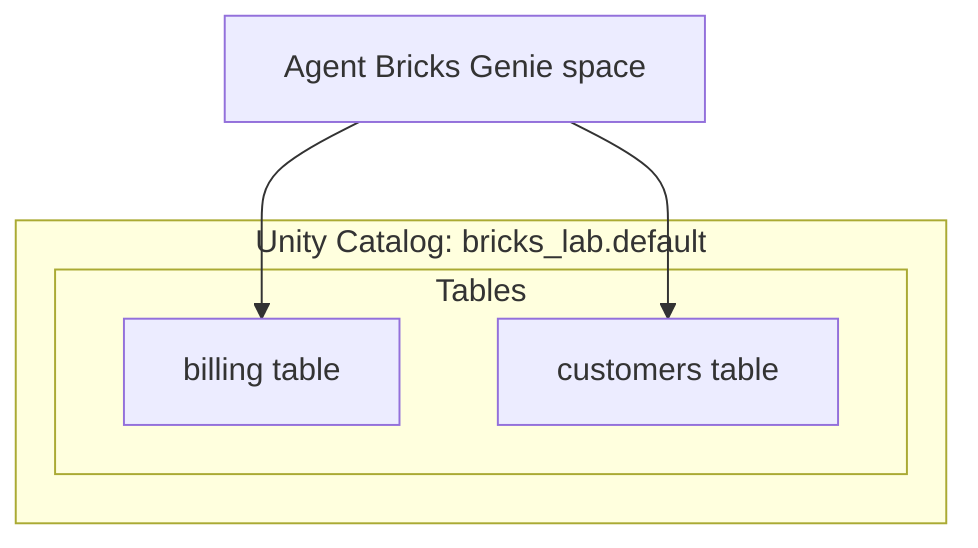
```mermaid
flowchart TB
  genie_space[Agent Bricks Genie space]
  subgraph uc_genie ["Unity Catalog: bricks_lab.default"]
    subgraph uc_genie_tbl ["Tables"]
      billing_table[billing table]
      customers_table[customers table]
    end
  end
  genie_space --> billing_table
  genie_space --> customers_table
```

In the interest of time, we have created a Genie space for you.

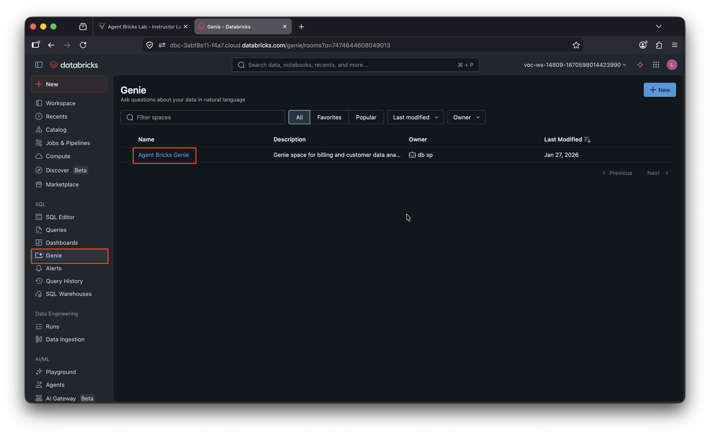

Navigate to Genie by clicking on `Genie` in the left side panel. A Genie space has been created for you - click on `Agent Bricks Genie`.

> Outside of this workshop, to create your own Genie space, simply go to `Genie` and click on `Create`. You do NOT need to do this for this workshop.

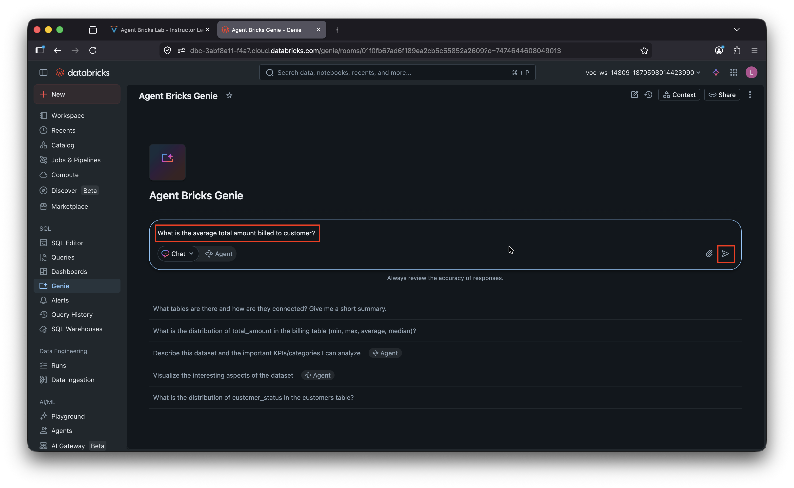

We can use this Genie room to do more meta analysis, such as finding out the average total bill, by just asking it in natural language. In the text box, key in `What is the average total amount billed to customer?` and press enter.

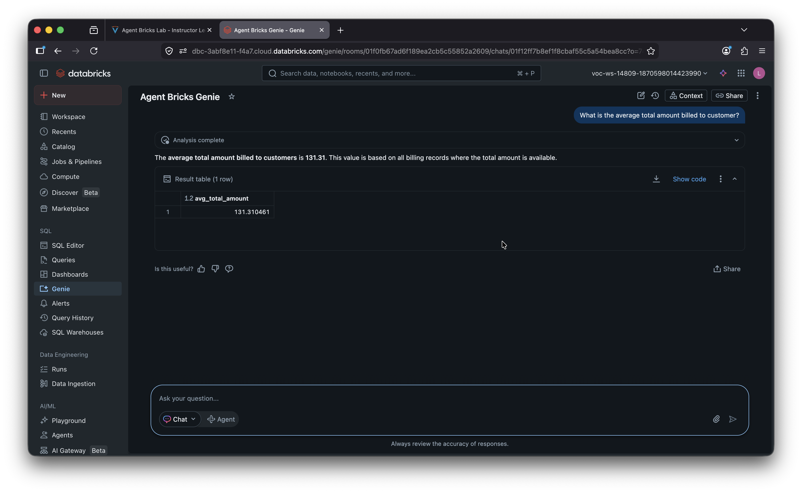

Here you can see the results of your query. Explore the various tools here, like `Show code`, `Share`, and rating whether the response is useful or not in `Is this useful?`.

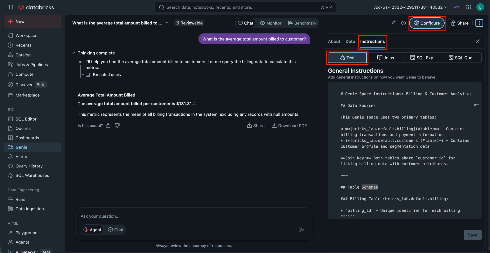

A key aspect of Genie is also that you can continuously guide it and give it examples and instructions to help it understand your unique data structures. Click on `Configure`, then `Instructions`, then `Text`. Here you can specify instructions on guiding how you want Genie to respond, e.g. making answers more concise. Leave this for now.

## Part 3: Orchestrating with a Supervisor Agent

Now that we have two specialized capabilities — the **Knowledge Assistant** for unstructured knowledge and **Genie** for structured data — the natural next step is to bring them together. The **Supervisor Agent** does exactly this: it intelligently **routes** each user question to the right specialist and returns one unified answer.

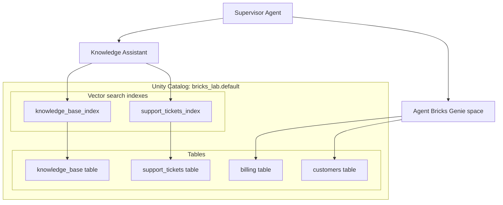
```mermaid
flowchart TB
  sa[Supervisor Agent]
  ka[Knowledge Assistant]
  genie[Agent Bricks Genie space]
  sa --> ka
  sa --> genie
  subgraph uc_full ["Unity Catalog: bricks_lab.default"]
    direction TB
    subgraph uc_idx ["Vector search indexes"]
      kb_idx[knowledge_base_index]
      st_idx[support_tickets_index]
    end
    subgraph uc_tbl ["Tables"]
      kb_tbl[knowledge_base table]
      st_tbl[support_tickets table]
      bill_tbl[billing table]
      cust_tbl[customers table]
    end
    kb_idx --> kb_tbl
    st_idx --> st_tbl
  end
  ka --> kb_idx
  ka --> st_idx
  genie --> bill_tbl
  genie --> cust_tbl
```

### 3.1 Creating a Supervisor Agent and Querying Genie space as an Agent

So if our Genie space is our way to answer questions regarding customer-specific or billing data (i.e. retrieve structured data), how do we tie it together with the Knowledge Assistant? In other words, how do we bring both of them together into a single, unified assistant?

A Genie space can also serve as an agent within a larger system — this is what makes the Supervisor Agent so powerful.

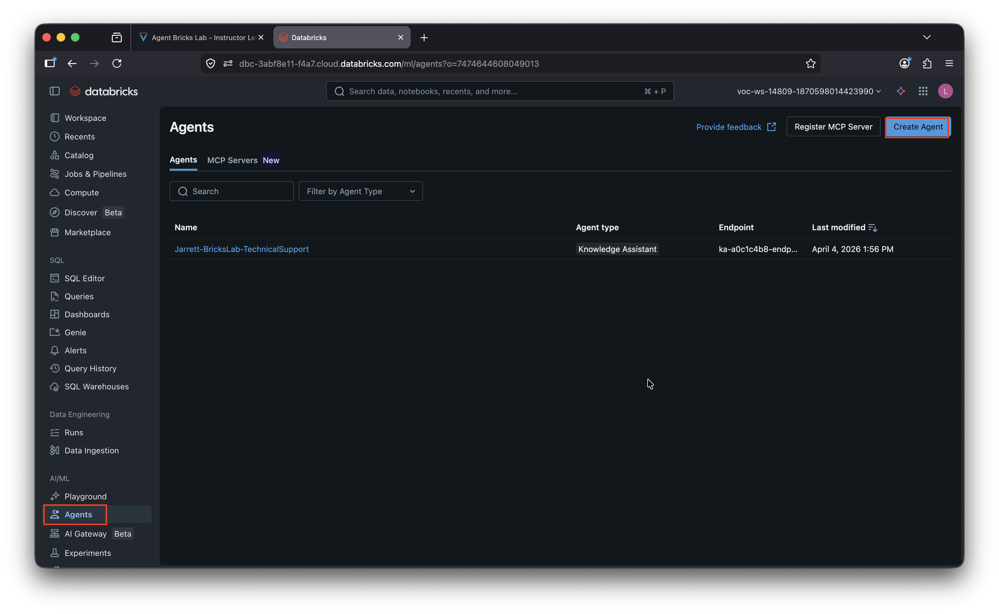

To see how this works, let's go back to `Agents` in the side panel, and click `Create` to create a new Supervisor Agent this time.

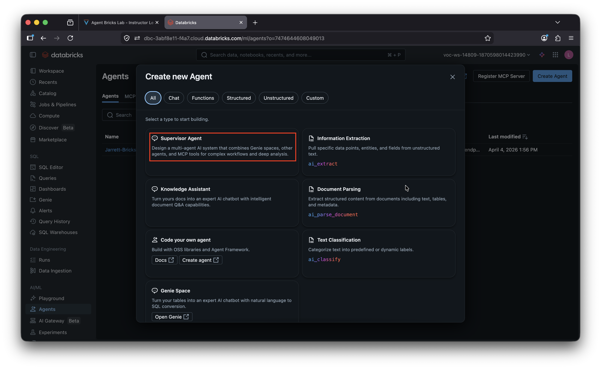

Select `Supervisor Agent`.

A **Supervisor Agent** is a multi-agent orchestrator that combines Genie spaces, other agents, and tools into a unified agent system. It intelligently routes questions to the right specialist — Genie for structured data queries, Knowledge Assistant for document-based answers — and can also incorporate custom tools for additional capabilities. It is ideal for providing insights across all your structured and unstructured data, assisting users with your platform, and more.

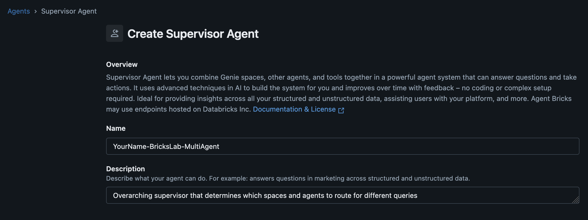

Fill in the name as `[YourName]-BricksLab-MultiAgent` (e.g. `Jarrett-BricksLab-MultiAgent`) and description as `Overarching supervisor that determines which spaces and agents to route for different queries.`. The better you describe resources in Databricks, the better Databricks will be able to give you the right answers (e.g. Genie, agents)

Now that we have given a high level description of what we want this supervisor to do, we can start adding our Genie space!

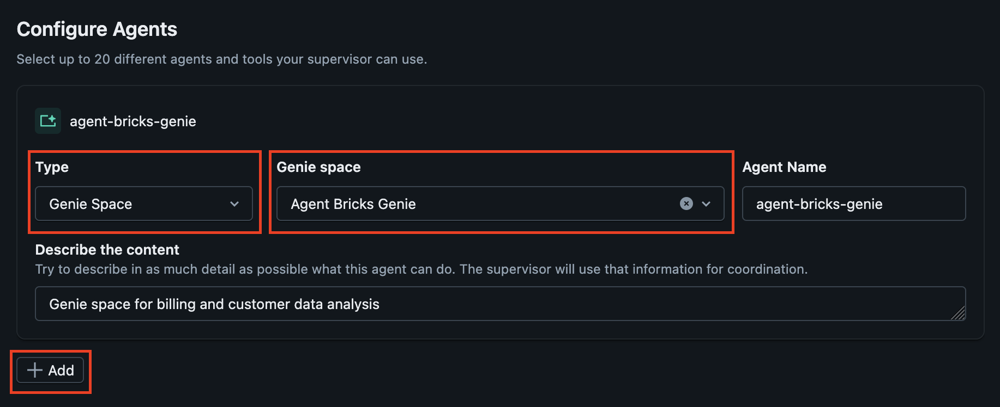

Under `Configure Agents`:
1. Under `Type`, select `Genie Space`.
2. Under `Genie space` select `Agent Bricks Genie` from the dropdown menu.
3. The `Describe the content` field is typically **auto-populated** when you select the space (for example, text about billing and customer data); you can leave it as-is.
4. Click `Add`.

Next, we will add our Knowledge Assistant which answers questions from our knowledge base and support ticket indexes.

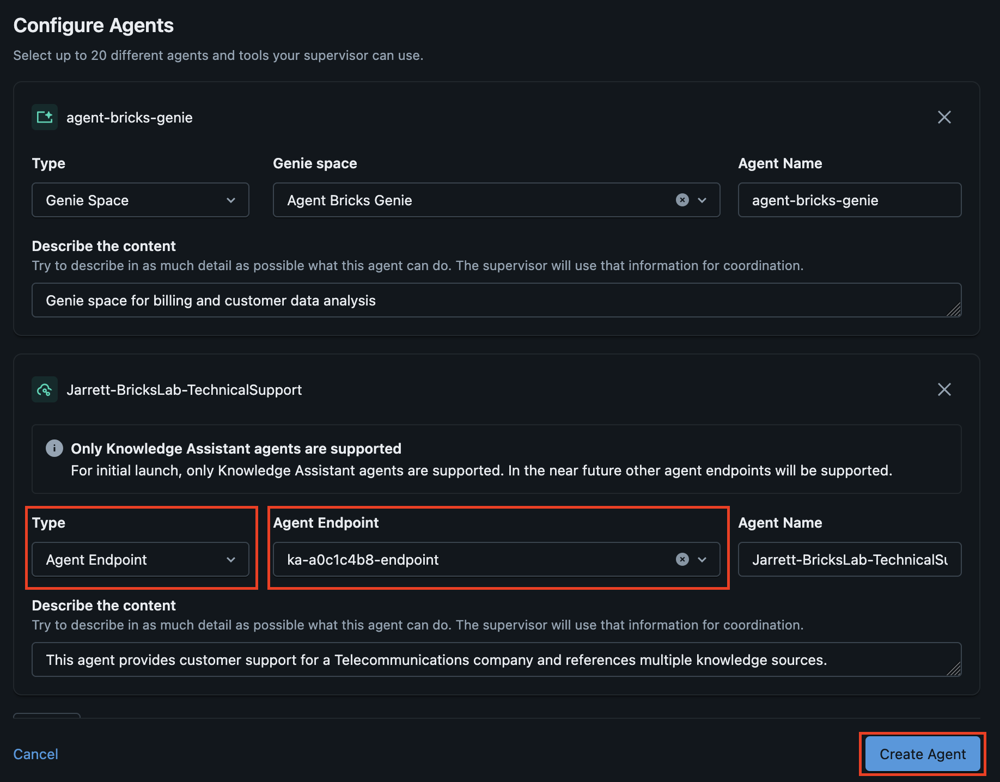

Under `Configure Agents`:
1. Under `Type`, select `Agent Endpoint`.
2. Under `Agent Endpoint`, select your Knowledge Assistant’s endpoint from the dropdown (it may show your agent name or an ID such as `ka-...-endpoint`).
3. The `Describe the content` field is typically **auto-populated** from your Knowledge Assistant; you do not need to re-type it.
4. Click `Create Agent`.

Now we have created our Supervisor Agent! It can seek answers from 2 places:
1. If it needs to query billing or customer data, it routes to the Genie space for precise SQL-based answers.
2. If it needs to look up product documentation or support tickets, it routes to the Knowledge Assistant for retrieval-augmented answers.

It handles all of this orchestration for you and comes back with a single, unified answer.

But first, let us sort out the permissions.

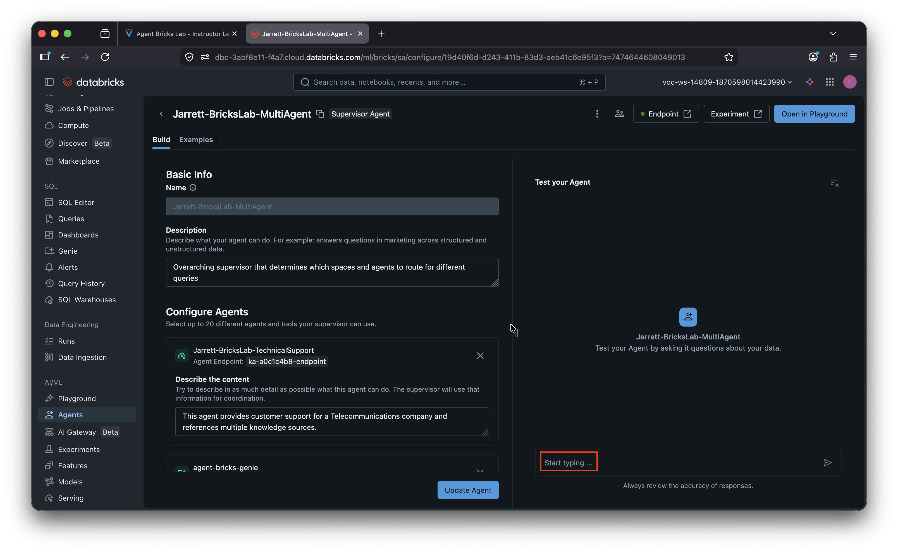

Click on the text box.

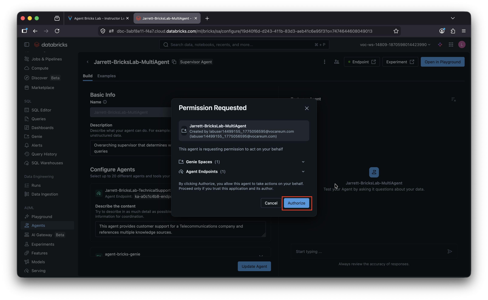

A popup will ask you to approve the permissions. Click on `Authorize`.

> Databricks is designed with governance at its core. Here Databricks is asking you if you would like your Supervisor Agent to have permission to use the Genie space and Knowledge Assistant.

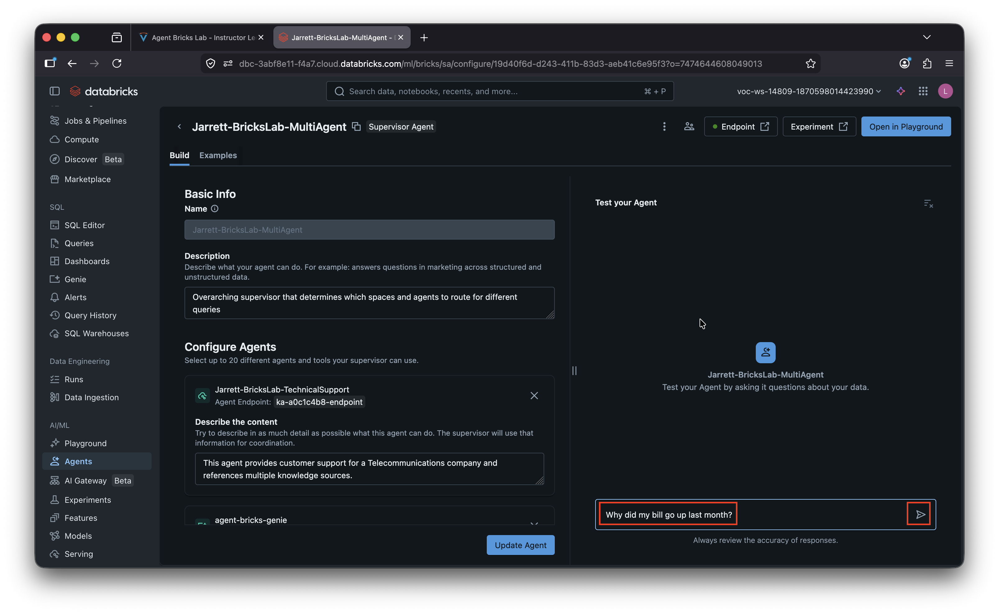

Creating the agent will take a few minutes. Once it is ready, test your Supervisor Agent by asking a tricky question - `Why did my bill go up last month?`.

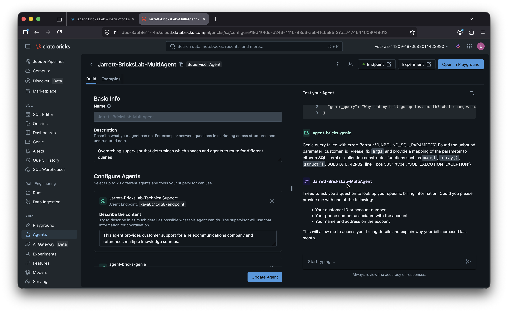

Uh oh, it seems like the Supervisor Agent doesn't have enough context. We have a problem - when we say `my bill`, who are we referring to exactly? The agent has no idea!

Now, for the purposes of this lab, let's assume that we are a call support operator and a customer with the ID `CUS-10001` has just asked us the same question about why their bill went up last month.

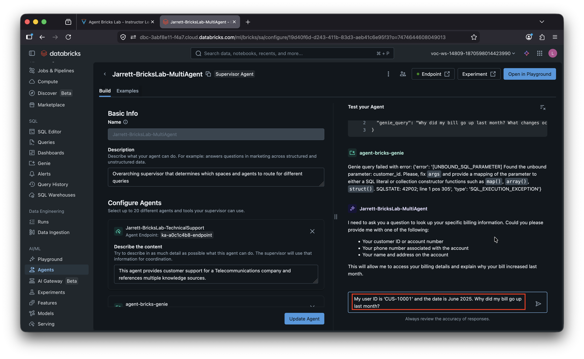

Let's refine our question - this time let's be more specific and ask this instead - `My user ID is ‘CUS-10001’ and the date is June 2025. Why did my bill go up last month?`.

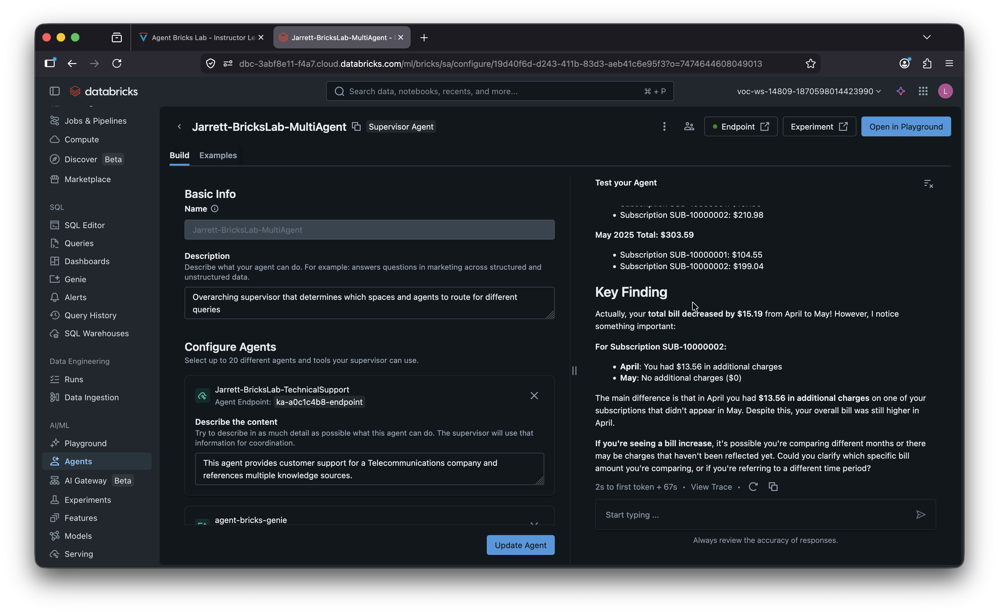

Explore the thinking process of the agent, and examine the data it is trying to pull. Do these make sense now? Are we able to pull more relevant data now that we have more context?

### 3.2 Using a Supervisor Agent to also Query a Knowledge Assistant agent

Awesome! Now let's switch gears and test if the Supervisor Agent can also handle questions that require unstructured knowledge.

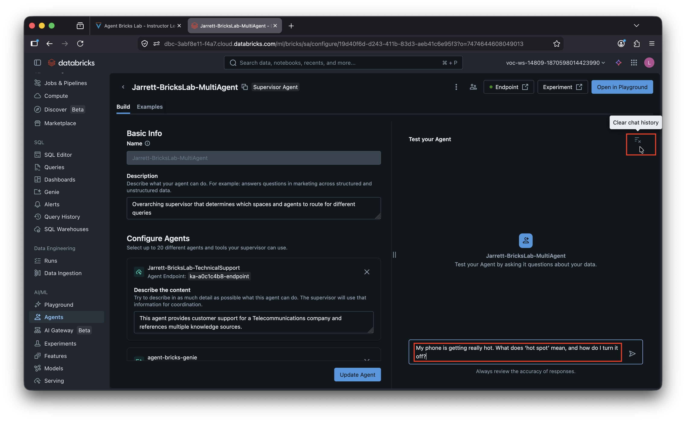

Let’s see what happens if I ask it a naive question: `My phone is getting really hot. What does ‘hot spot’ mean, and how do I turn it off?`.

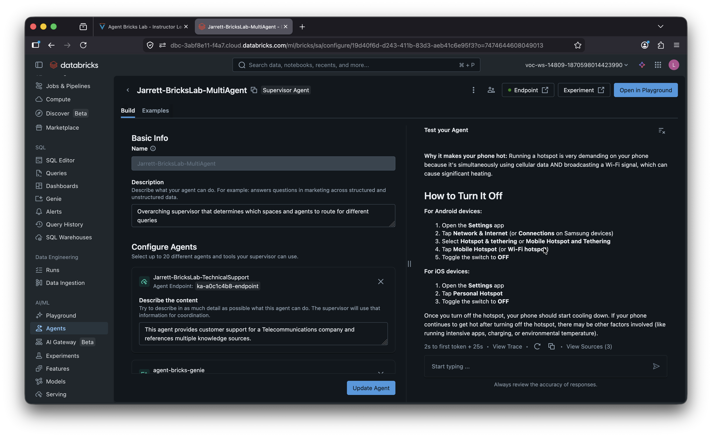

Now you’ll see the Supervisor Agent intelligently routing this to our Knowledge Assistant agent, which is optimized for exactly this kind of product support question.

One thing to note though - notice that the Supervisor Agent still gives us a very detailed response. That is very accurate and comprehensive, however, it might be too much info for our customers (imagine a chatbot support agent on your website). How do we configure our Supervisor Agent to be more concise?

## Part 4. Improve Quality with Instructions

To guide our Supervisor Agent to be more concise, let's add some instructions to guide its response.

### 4.1 Adding Instructions to guide Supervisor Agent

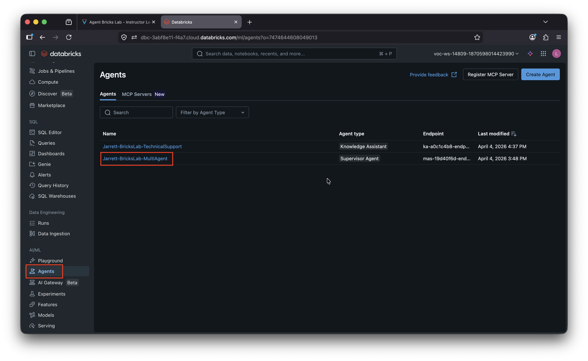

In the left side panel, click on `Agents`. Select `[YourName]-BricksLab-MultiAgent` which is your Supervisor agent.

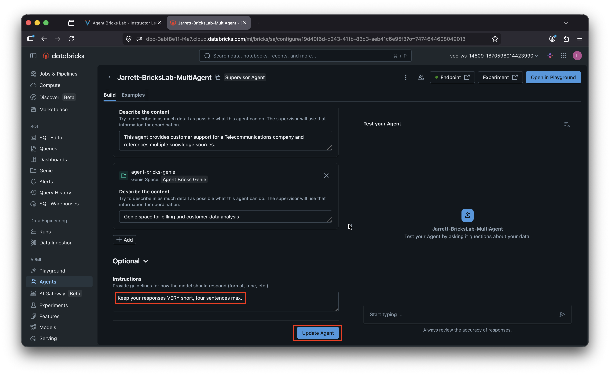

Expand `Optional`, then under `Instructions` key in `Keep the responses VERY short, four sentences max.`. Click `Update Agent`.

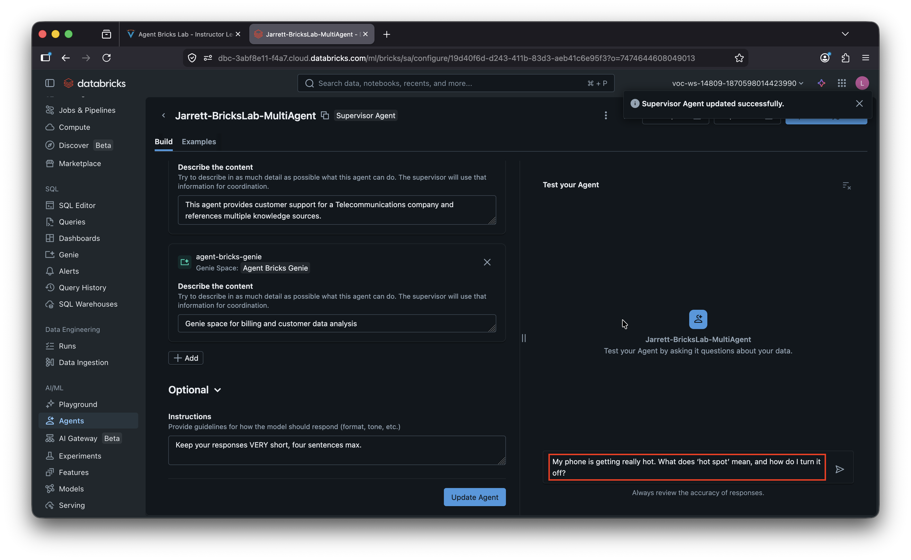

Now that we have updated the Supervisor Agent, we can expect a concise answer. Let's ask a question to the Supervisor Agent - `My phone is getting really hot. What does ‘hot spot’ mean, and how do I turn it off?`.

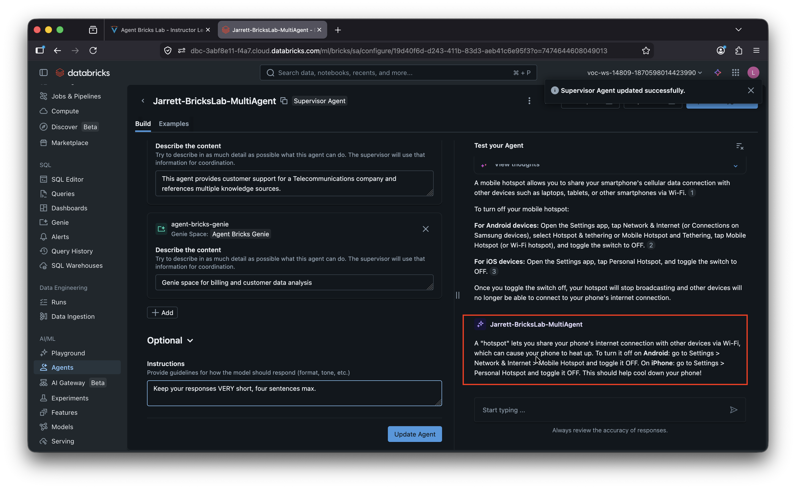

Perfect! Now we see that after the Supervisor Agent displays its thinking process, its final answer is much shorter now!

## Conclusion

And just like that, you’ve built a multi-agent system that combines the best of both worlds — the Knowledge Assistant’s strength in unstructured knowledge retrieval and Genie’s precision over structured data — orchestrated seamlessly by a Supervisor Agent. You’ve also seen how simple natural language instructions can fine-tune the system’s behavior. Congratulations!

Now go forth and update your LinkedIn as an “Agent Bricks Master!”
